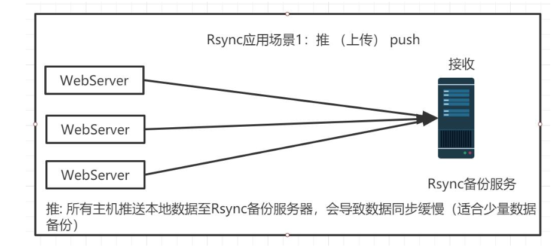
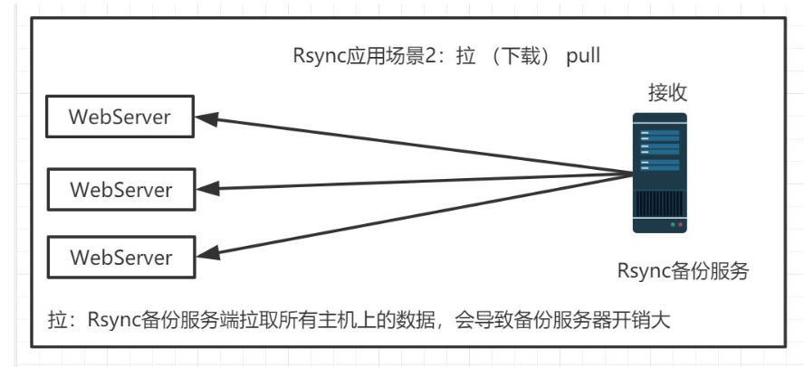
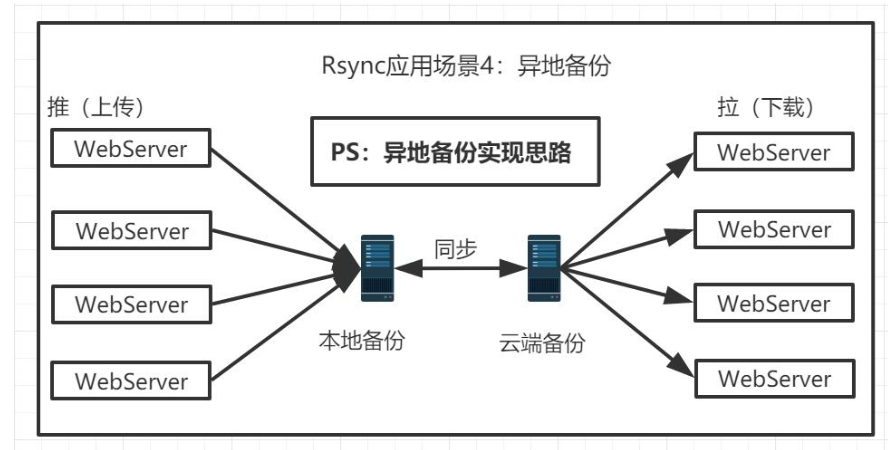

# Rsync+Crond实现定时备份

# **rsync介绍**

`rsync`英文称为`remote synchronizetion`，从软件的名称就可以看出来，rsync具有可使**本地和远程**两台主机之间的数据快速复制同步镜像、远程备份的功能，这个功能类似于ssh带的scp命令，但是又优于scp命令的功能，**scp每次都是全量拷贝，而rsync可以增量拷贝。**当然，rsync还可以在本地主机的不同分区或目录之间全量及增量的复制数据，这又类似cp命令。但是同样也优于cp命令，cp每次都是全量拷贝，而rsync可以增量拷贝。

在同步数据的时候，默认情况下，rsync通过其独特的“quick check”算法，它仅同步大小或者最后修改时间发生变化的文件或目录，当然也可根据权限、属主等属性的变化同步，但是需要制定相应的参数，甚至可以实现只同步一个文件里有变化的内容部分，所以，可是实现快速的同步备份数据。

**rsync** - 快速，通用，可实现全量和增量的远程（和本地）文件复制工具。

rsync监听端口：873

rsync运行模式：C/S

client/server ：客户端/服务端


# rsync优缺点

**优点：**
1）可以**增量备份**，支持socket（daemon），集中备份(**支持推拉，都是以客户端为参照物**)；socket（daemon）需要加密传输，可以利用vpn服务或ipsec服务。

2）可以**限速**进行数据的备份或恢复操作。

3）远程SHELL通道模式还可以**加密**（SSH）传输

4）支持**匿名认证**（无需系统用户）的进程模式传输，可以实现方便安全的进行数据备份和镜像

5）保持原文件或目录的权限、时间、软硬链接、属主、组等所有属性均不改变 –p

6）可以有排除指定文件或目录同步的功能，相当于打包命令tar的排除功能。（--exclude）

**缺点：**
1）大量小文件时进行同步备份，比对的时间较长，有时候会导致rsync进程停止运行或者进程挂起；
解决方法：
		a、打包后再同步；
		b、drbd（文件系统同步复制block）。

2）同步大文件，比如：10G这样的，有时也会出现问题，导致rsync进程中断，未完整同步前，是隐藏文件，但是会占用磁盘空间（ls -al查看）。直到同步完成后，将隐藏文件改成正常文件。而且，每中断一次，生成一个隐藏文件。


# rsync的应用场景

**应用场景1：推**

示意图如下：




**应用场景2：拉**

示意图如下：




**应用场景3：大量数据备份场景**

示意图如下：


 

**应用场景4：异地备份**




# rsync三种工作模式

Rsync有三种传输模式，分别是本地方式、远程方式、守护进程。

**本地复制模式：类似于cp**

```shell
rsync [OPTION...] SRC... [DEST]
```


**隧道传输模式： 类似于scp**

Pull: 拉取

```shell
rsync [OPTION...] [USER@]HOST:SRC... [DEST]
```

Push: 推送

```shell
rsync [OPTION...] SRC... [USER@]HOST:DEST
```


**守护进程模式： 以守护进程(socket)的方式传输数据(rsync  本身的功能).**最常用

Pull: 拉取

```shell
rsync [OPTION...] [USER@]HOST::SRC... [DEST]
rsync [OPTION...] rsync://[USER@]HOST[:PORT]/SRC... [DEST]
```

Push: 推送

```shell
rsync [OPTION...] SRC... [USER@]HOST::DEST
rsync [OPTION...] SRC... rsync://[USER@]HOST[:PORT]/DEST
```

注意：推拉操作都是通过rsync clent操作的。


## rsync守护进程模式部署

## 环境介绍

| 主机名 | 角色   | IP        | 系统      |
| ------ | ------ | --------- | --------- |
| c7-41  | 服务端 | 10.0.0.41 | CentOS7.7 |
| c7-42  | 客户端 | 10.0.0.42 | CentOS7.7 |


## 服务端部署

1、确认rsync软件服务是否存在			

```shell
rpm -qa rsync
#安装 yum -y install rsync
```

参数详解

| **参数**              | **说明**                                                     |
| --------------------- | ------------------------------------------------------------ |
| **-v, --verbose**     | **详细模式输出**                                             |
| **-a, --archive**     | **归档模式，表示以递归方式传输文件，并保持所有文件属性，等于-rlptgoD** |
| **-z, --compress**    | **对备份的文件在传输时进行压缩处理**                         |
| -P                    | 显示进度                                                     |
|                       |                                                              |
| -r, --recursive       | 对子目录以递归模式处理                                       |
| -l, --links           | 保留软链结                                                   |
| -p, --perms           | 保持文件权限                                                 |
| -o, --owner           | 保持文件属主信息                                             |
| -g, --group           | 保持文件属组信息                                             |
| -D, --devices         | 保持设备文件信息                                             |
| -t, --times           | 保持文件时间信息                                             |
| -e, --rsh=command     | 指定使用rsh、ssh方式进行数据同步                             |
| --exclude=PATTERN     | 指定排除不需要传输的文件模式                                 |
| --exclude-from=FILE   | 排除FILE中指定模式的文件                                     |
| -S, --sparse          | 对稀疏文件进行特殊处理以节省DST的空间                        |
| --bwlimit=KBPS        | 限制I/O带宽，KBytes per second                               |
| --delete              | 删除那些DST中SRC没有的文件                                   |
| --password-file=FILE  | 从FILE中得到密码                                             |
| -n, --dry-run         | 现实哪些文件将被传输                                         |
| -w, --whole-file      | 拷贝文件，不进行增量检测                                     |
| -B, --block-size=SIZE | 检验算法使用的块尺寸，默认是700字节。                        |
| -x, --one-file-system | 不要跨越文件系统边界                                         |
| -R, --relative        | 使用相对路径信息                                             |
| -b, --backup          | 创建备份，也就是对于目的已经存在有同样的文件名时，将老的文件重新命名为~filename。可以使用--suffix选项来指定不同的备份文件前缀。 |
| -u, --update          | 仅仅进行更新，也就是跳过所有已经存在于DST，并且文件时间晚于要备份的文件，不覆盖更新的文件 |
| -q, --quiet           | 精简输出模式                                                 |
| -c, --checksum        | 打开校验开关，强制对文件传输进行校验                         |

补充参数

```shell
--delete            实现无差异数据同步
--bwlimit=KBPS      实现数据传输过程中限速
--exclude=PATTERN   指定一个文件或目录 --exclude={file1，file2} 可以排除多个无顺序规则文件或目录
--exclude-from=FILE  指定排除多个文件或目录信息，将排除信息写入到一个文件中，利用--exclude-from=排除文件名   类似于tar 打包排除命令
```

2、手动配置rsync软件配置文件			

```shell
[root@ c7-41 ~]#
vim  /etc/rsyncd.conf

##全局配置			
uid = root    #用户			
gid = root    #用户组			
use chroot = no    #安全相关			
max connections = 200    #最大链接数			
timeout = 300    #超时时间			
pid file = /var/run/rsyncd.pid    #进程对应的进程号文件			
lock file = /var/run/rsync.lock    #锁文件			
log file = /var/log/rsyncd.log    #日志文件，显示出错信息

##模块配置			
[backup]            #模块名称			
path = /data      #模块对应的位置（路径）			
ignore errors       #忽略错误程序			
read only = false    #是否只读			
list = false        #是否可以列表			
hosts allow = 10.0.0.0/24  #准许访问rsync服务器的客户范围			
#hosts deny = 0.0.0.0/32      #禁止访问rsync服务器的客户范围			
auth users = rsync_backup    #不存在的用户；只用于认证			
secrets file = /etc/rsync.password  #设置进行连接认证的密匙文件
```

注意：配置文件中，行后不要有注释和空格。

3、创建rsync备份目录/授权rsync用户管理备份目录；修改备份目录权限			 							

```shell
[root@ c7-41 ~]#
mkdir -p /data
useradd rsync -s /sbin/nologin -M
chown -R rsync.rsync /data/
```

4、创建认证用户密码文件；修改文件权限							

```shell
[root@ c7-41 ~]#
echo "rsync_backup:123456" >/etc/rsync.password
chmod 600 /etc/rsync.password
```

5、重启rsync守护进程服务			

```shell
[root@ c7-41 ~]#
systemctl restart rsyncd.service
systemctl enable rsyncd.service

#启动文件
[root@ c7-41 ~]# vim /usr/lib/systemd/system/rsyncd.service
[Unit]
Description=fast remote file copy program daemon
  nditionPathExists=/etc/rsyncd.conf

[Service]
EnvironmentFile=/etc/sysconfig/rsyncd
ExecStart=/usr/bin/rsync --daemon --no-detach "$OPTIONS"

[Install]
WantedBy=multi-user.target
```


## 客户端部署

创建密码文件，客户端密码文件中，只需要密码即可。同时，密码文件的权限是600			

```shell
[root@ c7-42 ~]#
echo "123456">/etc/rsync.password
chmod 600 /etc/rsync.password
```

## 客户端推送文件

```shell
[root@ c7-42 ~]# rsync -avz aaa.txt rsync_backup@10.0.0.41::backup --password-file=/etc/rsync.password
```

注意：rsync默认使用873端口，防火墙开启时，需放行端口

## **客户端拉取文件**

```shell
[root@ c7-42 ~]# rsync -avz rsync_backup@10.0.0.41::backup --password-file=/etc/rsync.password /tmp
```

