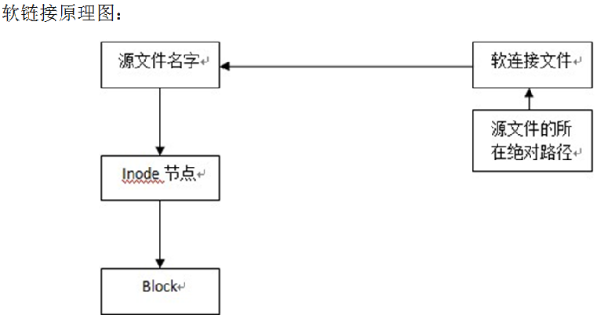
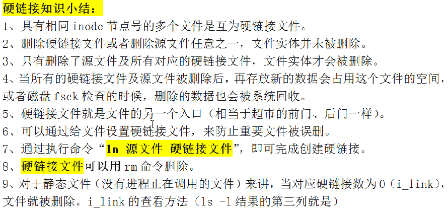

[TOC]


# 实训一


# 1.1 硬件知识


## 1.1.1 互联网公司常用服务器

目前，互联网公司常用服务器品牌：Dell、HP、IBM、浪潮、联系、航天联志等。

1U=4.45厘米

**Dell服务器品牌：**

2010年以前：1u  1850、1950，2u 2850、2950

2010-2013： 1u  R410、R610，2u R710

2014-2015： 1u  R420/430、R620/630，2u R720

**IBM品牌：**

1U服务器3550/m3 3550/m5

2U服务器3650

4U服务器3850

8U服务器3950

**HP品牌：**

DL380G7（2u）、DL580等


## 1.1.2 主机硬件体系介绍

从工作的角度上，我们需要重点掌握主机的CPU、内存、硬盘。各部件I/O性能比较如下图所示：


由于CPU、内存与硬盘网上可以搜索到很多的资料介绍，这里就不一一详述了。重点如下：

1、内存是CPU和磁盘之间的缓冲设备，临时存储器，主机重启，内存数据会释放掉；

2、进程：正在运行的程序，在内存中运行；

3、守护进程：持续保持运行着的程序；

4、程序：PHP、JAVA，代码文件，静态，放在磁盘里；

5、互联网公司中，缓存无处不在，特别是百度、淘宝集群架构中，都要有缓存；

6、缓存cache，是读数据的；

7、buffer和cache有何区别？

​	a.写入数据到内存，成为缓冲区（buffer）。

​	b.从内存读取数据，内存空间（cache）。

8、硬盘的接口或类型：IDE，SCSI，SAS，SATA，SSD；性能比较：SSD > SAS > SATA。

**企业应用：**

常规工作场景选SAS硬盘（转速15000转/分）。

不对外提供访问的服务器，如先下的数据备份，可选SATA（7200-15000转/分）。

高并发访问，小数据量，可以选择SSD。


## 1.1.3 硬盘主要介绍

数据迁移速度主要受到以下约束条件的影响。

硬盘转速：磁盘阵列采用的硬盘转速越慢，则数据迁移速度越慢；

硬盘容量：磁盘阵列采用的硬盘容量越大，硬盘损坏时需要从坏盘中迁移出的数据量就越多，数据迁移速度也就越慢；

业务繁忙程度：由于坏盘数据迁移的优先级较低，需要优先满足当前业务的I/O读写需求，因此业务越繁忙的时间段，数据迁移速度越慢。 

| **硬盘类型** | **容量** | **转速** | **可靠性** | **价格** | **适用场景**            |
| ------------ | -------- | -------- | ---------- | -------- | ----------------------- |
| SATA硬盘     | 较大     | 较低     | 较可靠     | 较低     | I/O读写率较低、业务量小 |
| FC硬盘       | 较小     | 较高     | 可靠       | 高       | I/O读写率较高、业务量大 |
| SAS硬盘      | 较小     | 高       | 可靠       | 较高     | I/O读写率较高、业务量大 |


**RAID的概念：**

RAID （ Redundant Array of Independent Disks ）即独立磁盘冗余阵列，通常简称为磁盘阵列。简单地说， RAID 是由多个独立的高性能磁盘驱动器组成的磁盘子系统，从而提供比单个磁盘更高的存储性能和数据冗余的技术。 RAID 是一类多磁盘管理技术，其向主机环境提供了成本适中、数据可靠性高的高性能存储。


**阵列卡（RAID卡）基本作用：**

网站数据量很大，单块盘装不下了，有了多块盘，又不想单个盘存放数据，就需要工具把所有硬盘整合成一个大磁盘，再这个大磁盘上在分区放数据。

**RAID有多种整合方式，RAID 0、RAID 1、RAID 5、RAID 10。**

**RAID的概念及优缺点：**

RAID 0：

**2块以上的盘** ，将数据保存不在不同磁盘上，具有**低成本**、**高读写性能**、 **100% 的存储**空间等优点，但是它不提供数据冗余保护，一旦数据损坏，将无法恢复。因此， RAID0 **一般适用于对性能要求严格但对数据安全性和可靠性不高的应用**，如视频、音频存储、临时数据缓存空间等。 raid 0 的**存取速度最快。**


​										**RAID0 ：无冗错的数据条带**


**RAID 1：**

最少2块盘，使用磁盘镜像技术   当主磁盘损坏时，镜像磁盘可以代替主磁盘工作，镜像磁盘相当于一个备份盘，这种磁盘模式具有系统容错的能力，**支持热插拔**  但磁盘的**利用率只有50%** 利用率是最低的。RAID1 提供了最佳的数据保护，一旦工作磁盘发生故障，系统自动从镜像磁盘读取数据，不会影响用户工作。**一般用于数据库应用，金融系统等**。


​										**RAID1 ：无校验的相互镜像**


**RAID 5：**

**5块以上的盘** raid 5 以**数据的奇偶位来保证数据安全**，但他不是以单独的磁盘空间来存放数据的校验位，而是将数据的校验位交互存放于各个磁盘上，任何一个磁盘损坏，都可以根据其他磁盘上的校验位来重建损坏的数据，因为奇偶效验码位于不同的磁盘上，所以提高了可靠性，可允许单个磁盘出错。**Raid5的读出效率很高，写入效率一般**。raid5的磁盘空间利用率较高，如果组成raid5的磁盘有N块，利用率为（N-1）/N读写速度为单个磁盘的（N-1倍）。用于事物处理环境，如售票处，销售系统等。


​									**RAID5 ：带分散校验的数据条带**


**RAID 10：**

也被称为RAID 1+0标准，实际是将RAID 0和RAID 1标准结合的产物，在连续地以位或字节为单位分割数据并且并行读/写多个磁盘的同时，为每一块磁盘作磁盘镜像进行冗余。它的优点是同时拥有RAID 0的超凡速度和RAID 1的数据高可靠性，但是CPU占用率同样也更高，而且磁盘的利用率比较低。由于利用了RAID 0极高的读写效率和RAID 1较高的数据保护、恢复能力，使RAID 10成为了一种性价比较高的等级，目前几乎所有的RAID控制卡都支持这一等级。


**主流 RAID 等级技术对比**

| **RAID** **等级** | **RAID0** | **RAID1** | **RAID3**        | **RAID5**        | **RAID6**        | **RAID10** |
| ----------------- | --------- | --------- | ---------------- | ---------------- | ---------------- | ---------- |
| **别名**          | 条带      | 镜像      | 专用奇偶校验条带 | 分布奇偶校验条带 | 双重奇偶校验条带 | 镜像加条带 |
| **容错性**        | 无        | 有        | 有               | 有               | 有               | 有         |
| **冗余类型**      | 无        | 有        | 有               | 有               | 有               | 有         |
| **热备份选择**    | 无        | 有        | 有               | 有               | 有               | 有         |
| **读性能**        | 高        | 低        | 高               | 高               | 高               | 高         |
| **随机写性能**    | 高        | 低        | 低               | 一般             | 低               | 一般       |
| **连续写性能**    | 高        | 低        | 低               | 低               | 低               | 一般       |
| **需要磁盘数**    | n≥1       | 2n (n≥1)  | n≥3              | n≥3              | n≥4              | 2n(n≥2)≥4  |
| **可用容量**      | 全部      | 50%       | (n-1)/n          | (n-1)/n          | (n-2)/n          | 50%        |


# 1.2 Linux基础优化


## 1.2.1 关闭SELinux

SELinux是美国国家安全局（NSA）对于强制访问控制的实现。

```shell
setenforce 0	#临时关闭
sed  -i 's#SELINUX=.*#SELINUX=disabled#g' /etc/selinux/config	#永久关闭
```


## 1.2.2 精简开机系统启动

Linux在服务器运行过程中，会有很多无用的软件服务默认就在运行，这些服务占用了系统资源，带来安全隐患，因此要关闭这些服务。

```
for A in `chkconfig --list |grep 3:on |awk '{print $1}' `;do chkconfig $A off;done
for B in rsyslog network sshd crond sysstat;do chkconfig $B on;done
chkconfig --list |grep 3:on
```

重要的开机服务如下所示：

**sshd**
远程连接Linux服务器需要这个服务程序。否则，无法连接Linux；

**rsyslog**
是操作系统提供的一种机制，系统的守护程序通常会使用rsyslog将各种信息写到格格系统日志文件中。CentOS中此服务名为syslog；

**network**
系统启动时，若想激活/关闭各个网络接口，则必须启动该服务；

**crond**
该服务用于周期性的执行系统及用户配置的计划任务；

**sysstat**
该服务包含监测系统性能及效率的一组工具。这些工具对于收集系统性能数据很有帮助，核心工具包：

```
iostat	    CPU使用率及硬盘吞吐效率的工具
mpstat	提供单个或多个处理器的数据
sar 		负责收集、报告并存储系统活跃的信息
```


## 1.2.3 关闭iptables防火墙

```shell
/etc/init.d/iptables stop	#临时关闭
chkconfig iptables off		#永久关闭
```


## 1.2.4 最小化原则

1.安装Linux系统最小化，即选包最小化，yum安装软件包也要最小化，无用的包不装。开机启动服务最小化，即无用的服务不开启；

2.操作系统命令最小化，用rm -f test.txt而不用rm -fr test.txt；

3.登陆Linux用户最小化。平时没有需求不用root登陆，用普通用户登陆即可；

4.普通用户授权最小化，即只给必须的管理系统的命令；

5.Linux系统文件及目录权限设置最小化，禁止随意创建、更改、删除。

​	


## 1.2.5 更改ssh服务端远程登录的配置

不同的端口代表不同的服务，IP地址标示唯一的主机。端口的范围0~65535，一般建议改为比1024大点的端口。不允许空密码登录，不允许root直接登录，不使用DNS，解决ssh反应慢的问题。


```shell
cp /etc/ssh/sshd_config /etc/ssh/sshd_config.ori

vi /etc/ssh/sshd_config
Port 52083						# SSH 预设使用22这个port，也可以使用其他port
PermitRootLogin no				# 是否允许root登入！预设是允许的，建议设定成no！
PasswordAuthentication yes		# 密码验证当然是需要的！所以这里写yes！
PermitEmptyPasswords no			# 若上面那一项如果设定为 yes 的话，这一项就最好，设定为no ，这个项目在是否允许以空的密码登入！
UseDNS no						# 是否使用DNS
GSSAPIAuthentication no		    # 解决SSH连接慢的问题
ListenAddress 10.10.10.7		# 设置服务器上的sshd服务绑定哪个IP地址对外服务
```


## 1.2.6 sudo控制用户对系统命令的最小化

执行# visudo相当于编辑vi /etc/sudoers文件。

```shell
# 编辑sudo的配置文件
# visudo
# 找到第98行，修改
root    ALL=(ALL)       ALL
www  ALL=(ALL)     /etc/init.d/sshd restart
# 上面www这一行的解释：
# www是系统的哪个账号可以使用sudo命令；
# 登录者的来源主机，哪台主机的www账号登录使用sudo命令；
# （ALL）表示可以切换成身份或用户（比如root）来执行sudo后续的命令；
# sudo可以执行的命令，多个命令用“，”隔开。
# 现在可以使用普通用户执行root用户才能做的重启ssh服务的命令
```


## 1.2.7 设置Linux服务器时间同步

```
echo "*/5 * * * * /usr/sbin/ntpdate ntp1.aliyun.com >/dev/null 2>&1">>/var/spool/cron/root
```


## 1.2.8 加大服务器文件描述符

文件描述符是由无符号整数表示的句柄，进程使用它来标识打开的文件。
查看文件描述符：

```
ulimit -n
```

执行vim /etc/security/limits.conf命令，再文件结尾加上如下一行。

```
echo '*               -       nofile          65535 ' >>/etc/security/limits.conf 
```

配置完成以后，退出当前会话，再次登录才可以生效。检查如下：

```
# ulimit -n
65535
```


## 1.2.9 调整内核参数

```shell
编辑/etc/sysctl.conf，到文件结尾将下面的内容拷贝进去即可：
# vi  /etc/sysctl.conf
net.ipv4.tcp_fin_timeout = 2
net.ipv4.tcp_tw_reuse = 1
net.ipv4.tcp_tw_recycle = 1
net.ipv4.tcp_syncookies = 1
net.ipv4.tcp_keepalive_time = 600
net.ipv4.ip_local_port_range = 4000    65000
net.ipv4.tcp_max_syn_backlog = 16384
net.ipv4.tcp_max_tw_buckets = 36000
net.ipv4.route.gc_timeout = 100
net.ipv4.tcp_syn_retries = 1
net.ipv4.tcp_synack_retries = 1
net.core.somaxconn = 16384
net.core.netdev_max_backlog = 16384
net.ipv4.tcp_max_orphans = 16384
#以下参数是对iptables防火墙的优化，防火墙未启动会有报错提示，可以忽略不理：
net.nf_conntrack_max = 25000000
net.netfilter.nf_conntrack_max = 25000000
net.netfilter.nf_conntrack_tcp_timeout_established = 180
net.netfilter.nf_conntrack_tcp_timeout_time_wait = 120
net.netfilter.nf_conntrack_tcp_timeout_close_wait = 60
net.netfilter.nf_conntrack_tcp_timeout_fin_wait = 120

# 使编辑生效
# sysctl -p
```


## 1.2.10 锁定关键系统文件

```shell
关键文件有：/etc/passwd、/etc/group、/etc/inittab、/etc/shadow、/etc/gshadow
# chattr  +i  /etc/passwd
# 查看文件属性，有i的是加过锁的文件
# lsattr /etc/passwd
----i--------e-  /etc/passwd

# 锁定系统文件：
# chattr  修改文件属性，给文件加锁
#       +i:锁定
#      -i:解除锁定
#      =：覆盖之前的，加上这个新的。
# /etc/passwd /etc/shadow /etc/group /etc/gshadow /etc/inittab
# lsattr  # 查询文件是否加锁
```


## 1.2.11 清除Linux系统多余的用户

​    可以将系统中/etc/passwd文件中的mail、game、at、bin等这些用户最后一列修改为/bin/false或者/sbin/nologin，禁止这些用户登录系统。


## 1.2.12 禁止Linux系统被外界ping

```
echo 'net.ipv4.icmp_echo_ignore_all = 1' >>/etc/sysctl.conf
sysctl -p
```


# 1.3 linux的目录介绍

## 1.3.1 linux目录结构

Linux的目录逻辑上只有一个顶点（/），是所有目录的起点。

应用程序命令目录：/usr/bin

数据文件、帮助目录：/usr/share

配置文件目录：/etc

启动命令目录：/etc/init.d

默认安装程序目录：/usr/local

小结：
1）Linux的目录结构像倒挂的树状结构；

2）逻辑上只有一个顶点（/），所有目录的起点；

3）目录结构和物理设备是没有关联的，也就是不同的目录可以跨越不同的磁盘设备或分区。比如下面：

/etc/类似Windows中的c盘
/etc/init.d/类似Windows中的d盘

4）所有的目录都是按照一定的类别有规律的组织和命名的。
所有设备必须挂载后使用，磁盘分区无法直接访问。挂载就是为要访问的设备设置一个入口。在Linux中不通过挂载是无法直接访问下面的设备：


## 1.3.2 linux目录结构及目录含义

| **目录**        | **含义**                                               |
| --------------- | ------------------------------------------------------ |
| **/**           | 根目录，linux中一切从根开始                            |
| **/bin**        | 命令 二进制文件的存放目录 binary                       |
| **/sbin**       | 超级命令  只有root用户能用                             |
| **/etc**        | 存放系统的配置文件                                     |
| **/dev**        | device 设备、光盘、硬盘（硬盘挂载才能使用）            |
| **/proc**       | 虚拟目录  目录中的信息为（内核、进程、软件）           |
| **/var**        | 变量文件（系统日志）                                   |
| **/tmp**        | 临时文件存放处                                         |
| **/usr**        | 用户程序包含二进制文件、库文件、文档和二级程序的源代码 |
| **/home**       | 普通用户的家目录                                       |
| **/boot**       | 系统引导程序+（系统内核）                              |
| **/lib**        | libary 库 库文件                                       |
| **/opt**        | option 第三方软件安装在这里                            |
| **/mnt**        | 临时挂载点                                             |
| **/media**      | 可移动媒体设备用于挂载可移动设备的临时目录             |
| **/srv**        | 服务数据（包含服务器特定服务相关的数据）               |
| **/lost+found** | 磁盘或文件系统损坏、断电，临时存放位置                 |

**重要文件**

| 目录重要文件                 |                                                |                |
| ---------------------------- | ---------------------------------------------- | -------------- |
| /etc配置文件                 | /etc/resolv.conf DNS                           | 客户端配置文件 |
| /etc/hosts                   | 主要是通过域名解析IP地址，建立一个映射关系。   |                |
| /etc/sysconfig/network       | 主机名配置文件                                 |                |
| /etc/fastab                  | 文件说明及挂载文件系统的方法                   |                |
| /etc/rc.local                | 用于存放开机自动启动的程序的文件               |                |
| /etc/init.d                  | 系统运行级别的配置文件                         |                |
| /etc/inittab                 | 系统开机启动要加载的配置文件                   |                |
| /etc/profile和/etc/profile.d | 此文件为系统的每个用户设置环境信息             |                |
| /etc/sudoers                 | 可以执行sudo命令的配置文件（全向提升）sudo介绍 |                |

| /var日志文件      | /var/log               | 各种系统日志存放地 |
| ----------------- | ---------------------- | ------------------ |
| /var/log/messages | 系统信息默认的日志文件 |                    |
| /var/log/secure   | 记录用户的登录信息     | x                  |

| /proc虚拟目录（内核、进程、软件） | /proc/cpuinfo                    | 处理器的信息 |
| --------------------------------- | -------------------------------- | ------------ |
| **/proc/memiofo**                 | 系统的内存信息                   |              |
| **/proc/interrupts**              | 正在使用的中断和曾今有多少个中断 |              |
| **/proc/ioports**                 | 前端正在使用的I/O端口            |              |
| **/proc/loadavg**                 | 系统负载的平均值信息             |              |
| **/proc/mounts**                  | 设备的挂载信息   df -h 类似      |              |


# 1.4 文件属性inode和block


## 1.4.1 inode的知识

**1. inode简介**

inode（index node）是文件或目录在Linux磁盘里的唯一标识，读文件首先要读取文件的inode，它相当于书的目录。Linux中没有扩展名的概念，但是为了让人看的明白，我们一般在文件的结尾加上扩展名用来区分不同类型的文件。比如：xx.sh、yy.txt等。磁盘在被格式化时，生成inode和block。blcok用来存放数据，inode用来存放这些文件或目录的属性，但是文件名不在inode当中。inode还包含指向文件的指针。一个文件创建后至少占用一个inode（一般也为一个）和一个block，inode会对应多个block，block之间也会相互对应，否则inode可能无法对应太多的block。

**2. inode介绍**

inode就是用来存储这些数据属性信息的（也就是ls -ld的结果），inode属性信息包括文件大小、属主（用户）、归属用户组、文件权限、文件类型、修改时间，还包含指向文件实体的指针功能（indoe节点--block的对应关系）等，但是inode里面唯独不包含文件名。  

```
ls -lhi /etc/hosts
[root@www ~]# ls -lhi /etc/hosts
129822 -rw-r--r--. 2 root root 158 Mar 12 19:17 /etc/hosts

第一列：inode 索引节点编号（相当于人的身份证），系统读取问件时首先通过找到inode的号码，才能读取文件内容
第二列：文件类型与权限
第二列共11个字符：其中一个字符为文件类型，随后的9个字符为文件的对应权限，最后一个是和selinux有关的一个标识
第三列：硬连接数（详细参看ln命令的讲解）
相当于入口，可以从不同的入口进入文件，还可以互为备份
第四列：文件或目录的所属用户（文件的所有者）
linux里面文件和程序的存在必须要有用户和组满足相应的存下需求
第五列：文件或目录的所属组
第六列：文件或目录的大小
第七、八、九列：文件或目录的修改时间：月日时分
第十列：实际的文件名或目录名
注意：文件名不算文件的属性
```

查看第一块磁盘第三分区的大小

```shell
[root@www ~]# dumpe2fs /dev/sda3 |grep -i "inode size"
dumpe2fs 1.41.12 (17-May-2010)
Inode size:	          256
```

grep -i  不区分大小写抓取
查看磁盘（block）的使用情况  df -h
查看inode的使用情况   df -hi

**inode的小结**
学会阶段性的知识做小结是学好linux运维的好习惯

```
1、诞生：磁盘被分区并格式化为ext4文件系统后会诞生一定数量的inode和block
2、含义：inode成为索引节点，作用是存放文件的属性信息，以及作为文件的索引（指向文件的实体block）
3、特点：
①ext3和ext4文件系统的block存放的是文件的实际内容（数据）
②indoe是磁盘上的一块存储空间，C6非启动分区inode默认大小为256字节，	C5是128字节。
③inode是一串数字，在同一个文件系统（分区df里是唯一的） 
6、inode节点号相同的文件，互为 硬链接文件，可以为一个文件的不同入口。
7、ext3和ext4文件系统下，一个文件至少占用一个inode和一个block（文件size大小）。
8、ext3和ext4文件系统下，正常情况一个文件只能占用一个inode,block
```


## 1.4.2 block的知识

有关block的知识小结：
1、含义：
block是用来存储实际数据的，每个block的大小一般有1K,2K,4K几种。其中引导分区等为1K，其他普通分区多为4K（C6）
特点：
2、磁盘读取数据是按block为单位读取的
3、一个文件可能占用多个block。每读取一次block就会消耗一次磁盘I/O(磁盘读写)
4、如果一个文件很大，占用多个block，如果文件很小（0.01K），至少占用一个block，并且这个block的剩余空间就浪费了，即无法再存储其他数据了
5、block并非越大越好。block太大对于存放小文件就会浪费磁盘空间，例如：10000K的文件，block大小为4K，占用250个block，如果block默认1K，则需要占用1000个block。访问效率谁更高？消耗IO分别为250次和1000次。
6、根据业务需求，确定默认的block大小，如果是大文件（小于16K）一般设置block大一点，小文件（小于1K）一般设置block小一点
7、block太大，例如4K，文件都是0.1K，大量浪费磁盘空间，但是访问性能高。
8、block太小，例如1K，文件都是1000K，消耗大量的磁盘IO
9、block是用来存储实际数据的，每个block的大小一般有1K,2K,4K几种。其中引导分区等为1K，其他普通分区多为4K（C6）
10、如果一个文件很大，占用多个block，如果文件很小（0.01K），至少占用一个block，并且这个block的剩余空间就浪费了，即无法再存储其他数据了


## 1.4.3 inode和block的重点总结

1、磁盘分区格式化文件系统后，会分为indoe和block两部分内容

2、inode存放文件的属性及指定文件实体指针（block的位置），文件名不在inode里，一般在上级目录的block里。

3、访问文件的过程，通过文件名（上一级目录的block）（inode号码==家庭住址）→ inode→blocks。

4、inode cento6一般情况默认非启动分区大小256B，block 1K,2K,4K,	默认4K，注意，引导分区等特殊分区除外。

5、通过df -i查看inode的数量及使用情况，dumpe2fs /dev/sda3查看inode及block的大小及数量。

6、一个文件至少要占用一个inode及一个block，多个文件可以占用同一个inode(硬链接)，相同硬链接。

7、一个block只能被一个文件使用（小文件block剩下的空间浪费），如果文件很小block很大，剩余空间浪费，无法继续被其他文件使用。

8、block不是越大越好，要根据业务的文件大小进行选择，一般centos6就是默认4K.


# 1.5 linux中的软硬链接

## 1.5.1 链接的概念

在Linux系统中，链接分为两种：一种为硬链接（Hard Link），另一种为软链接（Symbolic Link or Soft Link）。链接由ln命令创建，默认不带参数的情况下，执行ln命令创建的是硬链接，# ln -s命令创建的是软链接。创建命令如下：

硬链接：# ln  源文件  创建的目标文件

软链接：# ln  -s  源文件  创建的目标文件


## 1.5.2 硬链接

**硬链接通过索引节点（inode）来进行链接。**在Linux文件系统中，多个文件名指向同一个索引节点（inode），这是被允许的，这种情况被称为文件的硬链接。硬链接的作用之一，就是允许一个文件拥有多个有效路径（多个入口），这样用户可以建立硬链接到重要的文件，防止“误删”源数据。只要文件还存在一个以上的硬链接，删除其中的一个硬链接（删除了该文件的链接指向），不影响索引节点和其他的链接，即数据文件实体并未被删除。只有当最后一个链接被删除后，此时，如果有新的数据要存储到硬盘上，或系统通过类似fsck检查磁盘时，被删除文件的数据块及目录的链接才会被释放，空间被新的数据覆盖。也就是说，在Linux系统中，**删除静态文件（没有进程调用，目录也是文件）的条件是与之相关的所有硬链接文件均被删除，文件才会被删除。**

对硬链接有如下限制： 

不能对目录文件做硬链接。 

不能在不同的文件系统之间做硬链接。

就是说，链接文件和被链接文件必须位于同一个文件系统中。


## 1.5.3 软链接

软链接（Soft Link）也叫符号链接（Symbolic Link）。Linux系统里的软链接就相当于Windows里的快捷方式。软链接可以理解为一个文本文件，这个文件中包含有软链接指向另一源文件的位置信息内容。因此，通过软链接可以快速定位到软链接所指向的源文件实体。




## 1.5.4 硬链接软链接知识小结




## 1.5.5 目录、源文件、硬链接和软链接之间的关系

目录与硬链接：

目录无法创建硬链接，目录的软链接在生产场景中更经常用到。

软链接和源文件：

删除软链接不会影响源文件，但是删除源文件会导致软链接异常，再次访问软链接将提示“No such file or directory”。


# 1.6 网络基础


## 1.6.1 网络设备

**交换机**

含义：

交换机（英文：switch，意为‘开关’）是一种用于电信号转发的网络设备。它可以为接入交换机的任意两个网络节点提供独享的电信号通路。最常见的交换机是以太网交换机。其他常见的还有电话语音交换机、光纤交换机等。

**交换机的作用和特点说明：**

Ø 同一个交换机端口上连接的所有终端设备，均在一个网段上（称为个广播域）。

Ø 同一网段会有统一的网络标识，会产生广播消耗设备cpu资源。

Ø 交换机可以隔离冲突域，每一个端口就是一个冲突域。

Ø 终端用户的设备接入。

Ø 基本的安全功能。

Ø 广播域的隔离（VLAN）。


**路由器**

**路由器的作用**

Ø 路由协议的转发

Ø 数据转发，会维护一个路由表（相当于一个地图）

Ø 路由器会做为网关；一般会在网络出口的位置放一台路由器

Ø 广域网链路支持（FR  ATM  MSTP  SDH）


## 1.6.2 网络的三大类型

Ø 局域网：本地私有的一个网络范围。如果是一个大的局域网，也会成为一个园区网。

Ø 城域网：如果一个网络覆盖面积达到一个城市，就可以称为城域网。

Ø 广域网：如果覆盖面积达到了全国或全球，就称为广域网，最大的广域网就是internet。


# 常见面试题

## 1. linux磁盘满了

情况一 : 确定真的是不是磁盘空间不足

输入命令：df –lh 查看磁盘信息


很明显：Filesystem下的挂载点 /dev/xvda1 下的40G容量已经耗尽。

解决办法：

进入 / 根目录，查找磁盘空间中的大文件，使用命令`du -sh *`查找占用空间大的目录。然后使用命令find /home/zhang -size +1G查找出大于1G的文件。

情况二：

除了磁盘空间除了文件占用之外，还有一种情况，当磁盘空间满了之后，我们无法查找到大文件，此时可能是文件可能已经被删掉，但有进程依然在使用它。在进程运行期间，Linux 不会释放该文件的存储空间。此时看到磁盘空间仍是100%

此时适用命令lsof | lsof | grep deleted 查找到占用的进程，直接停止进程或者kill掉就可以释放空间（注：如果不是生产环境，重启操作系统或者重启占用该文件的程序，空间也会释放）


情况三：inode容量满

通过命令`df -hi`，查看inode使用情况。造成inode满了的原因是大量小文件的产生。


## 2. 文件删除的原理

删除文件但该文件被程序的占用时：

对于删除命令 rm 而言，实际就是减少磁盘引用计数 i_nlink。这里就会有一个问题，如果一个文件正在被某个进
程调用，而用户却执行 rm 操作把文件删除了，那么会出现什么结果呢？

当用户执行 rm 操作删除文件后，再执行ls 或者其他文件管理命令，无法再找到这个文件了，但是调用这个删除的文件的进程却在继续正常执行，依然能够从文件中正确的读取及写入内容。也就是说，还需要解除该进程的对该文件的调用才行。

当文件没有被调用时，执行了 rm 操作删除文件后是否还可以找回被删的文件呢？

rm 操作只是将文件的 i_nlink 减少了，或者说置 0 了，实际就是将文件名到 inode 的链接删除了，此时，并没有删
除文件的实体即（block 数据块），此时，如果及时停止机器工作，数据是可以找回的；如果此时继续写入数据，
那么当新数据就可能会被分配到被删除的数据的 block 数据块，此时，文件就会被真正的回收了、、、

如何删除文件：

1.硬链接数为 0 与这个文件有关的所有硬链接都被删除。（使用的是 rm 命令）

2.进程调用数为 0 没有人在使用这个文件。（使用的是 lsof）

3.重启占用文件的服务


## 3. RAID 0、RAID 1、RAID 5、RAID 10的区别及应用场景


## 4. 软连接和硬链接的区别


网站架构图

网站访问慢的原因


DNS解析原理


访问网站的流程


# 项目一

## Supervisor管理集群

文档：supervisor进程管理.note
链接：http://note.youdao.com/noteshare?id=e10ef4356add0c9d694ecb373fb403c3&sub=D31D963E5127467F915F5F85B745DDE8

### centos7 安装配置supervisor

```shell
systemctl   stop   firewalld.service
systemctl   disable firewalld.service

setenforce 0
sed -i  '/^SELINUX/s#enforcing#disabled#g' /etc/selinux/config

yum install -y wget 
wget -O /etc/yum.repos.d/CentOS-Base.repo http://mirrors.aliyun.com/repo/Centos-7.repo
wget -O /etc/yum.repos.d/epel.repo http://mirrors.aliyun.com/repo/epel-7.repo
yum clean all
yum makecache

yum -y install gcc gcc-c++  cmake curl  nmap  lrzsz unzip zip ntpdate telnet vim tree bash-completion iptables-services ntp dos2unix lsof net-tools sysstat

echo "*/5 * * * * /usr/sbin/ntpdate ntp1.aliyun.com >/dev/null 2>&1">>/var/spool/cron/root


#安装supervisor
yum -y install supervisor

#设置开机自启
systemctl enable supervisord.service


#配置jdk环境
tar -zxvf jdk-8u60-linux-x64.tar.gz -C /usr/local/
chown -R root.root /usr/local/jdk1.8.0_60
cat>>/etc/profile<<EOF
export JAVA_HOME=/usr/local/jdk1.8.0_60
export PATH=\$JAVA_HOME/bin:\$JAVA_HOME/jre/bin:\$PATH
export CLASSPATH=.\$CLASSPATH:\$JAVA_HOME/lib:\$JAVA_HOME/jre/lib:\$JAVA_HOME/lib/tools.jar
EOF

source /etc/profile
java -version


#安装tomcat
tar -zxvf apache-tomcat-7.0.47.tar.gz
mkdir -p /opt/tomcat01
cp -a apache-tomcat-7.0.47/* /opt/tomcat01/


#通过supervisor管理tomcat

#创建supervisor管理tomcat的子配置文件
vim /etc/supervisord.d/tomcat01.ini
[program:tomcat01]
command=/opt/tomcat01/bin/catalina.sh run
environment=JAVA_HOME="/usr/local/jdk1.8.0_60",JAVA_BIN="/usr/local/jdk1.8.0_60/bin"


#常用supervisorctl命令
supervisorctl status
supervisorctl stop tomcat
supervisorctl start tomcat
supervisorctl restart tomcat
supervisorctl reread
supervisorctl update
```


# 项目二

## NFS共享存储

**centos7 安装配置nfs服务**

### nfs的服务端操作

```shell
yum -y install nfs-utils rpcbind
```

**手动创建配置文件**

```shell
vim /etc/exports
/data 10.0.0.0/24(rw,sync,no_root_squash,no_all_squash)

/data: 共享目录位置。
10.0.0.0/24: 客户端 IP 范围，* 代表所有，即没有限制。
rw: 权限设置，可读可写。
sync: 同步共享目录。
no_root_squash: 可以使用 root 授权。
no_all_squash: 可以使用普通用户授权
```

**创建共享目录**

```
mkdir -p /data
```

**添加开始自启并重启nfs-server**

```shell
systemctl enable rpcbind
systemctl enable nfs-server
systemctl restart rpcbind
systemctl restart nfs-server
```


### nfs客户端操作

```shell
yum -y install nfs-utils rpcbind

systemctl enable rpcbind
systemctl restart rpcbind

#客户端不安装nfs-utils则不能挂载nfs共享目录；但可以不开启
```

**创建挂载目录并挂载**

```shell
mkdir -p /data
mount 10.0.0.42:/data /data

#查看挂载情况
[root@ c701 ~]# df -h
Filesystem           Size  Used Avail Use% Mounted on
/dev/mapper/cl-root   17G  2.7G   15G  16% /
devtmpfs             478M     0  478M   0% /dev
tmpfs                489M     0  489M   0% /dev/shm
tmpfs                489M  6.7M  482M   2% /run
tmpfs                489M     0  489M   0% /sys/fs/cgroup
/dev/sda1           1014M  121M  894M  12% /boot
tmpfs                 98M     0   98M   0% /run/user/0
10.0.0.42:/data       17G  1.9G   16G  11% /data
```

**添加到开机自动挂载**

```shell
echo '/bin/mount 10.0.0.42:/data /data'>>/etc/rc.local
```


### 测试共享目录


```
#分别两台机器的data目录下创建不同的目录然后查看共享情况

[root@ c702 data]# mkdir www
[root@ c701 data]# mkdir aaa


[root@ c701 data]# ll
total 0
drwxr-xr-x 2 root root 6 2019-11-04 17:31 aaa
drwxr-xr-x 2 root root 6 2019-11-04 17:30 www

[root@ c702 data]# ll
total 0
drwxr-xr-x 2 root root 6 2019-11-04 17:31 aaa
drwxr-xr-x 2 root root 6 2019-11-04 17:30 www
```


# 项目三

## rsync实现全网备份

### **rsync介绍**

`rsync`英文称为`remote synchronizetion`，从软件的名称就可以看出来，rsync具有可使本地和远程两台主机之间的数据快速复制同步镜像、远程备份的功能，这个功能类似于ssh带的scp命令，但是又优于scp命令的功能，**scp每次都是全量拷贝，而rsync可以增量拷贝。**当然，rsync还可以在本地主机的不同分区或目录之间全量及增量的复制数据，这又类似cp命令。但是同样也优于cp命令，cp每次都是全量拷贝，而rsync可以增量拷贝。

在同步数据的时候，默认情况下，rsync通过其独特的“quick check”算法，它仅同步大小或者最后修改时间发生变化的文件或目录，当然也可根据权限、属主等属性的变化同步，但是需要制定相应的参数，甚至可以实现只同步一个文件里有变化的内容部分，所以，可是实现快速的同步备份数据。

**rsync** - 快速，通用，可实现全量和增量的远程（和本地）文件复制工具。

rsync监听端口：873

rsync运行模式：C/S

client/server ：客户端/服务端


### rsync优缺点

**优点：**
1）可以**增量备份**，支持socket（daemon），集中备份(**支持推拉，都是以客户端为参照物**)；socket（daemon）需要加密传输，可以利用vpn服务或ipsec服务。

2）可以**限速**进行数据的备份或恢复操作。

3）远程SHELL通道模式还可以**加密**（SSH）传输

4）支持**匿名认证**（无需系统用户）的进程模式传输，可以实现方便安全的进行数据备份和镜像

5）保持原文件或目录的权限、时间、软硬链接、属主、组等所有属性均不改变 –p

6）可以有排除指定文件或目录同步的功能，相当于打包命令tar的排除功能。（--exclude）

**缺点：**
1）大量小文件时进行同步备份，比对的时间较长，有时候会导致rsync进程停止运行或者进程挂起；
解决方法：
		a、打包后再同步；
		b、drbd（文件系统同步复制block）。

2）同步大文件，比如：10G这样的，有时也会出现问题，导致rsync进程中断，未完整同步前，是隐藏文件，但是会占用磁盘空间（ls -al查看）。直到同步完成后，将隐藏文件改成正常文件。而且，每中断一次，生成一个隐藏文件。


### rsync的应用场景

**应用场景1：推**

示意图如下：


**应用场景2：拉**

示意图如下：


**应用场景3：大量数据备份场景**

示意图如下：


 

**应用场景4：异地备份**

示意图如下： 


### rsync三种工作模式

Rsync有三种传输模式，分别是本地方式、远程方式、守护进程。

**本地复制模式：类似于cp**

```shell
rsync [OPTION...] SRC... [DEST]
```


**隧道传输模式： 类似于scp**

Pull: 拉取

```shell
rsync [OPTION...] [USER@]HOST:SRC... [DEST]
```

Push: 推送

```shell
rsync [OPTION...] SRC... [USER@]HOST:DEST
```


**守护进程模式： 以守护进程（socket）的方式传输数据（rsync  本身的功能）。**最常用

Pull: 拉取

```shell
rsync [OPTION...] [USER@]HOST::SRC... [DEST]
rsync [OPTION...] rsync://[USER@]HOST[:PORT]/SRC... [DEST]
```

Push: 推送

```shell
rsync [OPTION...] SRC... [USER@]HOST::DEST
rsync [OPTION...] SRC... rsync://[USER@]HOST[:PORT]/DEST
```

注意：推拉操作都是通过rsync clent操作的。


### rsync守护进程模式部署

环境介绍：

```
centos6.8

10.0.0.21		rsync服务端
10.0.0.22		rsync客户端
```

**服务端部署**
1、确认rsync软件服务是否存在			

```shell
rpm -qa rsync
#安装 yum -y install rsync
```

参数详解

| **参数**              | **说明**                                                     |
| --------------------- | ------------------------------------------------------------ |
| -v, --verbose         | 详细模式输出                                                 |
| -a, --archive         | 归档模式，表示以递归方式传输文件，并保持所有文件属性，等于-rlptgoD |
| -z, --compress        | 对备份的文件在传输时进行压缩处理                             |
| -P                    | 显示进度                                                     |
|                       |                                                              |
| -r, --recursive       | 对子目录以递归模式处理                                       |
| -l, --links           | 保留软链结                                                   |
| -p, --perms           | 保持文件权限                                                 |
| -o, --owner           | 保持文件属主信息                                             |
| -g, --group           | 保持文件属组信息                                             |
| -D, --devices         | 保持设备文件信息                                             |
| -t, --times           | 保持文件时间信息                                             |
| -e, --rsh=command     | 指定使用rsh、ssh方式进行数据同步                             |
| --exclude=PATTERN     | 指定排除不需要传输的文件模式                                 |
| --exclude-from=FILE   | 排除FILE中指定模式的文件                                     |
| -S, --sparse          | 对稀疏文件进行特殊处理以节省DST的空间                        |
| --bwlimit=KBPS        | 限制I/O带宽，KBytes per second                               |
| --delete              | 删除那些DST中SRC没有的文件                                   |
| --password-file=FILE  | 从FILE中得到密码                                             |
| -n, --dry-run         | 现实哪些文件将被传输                                         |
| -w, --whole-file      | 拷贝文件，不进行增量检测                                     |
| -B, --block-size=SIZE | 检验算法使用的块尺寸，默认是700字节。                        |
| -x, --one-file-system | 不要跨越文件系统边界                                         |
| -R, --relative        | 使用相对路径信息                                             |
| -b, --backup          | 创建备份，也就是对于目的已经存在有同样的文件名时，将老的文件重新命名为~filename。可以使用--suffix选项来指定不同的备份文件前缀。 |
| -u, --update          | 仅仅进行更新，也就是跳过所有已经存在于DST，并且文件时间晚于要备份的文件，不覆盖更新的文件 |
| -q, --quiet           | 精简输出模式                                                 |
| -c, --checksum        | 打开校验开关，强制对文件传输进行校验                         |

补充参数

```shell
--delete            实现无差异数据同步
--bwlimit=KBPS      实现数据传输过程中限速
--exclude=PATTERN   指定一个文件或目录 --exclude={file1，file2} 可以排除多个无顺序规则文件或目录
--exclude-from=FILE  指定排除多个文件或目录信息，将排除信息写入到一个文件中，利用--exclude-from=排除文件名   类似于tar 打包排除命令
```

2、手动配置rsync软件配置文件			

```shell
vim  /etc/rsyncd.conf

##全局配置			
uid = rsync    #用户			
gid = rsync    #用户组			
use chroot = no    #安全相关			
max connections = 200    #最大链接数			
timeout = 300    #超时时间			
pid file = /var/run/rsyncd.pid    #进程对应的进程号文件			
lock file = /var/run/rsync.lock    #锁文件			
log file = /var/log/rsyncd.log    #日志文件，显示出错信息

##模块配置			
[backup]            #模块名称			
path = /data      #模块对应的位置（路径）			
ignore errors       #忽略错误程序			
read only = false    #是否只读			
list = false        #是否可以列表			
hosts allow = 10.0.0.0/24  #准许访问rsync服务器的客户范围			
hosts deny = 0.0.0.0/32      #禁止访问rsync服务器的客户范围			
auth users = rsync_backup    #不存在的用户；只用于认证			
secrets file = /etc/rsync.password  #设置进行连接认证的密匙文件
```

3、创建rsync软件进程用户			

```shell
useradd -s /sbin/nologin -M rsync
```

4、创建rsync备份目录/授权rsync用户管理备份目录；修改备份目录权限			 								

```shell
mkdir -p /data
chown -R rsync.rsync /data/
```

5、创建认证用户密码文件；修改文件权限							

```shell
echo "rsync_backup:123456" >/etc/rsync.password
chmod 600 /etc/rsync.password
```

6、启动rsync守护进程服务			

```shell
rsync --daemon
```

7、将rsync加入开机自启动服务中

```shell
echo "rsync --daemon">>/etc/rc.local
或者修改
vim /etc/xinetd.d/rsync
```

### 客户端部署

创建密码文件，客户端密码文件中，只需要密码即可。同时，密码文件的权限是600			

```shell
echo "123456">/etc/rsync.password		
chmod 600 /etc/rsync.password		
```

### 客户端测试推送文件

```shell
rsync -az aaa.txt rsync_backup@10.0.0.21::backup --password-file=/etc/rsync.password
```


yum仓库配置与使用


