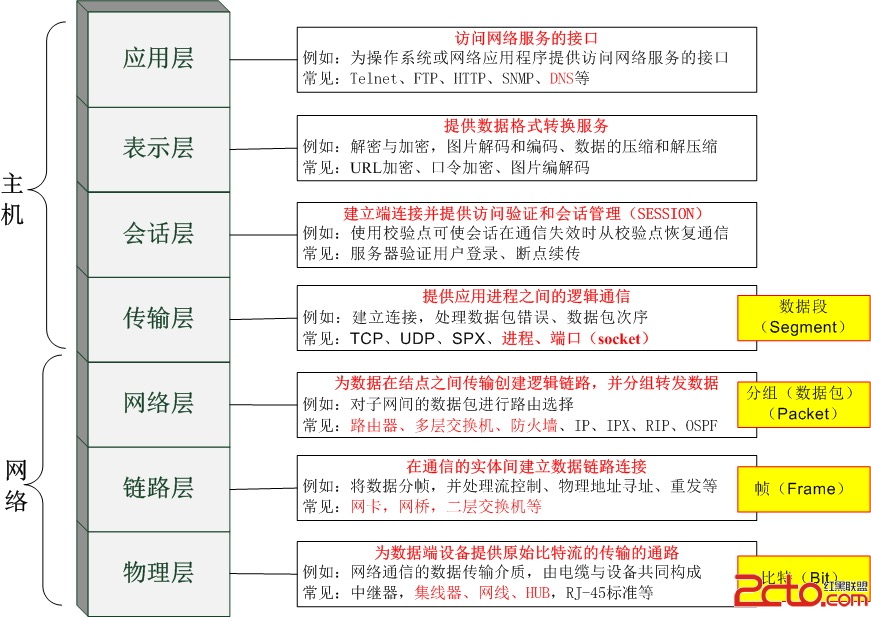
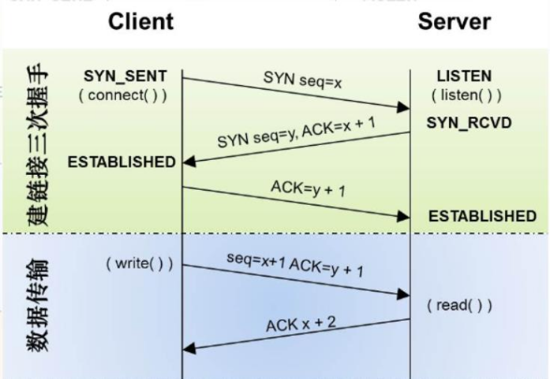

[TOC]


# Linux运维面试精华

# 必背

## 1、什么是运维？什么是游戏运维？

1）运维是指大型组织已经建立好的网络软硬件的维护，就是要保证业务的上线与运作的正常，在他运转的过程中，对他进行维护，他集合了网络、系统、数据库、开发、安全、监控于一身的技术，运维又包括很多种，有DBA运维、网站运维、虚拟化运维、监控运维、游戏运维等等

2）游戏运维又有分工，分为开发运维、应用运维（业务运维）和系统运维

开发运维：是给应用运维开发运维工具和运维平台的
应用运维：是给业务上线、维护和做故障排除的，用开发运维开发出来的工具给业务上线、维护、做故障排查
系统运维：是给应用运维提供业务上的基础设施，比如：系统、网络、监控、硬件等等

总结：开发运维和系统运维给应用运维提供了“工具”和“基础设施”上的支撑

开发运维、应用运维和系统运维他们的工作是环环相扣的

## 2、在工作中，运维人员经常需要跟运营人员打交道，请问运营人员是做什么工作的？

游戏运营要做的一个事情除了协调工作以外，还需要与各平台沟通，做好开服的时间、开服数、用户导量、活动等计划

## 3、现在给你三百台服务器，你怎么对他们进行管理？

管理3百台服务器的方式：
1）设定跳板机，使用统一账号登录，便于安全与登录的考量。
2）使用salt、ansiable、puppet进行系统的统一调度与配置的统一管理。
3）建立简单的服务器的系统、配置、应用的cmdb信息管理。便于查阅每台服务器上的各种信息记录。

## **4、简述raid0 raid1 raid5 三种工作模式的工作原理及特点**

RAID，可以把硬盘整合成一个大磁盘，还可以在大磁盘上再分区，放数据
还有一个大功能，多块盘放在一起可以有冗余（备份）
RAID整合方式有很多，常用的：0 1 5 10

RAID 0，可以是一块盘和N个盘组合

其优点读写快，是RAID中最好的
缺点：没有冗余，一块坏了数据就全没有了

RAID 1，只能2块盘，盘的大小可以不一样，以小的为准

10G+10G只有10G，另一个做备份。它有100%的冗余，缺点：浪费资源，成本高

RAID 5 ，3块盘，容量计算10*（n-1）,损失一块盘

特点，读写性能一般，读还好一点，写不好

冗余从好到坏：RAID1 RAID10 RAID 5 RAID0

性能从好到坏：RAID0 RAID10 RAID5 RAID1

成本从低到高：RAID0 RAID5 RAID1 RAID10

 

单台服务器：很重要盘不多，系统盘，RAID1

数据库服务器：主库：RAID10 从库 RAID5RAID0（为了维护成本，RAID10）

WEB服务器，如果没有太多的数据的话，RAID5,RAID0（单盘）

有多台，监控、应用服务器，RAID0 RAID5

我们会根据数据的存储和访问的需求，去匹配对应的RAID级别

 

## **5、LVS、Nginx、HAproxy有什么区别？工作中你怎么选择？**

LVS：是基于四层的转发
HAproxy：是基于四层和七层的转发，是专业的代理服务器
Nginx：是WEB服务器，缓存服务器，又是反向代理服务器，可以做七层的转发

**区别**：LVS由于是基于四层的转发所以只能做端口的转发，而基于URL的、基于目录的这种转发LVS就做不了

**工作选择**：

HAproxy和Nginx由于可以做七层的转发，所以URL和目录的转发都可以做，在很大并发量的时候我们就要选择LVS，像中小型公司的话并发量没那么大，选择HAproxy或者Nginx足已，由于HAproxy由是专业的代理服务器，配置简单，所以中小型企业推荐使用HAproxy

## **6、Squid、Varinsh和Nginx有什么区别，工作中你怎么选择？**

Squid、Varinsh和Nginx都是代理服务器

什么是代理服务器：

能当替用户去访问公网，并且能把访问到的数据缓存到服务器本地，等用户下次再访问相同的资源的时候，代理服务器直接从本地回应给用户，当本地没有的时候，我代替你去访问公网，我接收你的请求，我先在我自已的本地缓存找，如果我本地缓存有，我直接从我本地的缓存里回复你，如果我在我本地没有找到你要访问的缓存的数据，那么代理服务器就会代替你去访问公网

**区别：**

1）Nginx本来是反向代理/web服务器，用了插件可以做做这个副业但是本身不支持特性挺多，只能缓存静态文件

2）从这些功能上。varnish和squid是专业的cache服务，而nginx这些是第三方模块完成

3）varnish本身的技术上优势要高于squid，它采用了可视化页面缓存技术

 

在内存的利用上，Varnish比Squid具有优势，性能要比Squid高。

还有强大的通过Varnish管理端口，可以使用正则表达式快速、批量地清除部分缓存

它是内存缓存，速度一流，但是内存缓存也限制了其容量，缓存页面和图片一般是挺好的

4）squid的优势在于完整的庞大的cache技术资料，和很多的应用生产环境

工作中选择：

要做cache服务的话，我们肯定是要选择专业的cache服务，优先选择squid或者varnish。

## **7、Tomcat和Resin有什么区别，工作中你怎么选择？**

区别：Tomcat用户数多，可参考文档多，Resin用户数少，可考虑文档少
最主要区别则是Tomcat是标准的java容器，不过性能方面比resin的要差一些
但稳定性和java程序的兼容性，应该是比resin的要好

工作中选择：现在大公司都是用resin，追求性能；而中小型公司都是用Tomcat，追求稳定和程序的兼容

## **8、什么是中间件？什么是jdk？**

中间件介绍：

中间件是一种独立的系统软件或服务程序，分布式应用软件借助这种软件在不同的技术之间共享资源

中间件位于客户机/ 服务器的操作系统之上，管理计算机资源和网络通讯
是连接两个独立应用程序或独立系统的软件。相连接的系统，即使它们具有不同的接口

但通过中间件相互之间仍能交换信息。执行中间件的一个关键途径是信息传递，通过中间件，应用程序可以工作于多平台或OS环境。

jdk：jdk是Java的开发工具包，它是一种用于构建在 Java 平台上发布的应用程序、applet 和组件的开发环境

## **9、讲述一下Tomcat8005、8009、8080三个端口的含义？**

8005==》 关闭时使用

8009==》 为AJP端口，即容器使用，如Apache能通过AJP协议访问Tomcat的8009端口

8080==》 一般应用使用

 

## **10、什么叫CDN？**

1.即内容分发网络

2.其目的是通过在现有的Internet中增加一层新的网络架构，将网站的内容发布到最接近用户的网络边缘，使用户可就近取得所需的内容，提高用户访问网站的速度

 

## **11、什么叫网站灰度发布？**

灰度发布是指在黑与白之间，能够平滑过渡的一种发布方式

 

AB test就是一种灰度发布方式，让一部用户继续用A，一部分用户开始用B，如果用户对B没有什么反对意见，那么逐步扩大范围，把所有用户都迁移到B上面来灰度发布可以保证整体系统的稳定，在初始灰度的时候就可以发现、调整问题，以保证其影响度

## **12、简述DNS进行域名解析的过程？**

用户要访问www.baidu.com，会先找本机的host文件，再找本地设置的DNS服务器，如果也没有的话，就去网络中找根服务器，根服务器反馈结果，说只能提供一级域名服务器.cn，就去找一级域名服务器，一级域名服务器说只能提供二级域名服务器.com.cn,就去找二级域名服务器，二级域服务器只能提供三级域名服务器.baidu.com.cn，就去找三级域名服务器，三级域名服务器正好有这个网站www.baidu.com，然后发给请求的服务器，保存一份之后，再发给客户端

13、RabbitMQ是什么东西？

RabbitMQ也就是消息队列中间件，消息中间件是在消息的传息过程中保存消息的容器
消息中间件再将消息从它的源中到它的目标中标时充当中间人的作用
队列的主要目的是提供路由并保证消息的传递；如果发送消息时接收者不可用
消息队列不会保留消息，直到可以成功地传递为止，当然，消息队列保存消息也是有期限地

## **14、讲一下Keepalived的工作原理？**

在一个虚拟路由器中，只有作为MASTER的VRRP路由器会一直发送VRRP通告信息,
BACKUP不会抢占MASTER，除非它的优先级更高。当MASTER不可用时(BACKUP收不到通告信息)
多台BACKUP中优先级最高的这台会被抢占为MASTER。这种抢占是非常快速的(<1s)，以保证服务的连续性
由于安全性考虑，VRRP包使用了加密协议进行加密。BACKUP不会发送通告信息，只会接收通告信息

## **15、讲述一下LVS三种模式的工作过程？**

LVS 有三种负载均衡的模式，分别是VS/NAT（nat 模式） VS/DR(路由模式) VS/TUN（隧道模式）

**一、NAT模式（VS-NAT）**

**原理**：就是把客户端发来的数据包的IP头的目的地址，在负载均衡器上换成其中一台RS的IP地址
并发至此RS来处理,RS处理完后把数据交给负载均衡器,负载均衡器再把数据包原IP地址改为自己的IP
将目的地址改为客户端IP地址即可期间,无论是进来的流量,还是出去的流量,都必须经过负载均衡器
**优点**：集群中的物理服务器可以使用任何支持TCP/IP操作系统，只有负载均衡器需要一个合法的IP地址
**缺点**：扩展性有限。当服务器节点（普通PC服务器）增长过多时,负载均衡器将成为整个系统的瓶颈
因为所有的请求包和应答包的流向都经过负载均衡器。当服务器节点过多时
大量的数据包都交汇在负载均衡器那，速度就会变慢！

**二、IP隧道模式（VS-TUN）**

**原理**：首先要知道，互联网上的大多Internet服务的请求包很短小，而应答包通常很大
那么隧道模式就是，把客户端发来的数据包，封装一个新的IP头标记(仅目的IP)发给RS
RS收到后,先把数据包的头解开,还原数据包,处理后,直接返回给客户端,不需要再经过
负载均衡器。注意,由于RS需要对负载均衡器发过来的数据包进行还原,所以说必须支持
IPTUNNEL协议，所以,在RS的内核中,必须编译支持IPTUNNEL这个选项
**优点**：负载均衡器只负责将请求包分发给后端节点服务器，而RS将应答包直接发给用户
所以，减少了负载均衡器的大量数据流动，负载均衡器不再是系统的瓶颈，就能处理很巨大的请求量
这种方式，一台负载均衡器能够为很多RS进行分发。而且跑在公网上就能进行不同地域的分发。
**缺点**：隧道模式的RS节点需要合法IP，这种方式需要所有的服务器支持”IP Tunneling”
(IP Encapsulation)协议，服务器可能只局限在部分Linux系统上

**三、直接路由模式（VS-DR）**

**原理**：负载均衡器和RS都使用同一个IP对外服务但只有DR对ARP请求进行响应
所有RS对本身这个IP的ARP请求保持静默也就是说,网关会把对这个服务IP的请求全部定向给DR
而DR收到数据包后根据调度算法,找出对应的RS,把目的MAC地址改为RS的MAC（因为IP一致）
并将请求分发给这台RS这时RS收到这个数据包,处理完成之后，由于IP一致，可以直接将数据返给客户
则等于直接从客户端收到这个数据包无异,处理后直接返回给客户端
由于负载均衡器要对二层包头进行改换,所以负载均衡器和RS之间必须在一个广播域
也可以简单的理解为在同一台交换机上
**优点**：和TUN（隧道模式）一样，负载均衡器也只是分发请求，应答包通过单独的路由方法返回给客户端
与VS-TUN相比，VS-DR这种实现方式不需要隧道结构，因此可以使用大多数操作系统做为物理服务器。
**缺点**：（不能说缺点，只能说是不足）要求负载均衡器的网卡必须与物理网卡在一个物理段上。

## **16、mysql的innodb如何定位锁问题，mysql如何减少主从复制延迟？**

mysql的innodb如何定位锁问题:
在使用 show engine innodb status检查引擎状态时，发现了死锁问题
在5.5中，information_schema 库中增加了三个关于锁的表（MEMORY引擎）
innodb_trx         ## 当前运行的所有事务
innodb_locks     ## 当前出现的锁
innodb_lock_waits  ## 锁等待的对应关系

mysql如何减少主从复制延迟:

如果延迟比较大，就先确认以下几个因素：

1.从库硬件比主库差，导致复制延迟

2.主从复制单线程，如果主库写并发太大，来不及传送到从库就会导致延迟。

3.更高版本的mysql可以支持多线程复制

4.慢SQL语句过多

5.网络延迟

6.master负载，主库读写压力大，导致复制延迟，架构的前端要加buffer及缓存层

7.slave负载，一般的做法是，使用多台slave来分摊读请求，再从这些slave中取一台专用的服务器，只作为备份用，不进行其他任何操作.另外， 2个可以减少延迟的参数:–slave-net-timeout=seconds 单位为秒 默认设置为 3600秒

参数含义：当slave从主数据库读取log数据失败后，等待多久重新建立连接并获取数据

–master-connect-retry=seconds 单位为秒 默认设置为 60秒

参数含义：当重新建立主从连接时，如果连接建立失败，间隔多久后重试

通常配置以上2个参数可以减少网络问题导致的主从数据同步延迟

**MySQL数据库主从同步延迟解决方案**

最简单的减少slave同步延时的方案就是在架构上做优化，尽量让主库的DDL快速执行，还有就是主库是写，对数据安全性较高，比如sync_binlog=1，innodb_flush_log_at_trx_commit= 1 之类的设置，而slave则不需要这么高的数据安全，完全可以讲sync_binlog设置为0或者关闭binlog，innodb_flushlog也可以设置为0来提高sql的执行效率。另外就是使用比主库更好的硬件设备作为slave

## **17、如何重置mysql root密码？**

一、 在已知MYSQL数据库的ROOT用户密码的情况下，修改密码的方法：

1、 在SHELL环境下，使用mysqladmin命令设置：
      mysqladmin –u root –p password “新密码”   回车后要求输入旧密码

2、 在mysql>环境中,使用update命令，直接更新mysql库user表的数据：

​      Update  mysql.user  set  password=password(‘新密码’)  where  user=’root’;
​      flush   privileges;
​      注意：mysql语句要以分号”；”结束

3、 在mysql>环境中，使用grant命令，修改root用户的授权权限。

​      grant  all  on  *.*  to   root@’localhost’  identified  by  ‘新密码’；

二、 如查忘记了mysql数据库的ROOT用户的密码，又如何做呢？方法如下：

1、 关闭当前运行的mysqld服务程序：service  mysqld  stop（要先将mysqld添加为系统服务）
2、 使用mysqld_safe脚本以安全模式（不加载授权表）启动mysqld 服务
      /usr/local/mysql/bin/mysqld_safe  –skip-grant-table  &
3、 使用空密码的root用户登录数据库，重新设置ROOT用户的密码
     ＃mysql  -u   root
      Mysql> Update  mysql.user  set  password=password(‘新密码’)  where  user=’root’;
      Mysql> flush   privileges;

## **18、lvs/nginx/haproxy优缺点**

Nginx的优点是：
1、工作在网络的7层之上，可以针对http应用做一些分流的策略，比如针对域名、目录结构，它的正则规则比HAProxy更为强大和灵活，这也是它目前广泛流行的主要原因之一，Nginx单凭这点可利用的场合就远多于LVS了。

2、Nginx对网络稳定性的依赖非常小，理论上能ping通就就能进行负载功能，这个也是它的优势之一，相反LVS对网络稳定性依赖比较大，这点本人深有体会；

3、Nginx安装和配置比较简单，测试起来比较方便，它基本能把错误用日志打印出来，LVS的配置、测试就要花比较长的时间了，LVS对网络依赖比较大。

4、可以承担高负载压力且稳定，在硬件不差的情况下一般能支撑几万次的并发量，负载度比LVS相对小些。

5、Nginx可以通过端口检测到服务器内部的故障，比如根据服务器处理网页返回的状态码、超时等等，并且会把返回错误的请求重新提交到另一个节点，不过其中缺点就是不支持url来检测。比如用户正在上传一个文件，而处理该上传的节点刚好在上传过程中出现故障，Nginx会把上传切到另一台服务器重新处理，而LVS就直接断掉了，如果是上传一个很大的文件或者很重要的文件的话，用户可能会因此而不满。

6、Nginx不仅仅是一款优秀的负载均衡器/反向代理软件，它同时也是功能强大的Web应用服务器，LNMP也是近几年非常流行的web架构，在高流量的环境中稳定性也很好。

7、Nginx现在作为Web反向加速缓存越来越成熟了，速度比传统的Squid服务器更快，可考虑用其作为反向代理加速器

8、Nginx可作为中层反向代理使用，这一层面Nginx基本上无对手，唯一可以对比Nginx的就只有lighttpd了，不过lighttpd目前还没有做到Nginx完全的功能，配置也不那么清晰易读，社区资料也远远没Nginx活跃

9、Nginx也可作为静态网页和图片服务器，这方面的性能也无对手。还有Nginx社区非常活跃，第三方模块也很多

 

**Nginx的缺点是：**

1、Nginx仅能支持http、https和Email协议，这样就在适用范围上面小些，这个是它的缺点
2、对后端服务器的健康检查，只支持通过端口来检测，不支持通过url来检测
     不支持Session的直接保持，但能通过ip_hash来解决

LVS：使用Linux内核集群实现一个高性能、高可用的负载均衡服务器，它具有很好的可伸缩性（Scalability)、可靠性（Reliability)和可管理性（Manageability)

**LVS的优点是**：

1、抗负载能力强、是工作在网络4层之上仅作分发之用，没有流量的产生，这个特点也决定了它在负载均衡软件里的性能最强的，对内存和cpu资源消耗比较低

2、配置性比较低，这是一个缺点也是一个优点，因为没有可太多配置的东西，所以并不需要太多接触，大大减少了人为出错的几率

3、工作稳定，因为其本身抗负载能力很强，自身有完整的双机热备方案，如LVS+Keepalived，不过我们在项目实施中用得最多的还是LVS/DR+Keepalived

4、无流量，LVS只分发请求，而流量并不从它本身出去，这点保证了均衡器IO的性能不会收到大流量的影响。

5、应用范围较广，因为LVS工作在4层，所以它几乎可对所有应用做负载均衡，包括http、数据库、在线聊天室等

**LVS的缺点是：**

1、软件本身不支持正则表达式处理，不能做动静分离
     而现在许多网站在这方面都有较强的需求，这个是Nginx/HAProxy+Keepalived的优势所在
2、如果是网站应用比较庞大的话，LVS/DR+Keepalived实施起来就比较复杂了，特别后面有Windows Server的机器的话，如果实施及配置还有维护过程就比较复杂了，相对而言，Nginx/HAProxy+Keepalived就简单多了。

**HAProxy的特点是：**

1、HAProxy也是支持虚拟主机的。

2、HAProxy的优点能够补充Nginx的一些缺点，比如支持Session的保持，Cookie的引导，同时支持通过获取指定的url来检测后端服务器的状态

3、HAProxy跟LVS类似，本身就只是一款负载均衡软件，单纯从效率上来讲HAProxy会比Nginx有更出色的负载均衡速度，在并发处理上也是优于Nginx的

4、HAProxy支持TCP协议的负载均衡转发，可以对MySQL读进行负载均衡，对后端的MySQL节点进行检测和负载均衡，大家可以用LVS+Keepalived对MySQL主从做负载均衡

5、HAProxy负载均衡策略非常多，HAProxy的负载均衡算法现在具体有如下8种：

①roundrobin，表示简单的轮询，这个不多说，这个是负载均衡基本都具备的；
② static-rr，表示根据权重，建议关注；
③leastconn，表示最少连接者先处理，建议关注；
④ source，表示根据请求源IP，这个跟Nginx的IP_hash机制类似
    我们用其作为解决session问题的一种方法，建议关注；
⑤ri，表示根据请求的URI；
⑥rl_param，表示根据请求的URl参数’balance url_param’ requires an URL parameter name；
⑦hdr(name)，表示根据HTTP请求头来锁定每一次HTTP请求；
⑧rdp-cookie(name)，表示根据据cookie(name)来锁定并哈希每一次TCP请求。

## **19、mysql数据备份工具**

mysqldump工具，mysqldump是mysql自带的备份工具，目录在bin目录下面：/usr/local/mysql/bin/mysqldump，支持基于innodb的热备份，但是由于是逻辑备份，所以速度不是很快，适合备份数据比较小的场景，Mysqldump完全备份+二进制日志可以实现基于时间点的恢复。

**基于LVM快照备份**

在物理备份中，有基于文件系统的物理备份（LVM的快照），也可以直接用tar之类的命令对整个数据库目录
进行打包备份，但是这些只能进行泠备份，不同的存储引擎备份的也不一样，myisam自动备份到表级别
而innodb不开启独立表空间的话只能备份整个数据库。

**tar包备份**

percona提供的xtrabackup工具，支持innodb的物理热备份，支持完全备份，增量备份，而且速度非常快，支持innodb存储引起的数据在不同，数据库之间迁移，支持复制模式下的从机备份恢复备份恢复，为了让xtrabackup支持更多的功能扩展，可以设立独立表空间，打开 innodb_file_per_table功能，启用之后可以支持单独的表备份

## **20、keepalive的工作原理和如何做到健康检查**

keepalived是以VRRP协议为实现基础的，VRRP全称Virtual Router Redundancy Protocol，即虚拟路由冗余协议。

虚拟路由冗余协议，可以认为是实现路由器高可用的协议，即将N台提供相同功能的路由器组成一个路由器组
这个组里面有一个master和多个backup，master上面有一个对外提供服务的vip（该路由器所在局域网内
其他机器的默认路由为该vip），master会发组播，当backup收不到vrrp包时就认为master宕掉了
这时就需要根据VRRP的优先级来选举一个backup当master。这样就可以保证路由器的高可用了

keepalived主要有三个模块，分别是core、check和vrrp。core模块为keepalived的核心，负责主进程的启动、维护及全局配置文件的加载和解析。check负责健康检查，包括常见的各种检查方式，vrrp模块是来实现VRRP协议的

 

Keepalived健康检查方式配置

```
HTTP_GET|SSL_GET
HTTP_GET | SSL_GET
{
url {
path /# HTTP/SSL 检查的url可以是多个
digest  # HTTP/SSL 检查后的摘要信息用工具genhash生成
status_code 200# HTTP/SSL 检查返回的状态码
}
connect_port 80 # 连接端口
bindtoconnect_timeout 3 # 连接超时时间
nb_get_retry 3 # 重连次数
delay_before_retry 2 #连接间隔时间
}
```

 

 

## 21、统计ip访问情况，要求分析nginx访问日志，找出访问页面数量在前十位的ip

```
cat access.log | awk '{print $1}' | uniq -c | sort -rn | head -10
```

## 22、使用tcpdump监听主机为192.168.1.1，tcp端口为80的数据，同时将输出结果保存输出到tcpdump.log

```
tcpdump ‘host 192.168.1.1 and port 80’ > tcpdump.log
```

## 23、如何将本地80 端口的请求转发到8080 端口，当前主机IP 为192.168.2.1

```
iptables -A PREROUTING -d 192.168.2.1 -p tcp -m tcp -dport 80 -j DNAT-to-destination 192.168.2.1:8080
```

## 24、简述raid0 raid1 raid5 三种工作模式的工作原理及特点

**raid0 （条带卷）：**

需要几块硬盘 至少是一块硬盘，可以把所有硬盘的容量都叠加在一起； 拥有最高的读写速度，磁盘空间没有被浪费但是只要其中一块硬盘坏了，数据就全丢了。

 

**raid1（镜像卷）：**

只能是两块硬盘，读的速度相当于一块盘的速度，写的速度慢了一半，因为写的时候，一边正常写入，一边备份。磁盘空间被浪费了一半XXIV可以损坏一块盘

 

**raid5（奇偶校验卷）：**

至少需要 3 块盘及以上，读的速度快，写得速度慢，因为每次写入之后，都需要校验（奇偶校验）。损失一块盘的容量。

最多可以损坏一块。（还有一个热备盘，什么也不干，作为预备盘。）

 

**raid6：**

最少 4 块盘，5 块盘也可以，损失 2 块盘，不管硬盘多少，只损失两块盘容量。

 

**raid10：**

raid0 与 raid1 的组合：

至少需要 4 块硬盘，磁盘的数量必须是偶数（因为 raid1 必须是两块盘才能组合），读写速度都很快，损失了一半的容量，不管有多少盘，最多可以损坏两块盘，不支持虚拟磁盘。

 

1. raid0：追求性能，不需要保证数据的安全 mysql slave 数据库从库（数据库的小弟），集群的节

点。

2. raid1：安全性，对性能要求不高，对数据安全性高（有冗余）成本比较高。

3. raid5：对于性能要求不高 用户并发比较小

4. raid10：价格贵、性能好、安全性高、一般是用于数据库的主库。


## 25、你对现在运维工程师的理解和以及对其工作的认识

运维工程师在公司当中责任重大，需要保证时刻为公司及客户提供最高、最快、最稳定、最安全的服务
运维工程师的一个小小的失误，很有可能会对公司及客户造成重大损失
因此运维工程师的工作需要严谨及富有创新精神

## 26、实时抓取并显示当前系统中tcp 80端口的网络数据信息，请写出完整操作命令

```
tcpdump -nn tcp port 80
```

## 27、服务器开不了机怎么解决一步步的排查

A、造成服务器故障的原因可能有以下几点：

1.服务器电源有问题

2.服务器系统文件丢失，硬件问题，散热不良造成蓝屏和死机

3.服务器网络参数配置有误，物理链路原因等 

B、如何排查服务器故障的处理步骤如下：

 

## 28、Linux系统中病毒怎么解决

1）最简单有效的方法就是重装系统
2）要查的话就是找到病毒文件然后删除
中毒之后一般机器cpu、内存使用率会比较高，机器向外发包等异常情况，排查方法简单介绍下，top 命令找到cpu使用率最高的进程，一般病毒文件命名都比较乱，可以用 ps aux 找到病毒文件位置，rm -f  命令删除病毒文件，检查计划任务、开机启动项和病毒文件目录有无其他可以文件等

3）由于即使删除病毒文件不排除有潜伏病毒，所以最好是把机器备份数据之后重装一下

## 29、发现一个病毒文件你删了他又自动创建怎么解决

公司的内网某台linux服务器流量莫名其妙的剧增,用iftop查看有连接外网的情况
针对这种情况一般重点查看netstat连接的外网ip和端口。用lsof -p pid可以查看到具体是那些进程，哪些文件，经查勘发现/root下有相关的配置conf.n hhe两个可疑文件，rm -rf后不到一分钟就自动生成了，由此推断是某个母进程产生的这些文件。所以找到母进程就是找到罪魁祸首

查杀病毒最好断掉外网访问，还好是内网服务器，可以通过内网访问

断了内网，病毒就失去外联的能力，杀掉它就容易的多，怎么找到呢，找了半天也没有看到蛛丝马迹，没办法只有ps axu一个个排查，方法是查看可以的用户和和系统相似而又不是的冒牌货，果然，看到了如下进程可疑，看不到图片就是/usr/bin/.sshd，于是我杀掉所有.sshd相关的进程，然后直接删掉.sshd这个可执行文件，然后才删掉了文章开头提到的自动复活的文件

总结一下，遇到这种问题，如果不是太严重，尽量不要重装系统

一般就是先断外网，然后利用iftop,ps,netstat,chattr,lsof,pstree这些工具顺藤摸瓜
一般都能找到元凶。但是如果遇到诸如此类的问题
/boot/efi/EFI/redhat/grub.efi: Heuristics.Broken.Executable FOUND，个人觉得就要重装系统了

## 30、说说TCP/IP的七层模型

应用层 (Application)：
网络服务与最终用户的一个接口。
协议有：HTTP FTP TFTP SMTP SNMP DNS TELNET HTTPS POP3 DHCP

表示层（Presentation Layer）：

数据的表示、安全、压缩。（在五层模型里面已经合并到了应用层）
格式有，JPEG、ASCll、DECOIC、加密格式等

会话层（Session Layer）：

建立、管理、终止会话。（在五层模型里面已经合并到了应用层）
对应主机进程，指本地主机与远程主机正在进行的会话

传输层 (Transport)：

定义传输数据的协议端口号，以及流控和差错校验。
协议有：TCP UDP，数据包一旦离开网卡即进入网络传输层

网络层 (Network)：

进行逻辑地址寻址，实现不同网络之间的路径选择。
协议有：ICMP IGMP IP（IPV4 IPV6） ARP RARP

数据链路层 (Link)：

建立逻辑连接、进行硬件地址寻址、差错校验等功能。（由底层网络定义协议）
将比特组合成字节进而组合成帧，用MAC地址访问介质，错误发现但不能纠正

物理层（Physical Layer）：

是计算机网络OSI模型中最低的一层

物理层规定:为传输数据所需要的物理链路创建、维持、拆除
而提供具有机械的，电子的，功能的和规范的特性

简单的说，物理层确保原始的数据可在各种物理媒体上传输。局域网与广域网皆属第1、2层

物理层是OSI的第一层，它虽然处于最底层，却是整个开放系统的基础
物理层为设备之间的数据通信提供传输媒体及互连设备，为数据传输提供可靠的环境
如果您想要用尽量少的词来记住这个第一层，那就是“信号和介质”

 

## 31、你常用的Nginx模块，用来做什么

rewrite模块，实现重写功能
access模块：来源控制
ssl模块：安全加密
ngx_http_gzip_module：网络传输压缩模块
ngx_http_proxy_module 模块实现代理
ngx_http_upstream_module模块实现定义后端服务器列表
ngx_cache_purge实现缓存清除功能

## 32、请列出你了解的web服务器负载架构

```
Nginx
Haproxy
Keepalived
LVS
```

## 33、查看http的并发请求数与其TCP连接状态

```
netstat -n | awk ‘/^tcp/ {++S[$NF]} END {for(a in S) print a, S[a]}’
```

还有ulimit -n 查看linux系统打开最大的文件描述符，这里默认1024
不修改这里web服务器修改再大也没用，若要用就修改很几个办法，这里说其中一个：
修改/etc/security/limits.conf

- soft nofile 10240

- hard nofile 10240

  重启后生效

## 34、用tcpdump嗅探80端口的访问看看谁最高

```
tcpdump -i eth0 -tnn dst port 80 -c 1000 | awk -F”.” ‘{print $1″.”$2″.”$3″.”$4}’| sort | uniq -c | sort -nr |head -20
```

35、写一个脚本，实现判断192.168.1.0/24网络里，当前在线的IP有哪些，能ping通则认为在线

```
for ip in seq 1 255
do
{
ping -c 1 192.168.1.$ip > /dev/null 2>&1
if [ $? -eq 0 ]; then
echo 192.168.1.$ip UP
else
echo 192.168.1.$ip DOWN
fi
}&
done
wait
```

## 36、已知 apache 服务的访问日志按天记录在服务器本地目录/app/logs 下，由于磁盘空间紧张现在要求只能保留最近 7 天的访问日志！请问如何解决？请给出解决办法或配置或处理命令

```shell
创建文件脚本：
for n in seq 14
do        
date -s “11/0$n/14”
touch access_www_(date +%F).log
done
解决方法：
-rw-r–r–. 1 root root 0 Jan  1 00:00 access_www_2015-01-01.log
-rw-r–r–. 1 root root 0 Jan  2 00:00 access_www_2015-01-02.log
-rw-r–r–. 1 root root 0 Jan  3 00:00 access_www_2015-01-03.log
-rw-r–r–. 1 root root 0 Jan  4 00:00 access_www_2015-01-04.log
-rw-r–r–. 1 root root 0 Jan  5 00:00 access_www_2015-01-05.log
-rw-r–r–. 1 root root 0 Jan  6 00:00 access_www_2015-01-06.log
-rw-r–r–. 1 root root 0 Jan  7 00:00 access_www_2015-01-07.log
-rw-r–r–. 1 root root 0 Jan  8 00:00 access_www_2015-01-08.log
-rw-r–r–. 1 root root 0 Jan  9 00:00 access_www_2015-01-09.log
-rw-r–r–. 1 root root 0 Jan 10 00:00 access_www_2015-01-10.log
-rw-r–r–. 1 root root 0 Jan 11 00:00 access_www_2015-01-11.log
-rw-r–r–. 1 root root 0 Jan 12 00:00 access_www_2015-01-12.log
-rw-r–r–. 1 root root 0 Jan 13 00:00 access_www_2015-01-13.log
-rw-r–r–. 1 root root 0 Jan 14 00:00 access_www_2015-01-14.log

也可以使用-exec rm -f {} ;进行删除
-rw-r–r–. 1 root root 0 Jan  7 00:00 access_www_2015-01-07.log
-rw-r–r–. 1 root root 0 Jan  8 00:00 access_www_2015-01-08.log
-rw-r–r–. 1 root root 0 Jan  9 00:00 access_www_2015-01-09.log
-rw-r–r–. 1 root root 0 Jan 10 00:00 access_www_2015-01-10.log
-rw-r–r–. 1 root root 0 Jan 11 00:00 access_www_2015-01-11.log
-rw-r–r–. 1 root root 0 Jan 12 00:00 access_www_2015-01-12.log
-rw-r–r–. 1 root root 0 Jan 13 00:00 access_www_2015-01-13.log
-rw-r–r–. 1 root root 0 Jan 14 00:00 access_www_2015-01-14.log
或者
find /app/logs -type f  -mtime +7 -name '*.log'|xargs rm -f
```

## 37、如何优化 Linux系统（可以不说太具体）？

不用root，添加普通用户，通过sudo授权管理
更改默认的远程连接SSH服务端口及禁止root用户远程连接
定时自动更新服务器时间
配置国内yum源
关闭selinux及iptables（iptables工作场景如果有外网IP一定要打开，高并发除外）
调整文件描述符的数量
精简开机启动服务（crond rsyslog network sshd）
内核参数优化（/etc/sysctl.conf）
更改字符集，支持中文，但建议还是用英文字符集，防止乱码
锁定关键系统文件
清空/etc/issue，去除系统及内核版本登录前的屏幕显示

## 38、请执行命令取出 linux 中 eth0 的 IP 地址(请用 cut，有能力者也可分别用 awk,sed 命令答)

```shell
cut方法1：ifconfig eth0|sed -n ‘2p’|cut -d “:” -f2|cut -d ” ” -f1192.168.20.130
awk方法2：ifconfig eth0|awk ‘NR==2’|awk -F “:” ‘{print $2}’|awk ‘{print $1}’192.168.20.130
awk多分隔符方法3：ifconfig eth0|awk ‘NR==2’|awk -F “[: ]+” ‘{print $4}’192.168.20.130
sed方法4：ifconfig eth0|sed -n ‘/inet addr/p’|sed -r ‘s#^.ddr:(.)Bc.*$##g’192.168.20.130
```

## 39、请写出下面 linux SecureCRT 命令行快捷键命令的功能？

```
Ctrl + a
Ctrl + c
Ctrl + d
Ctrl + e
Ctrl + l
Ctrl + u
Ctrl + k
tab
Ctrl+shift+c
Ctrl+shift+v

解答：
Ctrl + a —->光标移动到行首
Ctrl + e —->光标移动到行尾
Ctrl + c —->终止当前程序
Ctrl + d —->如果光标前有字符则删除，没有则退出当前中断
Ctrl + l —->清屏
Ctrl + u —->剪切光标以前的字符
Ctrl + k —->剪切光标以后的字符
Ctrl + y —->复制u/k的内容
Ctrl + r —->查找最近用过的命令
tab —->命令或路径补全
Ctrl+shift+c —->复制
Ctrl+shift+v —->粘贴
```

## 40、每天晚上 12 点，打包站点目录/var/www/html 备份到/data 目录下（最好每次备份按时间生成不同的备份包）

```shell
$ cat a.sh
#!/bin/bash
cd /var/www/ && /bin/tar zcf /data/html-date +%m-%d%H.tar.gz html/

$ crontab –e
00 00 * * * /bin/sh /root/a.sh
```

## 41、DNS 原理

相信大家可能知道 windows 或者 linux 系统层面的/etc/hosts 文件是：IP 地址与域名的对应关系。

我们一般访问网站的步骤：

打开网页-------输入网址 www.sb.com-----查看本地的 DNS 库是否存在该网站域名与对应 ip 地址的对应关系

接下来分为两种情况：

① 本地存在该网站域名相对应的 IP 地址，然后我们直接根据本地缓存的 DNS 进行解析，然后访问

该域名对应的 IP 地址，然后进行 TCP 的三次握手,进行与网站的连接，当然我们访问网站完毕之

后，我们又进行了四次挥手，然后断开连接。（后面详细解释 TCP 的三次握手与四次挥手） 

② 本地不存在该网站域名与 IP 地址的对应关系，然后我们本地的 DNS 系统，也就是 LDNS（简称

local DNS）；开始从 DNS 系统的根进行请求对 www.sb.com 域名的解析，并且针对 DNS 系统的

各个阶层进行查找，进行一级一级的查找，最终会找到 www.sb.com 这个域名，当然 DNS 系统里

这个域名的进行授权的 DNS 服务器正是我们企业购买的 DNS 服务器，反之，没有该域名相应的

解析授权的 DNS 服务器，也就表明该网站没有搭建成功。

 

总结： 

进行本地 DNS 查找以及授权 DNS 服务器的查找，获得 IP 地址，并且加载本地 DNS 的缓存 

进行建立 TCP 连接的过程（三次握手），发送 http 报文以及请求报文的细节，web 服务器的响应并且处理客户端的 

请求，关闭 TCP 连接（四次挥手）； 

 

## 41、http 常识

**http 请求方法**

GET 客户端的=请求指定资源信息，服务器返回指定资源

HEAD 只请求响应报文中的 HTTP 首部

POST 将客户端的数据提交到服务器

PUT 用从客户端向服务器传送的数据取代指定文档的文档内容

DELETE 请求服务器删除 request-URI 所标识的资源

MOVE 请求服务器将指定的页面移动至另一个网络地址

 

**http 状态码**

http 状态码是用来表示 web 服务器响应 http 请求状态的数字代码（不同的数字代表不同的含义）

一般数字码分为：

100~199 用于客户端的相应的某些动作

200~299 用于表示成功（其中的 200 最常见）

300~399 用于已经移动的文件，并且常被包括在定位头信息中指定新的地址信息（301 永久跳转）

400~499 用于指出客户端的错误（403 禁止访问、404 页面找不到）

500~599 用于服务器内部的错误（500 服务器的内部错误、502 坏的网关、504 网关超时）

 

## 43、TCP 的三次握手与四次挥手原理

 **三次握手**



**CLOSED 关闭状态：** 

为建立建立连接之前的起始点，在连接超时或者连接关闭的时候进入此状态，但是这并不是一个真正的状态，而是

这个状态图的假想起点和终点（便于我们思考与理解）。

**LISTEN 监听状态：**

服务器 server 端等待连接的状态。服务器经过 socket，bind，listen 函数之后进入此状态，开始监听客户端发

过来的连接请求。此称为应用程序被动打开（等待客户端的连接请求）。

**SYN_SENT 状态：**

第一次握手发生阶段，客户端发起连接。客户端调用 connect，发送 SYN 给服务器端，然后客户端进入 SYN_SENT状态，等待服务端的确认（三次握手中的第二个报文）。如果服务器端不能连接，则客户端直接进入 CLOSED 状态。 

**SYN_RCVD 状态：**

第二次握手发生阶段，这里是服务器端接收到了客户端的 SYN 请求，此时服务端由 LISTEN 进入 SYN_RCVD 状态，同时服务器端回应一个 ACK，然后再发送一个 SYN 即 SYN+ACK 给客户端。

状态图中还描绘了这样一种情况，当客户端在发送 SYN 的同时也收到服务器端的 SYN 请求，即两个同时发起连接请求，那么客户端就会从 SYN_SENT 转换到 SYN_REVD 状态。

**ESTABLISHED 状态：**

第三次握手发生阶段，客户端接收到服务器端的 ACK 包（ACK，SYN）之后，也会发送一个 ACK 确认包，客户端进入 ESTABLISHED 状态，表明客户端这边已经准备好，但 TCP 需要两端都准备好才可以进行数据传输。服务器端收到客户端的 ACK 之后会从 SYN_RCVD 状态转移到 ESTABLISHED 状态，表明服务器端也准备好进行数据传输了。 

**总结：**

客户端和服务器端都变为 ESTABLISHED 状态，就可以进行数据的传输了；当然 ESTABLISHED 也可以说是一个数据传送状态。

**四次挥手**


**FIN_WAIT_1 状态：**

第一次挥手 主动关闭的一方（执行主动关闭的一方既可以是客户端，也可以是服务器端，我们这里以客户端执行主动关闭为例子），终止连接时，发送 FIN 给对方，然后等待对方返回 ACK 。第一次挥手客户端就进入 fin_wait_1状态。

**CLOSE_WAIT 状态：**

接收到 FIN 之后，被动关闭的一方进入 close_wait 状态。进入该状态的具体动作是接收到客户端发来的 FIN，同时服务端对客户端发送 ACK。 CLOSE_WAIT 状态：可以理解为被动关闭的一方此时正在等待上层应用程序发出关闭连接指令。TCP 关闭是全双工过程，这里客户端执行了主动关闭，被动方服务器端接收到 FIN 后也需要调用 close 关闭，这个 CLOSE_WAIT 就是处于这个状态，等待关闭的请求方发送 FIN，发送了 FIN 则进入 LAST_ACK 状态。

**FIN_WAIT_2 状态：**

主动端（这里是客户端）先执行主动关闭发送 FIN，然后接收到被动方（这里是服务端）返回的 ACK 后进入此状态。

**LAST_ACK 状态：**

被动方（服务器端）发起关闭请求，发送 FIN 给对方，进入此状态，同时在接收到 ACK 时进入 CLOSED 状态。

**CLOSING 状态：**

两边同时发起关闭请求时（即主动方发送 FIN，等待被动方返回 ACK，同时被动方也发送了 FIN；主动方接收到了FIN 之后，发送 ACK 给被动方），主动方会由 FIN_WAIT_1 进入此状态，等待被动方返回 ACK。

**TIME_WAIT 状态：**

从状态变迁图会看到，四次挥手操作最后都会经过这样一个状态然后进入 CLOSED 状态。共有三个状态会进入该状态

**由 CLOSEING 状态进入：**

同时发起关闭情况下，当主动端接收到 ACK 后，进入此状态，实际上这里的同时是这样的情况：客户端发起关闭请求，发送 FIN 之后等待服务器端回应 ACK，但此时服务器端同时也发起关闭请求，也发送了 FIN，并且被客户端先于 ACK 接收到。

**由 FIN_WAIT_1 进入：**

发起关闭后，发送了 FIN，等待 ACK 的时候，正好被动方（服务器端）也发起关闭请求，发送了 FIN，这时客户端接收到了先前 ACK，也收到了对方的 FIN，然后发送 ACK（对对方 FIN 的回应），与 CLOSING 进入的状态不同的是接收到 FIN 和 ACK 的先后顺序。

**由 FIN_WAIT_2 进入：**

这是不同时的情况，主动方在完成自身发起的主动关闭请求后，接收到了对方发送过来的 FIN，然后回应 ACK。

## 44、TCP 十一种状态转移总结


## 45、MySQL 主从同步原理

mysql 主从复制用途
实时灾备，用于故障切换
读写分离，提供查询服务
备份，避免影响业务

主从部署必要条件
主库开启 binlog 日志（设置 log-bin 参数）
主从 server-id 不同
从库服务器能连通主库

主从复制原理图：


**该架构存在的问题：**

主库的宕机可能存在数据的丢失；当然从库也可能宕机，我们可以部署双从；

从库只有一个 SQL 线程，当用户的操作过多时，主库生成大量的 bin-log 二进制日志，从库可能忙不过来；

 

**数据库高可用介绍：**

我们使用的是 MHA 软件。。。

MHA 可以运行在每台 MySQL 服务器上，MHA 会定时探测集群中的 master 节点，当 master 出现故障时，它可以自动将最新数据的 slave 提升为新的 master，然后将所有其他的 slave 重新指向新的 master。整个故障转移过程对应用程序完全透明。

 

**MHA 的缺点：**

在 MHA 自动故障切换过程中，MHA 试图从宕机的主服务器上保存二进制日志，最大程度的保证数据的不丢失，但这并不总是可行的。例如，如果主服务器硬件故障或无法通过 ssh 访问，MHA 没法保存二进制日志，只进行故障转移而丢失了最新的数据。


## **Keepalived 工作原理**

 

**软件介绍**

Keepalived 软件起初是专为 LVS 负载均衡软件设计的，用来管理并监控 LVS 集群系统中各个服务节点的状态，后来又加入了可以实现高可用的 VRRP 功能。因此，Keepalived 除了能够管理 LVS 软件外，还可以作为其他服务（例如：Nginx、Haproxy、MySQL 等）的高可用解决方案软件。

 

Keepalived 采用是模块化设计，不同模块实现不同的功能；

keepalived 主要有三个模块，分别是 core、check 和 vrrp。

core：是 keepalived 的核心，负责主进程的启动和维护，全局配置文件的加载解析等

check： 负责 healthchecker(健康检查)，包括了各种健康检查方式，以及对应的配置的解析包括 LVS 的配		置解析；可基于脚本检查对 IPVS 后端服务器健康状况进行检查。

vrrp：VRRPD 子进程，VRRPD 子进程就是来实现 VRRP 协议的

 

**keepalived 高可用原理**

Keepalived 高可用服务对之间的故障切换转移，是通过 VRRP (Virtual Router Redundancy Protocol ,虚拟路

由器冗余协议）来实现的。

在 Keepalived 服务正常工作时，主 Master 节点会不断地向备节点发送（多播的方式）心跳消息 ICMP，用以告诉备 Backup 节点自己还活看，当主 Master 节点发生故障时，就无法发送心跳消息，备节点也就因此无法继续检测到来自主 Master 节点的心跳了，于是调用自身的接管程序，接管主 Master 节点的 IP 资源及服务。而当主 Master节点恢复时，备 Backup 节点又会释放主节点故障时自身接管的 IP 资源及服务，恢复到原来的备用角色。

 

**VRRP 介绍：**

VRRP ,全 称 Virtual Router Redundancy Protocol ,中文名为虚拟路由冗余协议 ，VRRP 的出现就是为了解决

静态踣甶的单点故障问题，VRRP 是通过一种竞选机制来将路由的任务交给某台 VRRP 路由器的。

 

**出现脑裂的原因****：**

一般来说，裂脑的发生，有以下几种原因：

高可用服务器对之间心跳线链路发生故障，导致无法正常通信。

因心跳线坏了（包括断了，老化）。

因网卡及相关驱动坏了，ip 配置及冲突问题（网卡直连）。

因心跳线间连接的设备故障（网卡及交换机）。

因仲裁的机器出问题（采用仲裁的方案）。

高可用服务器上开启了 iptables 防火墙阻挡了心跳消息传输。

高可用服务器上心跳网卡地址等信息配置不正确，导致发送心跳失败。

其他服务配置不当等原因，如心跳方式不同，心跳广插冲突、软件 Bug 等。

Keepalived 配置里 VRRP 实例如果 virtual_router_id 两端参数配置不一致也会导致裂脑问题发生。

 

**如何解决脑裂：**

① 同时使用串行电缆和以太网电缆连接，同时用两条心跳线路，这样一条线路坏了，另一个还是好的，依然能传

送心跳消息。

② 当检测到裂脑时强行关闭一个心跳节点（这个功能需特殊设备支持，如 Stonith、feyce）。相当于备节点接收

不到心跳消患，通过单独的线路发送关机命令关闭主节点的电源。

③ 做好对裂脑的监控报警（如邮件及手机短信等或值班）.在问题发生时人为第一时间介入仲裁，降低损失。

管理员可以通过手机回复对应数字或简单的字符串操作返回给服务器.让服务器根据指令自动处理相应故障这样解

决故障的时间更短。**Keepalived 工作原理**

 

**软件介绍**

Keepalived 软件起初是专为 LVS 负载均衡软件设计的，用来管理并监控 LVS 集群系统中各个服务节点的状态，后来又加入了可以实现高可用的 VRRP 功能。因此，Keepalived 除了能够管理 LVS 软件外，还可以作为其他服务（例如：Nginx、Haproxy、MySQL 等）的高可用解决方案软件。

 

Keepalived 采用是模块化设计，不同模块实现不同的功能；

keepalived 主要有三个模块，分别是 core、check 和 vrrp。

core：是 keepalived 的核心，负责主进程的启动和维护，全局配置文件的加载解析等

check： 负责 healthchecker(健康检查)，包括了各种健康检查方式，以及对应的配置的解析包括 LVS 的配置解析；可基于脚本检查对 IPVS 后端服务器健康状况进行检查。

vrrp：VRRPD 子进程，VRRPD 子进程就是来实现 VRRP 协议的

 

## **46、keepalived 高可用原理**

Keepalived 高可用服务对之间的故障切换转移，是通过 VRRP (Virtual Router Redundancy Protocol ,虚拟路

由器冗余协议）来实现的。

在 Keepalived 服务正常工作时，主 Master 节点会不断地向备节点发送（多播的方式）心跳消息 ICMP，用以告诉备 Backup 节点自己还活看，当主 Master 节点发生故障时，就无法发送心跳消息，备节点也就因此无法继续检测到来自主 Master 节点的心跳了，于是调用自身的接管程序，接管主 Master 节点的 IP 资源及服务。而当主 Master节点恢复时，备 Backup 节点又会释放主节点故障时自身接管的 IP 资源及服务，恢复到原来的备用角色。

 

**VRRP 介绍：**

VRRP ,全 称 Virtual Router Redundancy Protocol ,中文名为虚拟路由冗余协议 ，VRRP 的出现就是为了解决

静态踣甶的单点故障问题，VRRP 是通过一种竞选机制来将路由的任务交给某台 VRRP 路由器的。

 

**出现脑裂的原因****：**

一般来说，裂脑的发生，有以下几种原因：

高可用服务器对之间心跳线链路发生故障，导致无法正常通信。

因心跳线坏了（包括断了，老化）。

因网卡及相关驱动坏了，ip 配置及冲突问题（网卡直连）。

因心跳线间连接的设备故障（网卡及交换机）。

因仲裁的机器出问题（采用仲裁的方案）。

高可用服务器上开启了 iptables 防火墙阻挡了心跳消息传输。

高可用服务器上心跳网卡地址等信息配置不正确，导致发送心跳失败。

其他服务配置不当等原因，如心跳方式不同，心跳广插冲突、软件 Bug 等。

Keepalived 配置里 VRRP 实例如果 virtual_router_id 两端参数配置不一致也会导致裂脑问题发生。

 

**如何解决脑裂：**

① 同时使用串行电缆和以太网电缆连接，同时用两条心跳线路，这样一条线路坏了，另一个还是好的，依然能传

送心跳消息。

② 当检测到裂脑时强行关闭一个心跳节点（这个功能需特殊设备支持，如 Stonith、feyce）。相当于备节点接收

不到心跳消患，通过单独的线路发送关机命令关闭主节点的电源。

③ 做好对裂脑的监控报警（如邮件及手机短信等或值班）.在问题发生时人为第一时间介入仲裁，降低损失。

管理员可以通过手机回复对应数字或简单的字符串操作返回给服务器.让服务器根据指令自动处理相应故障这样解

决故障的时间更短。


## **47、文件删除的原理**

**删除文件但是该文件还被应用程序的调用的情况：**

对于删除命令 rm 而言，实际就是减少磁盘引用计数 i_nlink。这里就会有一个问题，如果一个文件正在被某个进程调用，而用户却执行 rm 操作把文件删除了，那么会出现什么结果呢？当用户执行 rm 操作删除文件后，再执行ls 或者其他文件管理命令，无法再找到这个文件了，但是调用这个删除的文件的进程却在继续正常执行，依然能够从文件中正确的读取及写入内容。也就是说，还需要解除该进程的对该文件的调用才行。

 

**当文件没有被调用时，执行了 rm 操作删除文件后是否还可以找回被删的文件呢？**

rm 操作只是将文件的 i_nlink 减少了，或者说置 0 了，实际就是将文件名到 inode 的链接删除了，此时，并没有删除文件的实体即（block 数据块），此时，如果及时停止机器工作，数据是可以找回的；如果此时继续写入数据，那么当新数据就可能会被分配到被删除的数据的 block 数据块，此时，文件就会被真正的回收了。

 

**如何删除文件：**

1.硬链接数为 0 与这个文件有关的所有硬链接都被删除。（使用的是 rm 命令）

2.进程调用数为 0 没有人在使用这个文件。（使用的是 lsof）

没有被彻底删除-硬链接数为 0,进程调用数不为零

解答:文件删除（硬链接）但是这个文件还有进程在调用，这个文件还没有被完全删除。最总导致磁

盘空间满了。硬链接数为零，进程调用数不为零，导致磁盘空间满了。


