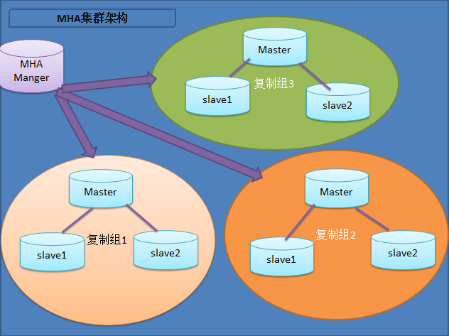
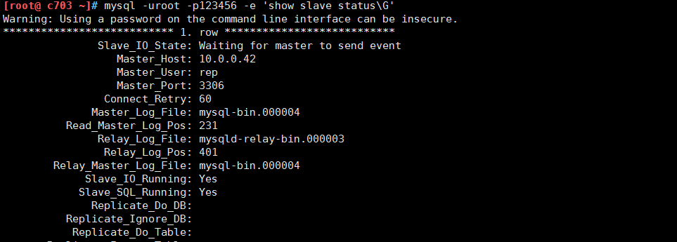
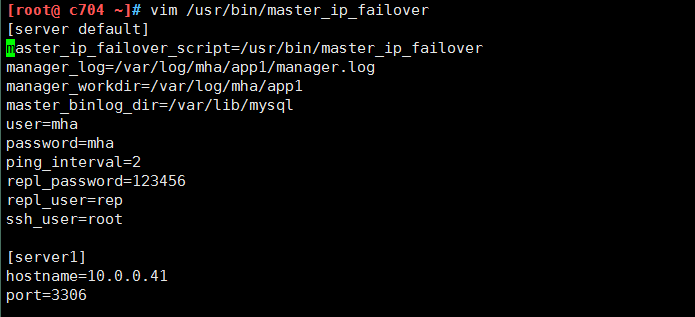

[TOC]


# Mysql高可用之MHA+Atlas读写分离


# 1. MySQL MHA架构介绍

MHA（Master High Availability）目前在MySQL高可用方面是一个相对成熟的解决方案，它由日本DeNA公司youshimaton（现就职于Facebook公司）开发，是一套优秀的作为MySQL高可用性环境下故障切换和主从提升的高可用软件。在MySQL故障切换过程中，MHA能做到在0~30秒之内自动完成数据库的故障切换操作，并且在进行故障切换的过程中，MHA能在最大程度上保证数据的一致性，以达到真正意义上的高可用。

github地址：<https://github.com/yoshinorim>

**该软件由两部分组成：MHA Manager（管理节点）和MHA Node（数据节点）。**MHA Manager可以单独部署在一台独立的机器上管理多个master-slave集群，也可以部署在一台slave节点上。MHA Node运行在每台MySQL服务器上，MHA Manager会定时探测集群中的master节点，当master出现故障时，它可以自动将最新数据的slave提升为新的master，然后将所有其他的slave重新指向新的master。整个故障转移过程对应用程序完全透明。

在MHA自动故障切换过程中，MHA试图从宕机的主服务器上保存二进制日志，最大程度的保证数据的不丢失，但这并不总是可行的。例如，如果主服务器硬件故障或无法通过ssh访问，MHA没法保存二进制日志，只进行故障转移而丢失了最新的数据。**使用MySQL 5.5的半同步复制，可以大大降低数据丢失的风险。MHA可以与半同步复制结合起来。**如果只有一个slave已经收到了最新的二进制日志，MHA可以将最新的二进制日志应用于其他所有的slave服务器上，因此可以保证所有节点的数据一致性。

目前MHA主要支持一主多从的架构，**要搭建MHA,要求一个复制集群中必须最少有三台数据库服务器，**一主二从，即一台充当master，一台充当备用master，另外一台充当从库，因为至少需要三台服务器，出于机器成本的考虑，淘宝也在该基础上进行了改造，目前淘宝TMHA已经支持一主一从。（出自：《深入浅出MySQL(第二版)》）

官方介绍：https://code.google.com/p/mysql-master-ha/


下图展示了如何通过MHA Manager管理多组主从复制。



可以将MHA工作原理总结为如下：

（1）从宕机崩溃的master保存二进制日志事件（binlog events）;
（2）识别含有最新更新的slave；
（3）应用差异的中继日志（relay log）到其他的slave；
（4）应用从master保存的二进制日志事件（binlog events）；
（5）提升一个slave为新的master；
（6）使其他的slave连接新的master进行复制；


**MHA软件由两部分组成，Manager工具包和Node工具包，具体的说明如下。**

Manager工具包主要包括以下几个工具：

```shell
masterha_check_ssh              检查MHA的SSH配置状况
masterha_check_repl             检查MySQL复制状况
masterha_manger                 启动MHA
masterha_check_status           检测当前MHA运行状态
masterha_master_monitor         检测master是否宕机
masterha_master_switch          控制故障转移（自动或者手动）
masterha_conf_host              添加或删除配置的server信息
```

Node工具包（这些工具通常由MHA Manager的脚本触发，无需人为操作）主要包括以下几个工具：

```
save_binary_logs                保存和复制master的二进制日志
apply_diff_relay_logs           识别差异的中继日志事件并将其差异的事件应用于其他的slave
filter_mysqlbinlog              去除不必要的ROLLBACK事件（MHA已不再使用这个工具）
purge_relay_logs                清除中继日志（不会阻塞SQL线程）
```


# 2. 安装部署

## 2.1 资源准备

| 主机名 |    ip     |   系统    |       角色        |                         安装软件                          |
| :----: | :-------: | :-------: | :---------------: | :-------------------------------------------------------: |
| c7m01  | 10.0.0.41 | centos7.2 |     master主      |                 mysql5.6，mha4mysql-node                  |
|  c702  | 10.0.0.42 | centos7.2 | slave02（备用主） |                 mysql5.6，mha4mysql-node                  |
|  c703  | 10.0.0.43 | centos7.2 |      slave03      |                 mysql5.6，mha4mysql-node                  |
|  c704  | 10.0.0.44 | centos7.2 |     mha+atlas     | mysql5.6-client，mha4mysql-manager，mha4mysql-node，atlas |
|        | 10.0.0.49 | centos7.2 |        VIP        |                    绑定到mysql-master                     |


## 2.2 环境准备

以下需要在四台机器上操作

**时间同步**

```shell
echo "*/5 * * * * /usr/sbin/ntpdate ntp1.aliyun.com >/dev/null 2>&1" >>/var/spool/cron/root
```

**hosts解析**

```shell
cat >>/etc/hosts<<EOF
10.0.0.41 c7m01
10.0.0.42 c702
10.0.0.43 c703
10.0.0.44 c704
EOF
```

**关闭防火墙和selinux**

```shell
systemctl   stop   firewalld.service
systemctl   disable firewalld.service

setenforce 0
sed -i  '/^SELINUX/s#enforcing#disabled#g' /etc/selinux/config
```

**互相配置ssh免密码登录**

注意：是互相，并且最好不要禁掉密码登录，如果禁了，可能会有问题。

```shell
yum -y install sshpass

#!/bin/bash
UserName=root
IPlist=(10.0.0.41 10.0.0.42 10.0.0.43 10.0.0.44 )
#创建密钥
ssh-keygen -t dsa -f ~/.ssh/id_dsa -P "" &>/dev/null
#分发公钥
for i in ${IPlist[*]}
  do
    sshpass -p "123456" ssh-copy-id -i ~/.ssh/id_dsa.pub -p 22 -o StrictHostKeyChecking=no $UserName@$i &>/dev/null
done
```


## 2.3 mysql主从配置

### 2.3.1 安装yum repo

```shell
wget http://repo.mysql.com/mysql-community-release-el7-5.noarch.rpm
rpm -ivh mysql-community-release-el7-5.noarch.rpm
yum install mysql-server mysql -y
```

注意：在新版本的CentOS7中，默认的数据库已更新为了Mariadb，而非 MySQL，所以执行 yum install mysql 命令只是更新Mariadb数据库，并不会安装 MySQL 。

### 2.3.2 启动mysql

```shell
systemctl restart mysql
```

修改密码

```shell
update mysql.user set password=password('123456') where user='root' and host='localhost';
flush privileges;
```

### 2.3.3 配置主从

**c7m01主服务器操作**

```shell
vim /etc/my.cnf

[mysqld]
server-id=1
log-bin=mysql-bin
#禁止mysql自动删除relaylog工能
relay_log_purge = 0
#mysql5.6已上的特性，开启gtid，必须主从全开
gtid_mode = on
enforce_gtid_consistency = 1
log_slave_updates = 1


#重启mysql
systemctl restart mysql
```

创建同步的用户

```shell
mysql -uroot -p123456
mysql> grant replication slave on *.* to 'rep'@'10.0.0.%' identified by '123456';
mysql> flush privileges;
```

查看mysql主库的master状态

```shell
mysql> show master status\G
*************************** 1. row ***************************
             File: mysql-bin.000001
         Position: 527
```

查看GTID状态

```shell
mysql> show global variables like '%gtid%';
+---------------------------------+------------------------------------------+
| Variable_name                   | Value                                    |
+---------------------------------+------------------------------------------+
| binlog_gtid_simple_recovery     | OFF                                      |
| enforce_gtid_consistency        | ON                                       |  #执行GTID
| gtid_executed                   | 60923edc-2d3c-11ea-8f2a-000c2967f9f8:1-2 |
| gtid_mode                       | ON                                       |	#开启GTID模块
| gtid_owned                      |                                          |
| gtid_purged                     |                                          |
| simplified_binlog_gtid_recovery | OFF                                      |
+---------------------------------+------------------------------------------+
```


**c702从服务器操作**

```shell
vim /etc/my.cnf

[mysqld]
server-id=2
log-bin=mysql-bin
#禁止mysql自动删除relaylog工能
relay_log_purge = 0
#mysql5.6已上的特性，开启gtid，必须主从全开
gtid_mode = on
enforce_gtid_consistency = 1
log_slave_updates = 1


#重启mysql
systemctl restart mysql
```

创建同步的用户

```shell
mysql -uroot -p123456
mysql> grant replication slave on *.* to 'rep'@'10.0.0.%' identified by '123456';
mysql> flush privileges;
```

关闭从服务器的复制功能

```shell
mysql -uroot -p123456
mysql> stop slave;
```

配置从服务器指向master

```shell
change master to master_host='10.0.0.41',
master_user='rep',
master_password='123456',
master_log_file='mysql-bin.000001',
master_log_pos=527;
```

开启从服务器的复制功能

```shell
mysql> start slave;
```

报错1：

```bash
ERROR 1872 (HY000): Slave failed to initialize relay log info structure from the repository

报错原因：
从库已经存在之前的relay log

解决方法：
使用RESET SLAVE语句，清除master信息和relay日志的信息，删除所有的relay日志文件，并开始创建一个全新的中继日志
mysql> stop slave;
mysql> reset slave
```

检查从服务器的复制功能状态

```shell
#检查画横线的两行是否变为yes
mysql> show slave status\G
```

报错2：

```bash
mysql> show slave status\G；
ERROR：
No query specified

解决办法：
去掉分号
; \g \G三者选其一即可。
```

**c703从服务器操作**

```shell
vim /etc/my.cnf

[mysqld]
server-id=3
log-bin=mysql-bin

#禁止mysql自动删除relaylog工能
relay_log_purge = 0

#mysql5.6已上的特性，开启gtid，必须主从全开
gtid_mode = on
enforce_gtid_consistency = 1
log_slave_updates = 1

#重启mysql
systemctl restart mysql
```

创建同步的用户

```shell
mysql -uroot -p123456
mysql> grant replication slave on *.* to 'rep'@'10.0.0.%' identified by '123456';
mysql> flush privileges;
```

关闭从服务器的复制功能

```bash
mysql -uroot -p123456
mysql> stop slave;
```

配置从服务器指向master

```bash
change master to master_host='10.0.0.41',
master_user='rep',
master_password='123456',
master_log_file='mysql-bin.000004',
master_log_pos=530;
```

开启从服务器的复制功能

```bash
mysql> start slave;
```

检查从服务器的复制功能状态

```bash
#检查画横线的两行是否变为yes
mysql> show slave status\G
```


**什么是GTID**

> - GTID（全球交易）全局事务标识符：是一个唯一的标识符，它创建并与源服务器（主）上提交的每个事务相关联。此标识符不仅对其发起的服务器是唯一的，而且在给定复制设置中的所有服务器上都是唯一的。所有交易和所有GTID之间都有1对1的映射。
> - GTID实际上是由UUID + TID组成的。其中UUID是一个MySQL的实例的唯一标识.TID代表了该实例上已经提交的事务数量，并且随着事务提交单调递增。

 **GTID的新特性**

（1）支持多线程复制：事实上是针对每个数据库开启相应的独立线程，即每个库有一个单独的（sql thread）

（2）支持启用GTID，在配置主从复制，传统的方式里，你需要找到binlog和POS点，然后将master改为指向。在mysql5.6里，无须再知道binlog和POS点，只需要知道master的IP /端口/账号密码即可，因为同步复制是自动的，MySQL的通过内部机制GTID自动找点同步。

（3）基于行复制只保存改变的列，大大节省磁盘空间，网络，内存等

（4）支持把主站和从站的相关信息记录在表中;原来是记录在文件里，现在则记录在表里，增强可用性

（5）支持延迟复制


## 2.4 安装MHA

**所有节点操作**

###  2.4.1 安装依赖

```
yum install perl-DBD-MySQL -y
yum install -y perl-Config-Tiny epel-release perl-Log-Dispatch perl-Parallel-ForkManager perl-Time-HiRes
```

### 2.4.2 授权MHA管理用户

```
grant all privileges on *.* to mha@'10.0.0.%' identified by 'mha';
flush privileges;
```

### 2.4.3 安装MHA node节点

```
#上传mha4mysql-node-0.58-0.el7.centos.noarch.rpm
rpm -ivh mha4mysql-node-0.58-0.el7.centos.noarch.rpm
```

### 2.4.4 安装MHA管理节点

**注意：MHA管理节点不要安装到mysql主库和切换的从库上（备用的主库），否则会在后面出现vip无法漂移的情况。**

```shell
[root@ c704 ~]# rpm -ivh mha4mysql-manager-0.58-0.el7.centos.noarch.rpm
```

附带源码安装方式：

```shell
yum  -y install perl-DBD-MySQL perl-Config-Tiny perl-Params-Validate  perl-CPAN perl-devel perl-ExtUtils-CBuilder perl-ExtUtils-MakeMaker

node节点：
tar xf mha4mysql-node-0.58.tar.gz
cd mha4mysql-node-0.58
perl Makefile.PL
make && make install


manager节点：
tar xf mha4mysql-manager-0.58.tar.gz
cd mha4mysql-manager-0.58
perl Makefile.PL
make && make install

#安装完成后会在/usr/local/bin目录下面生成以下脚本文件
```


### 2.4.4 配置MHA

```shell
[root@ c704 ~]# mkdir -p /etc/mha
[root@ c704 ~]# mkdir -p /var/log/mha/app1


[root@ c704 ~]# vim /etc/mha/app1.cnf

[server default]
manager_log=/var/log/mha/app1/manager.log
manager_workdir=/var/log/mha/app1
master_binlog_dir=/var/lib/mysql #binlog的目录，如果说miysql的环境不一样，binlog位置不同，每台服务器的binlog的位置写在server标签里面即可
user=mha
password=mha
ping_interval=2
repl_password=123456
repl_user=rep
ssh_user=root

[server1]
hostname=10.0.0.41
port=3306

[server2]
hostname=10.0.0.42
port=3306

[server3]
hostname=10.0.0.43
port=3306
ignore_fail=1  #如果这个节点挂了，mha将不可用，加上这个参数，slave挂了一样可以用
no_master=1  #从不将这台主机转换为master
#candidate_master=1 #如果候选master有延迟的话，relay日志超过100m，failover切换不能成功，加上此参数后会忽略延迟日志大小。
#check_repl_delay=0 #用防止master故障时,切换时slave有延迟,卡在那里切不过来
```

```shell
注意：
#以上配置文件内容，每行的最后不要留有空格和注释。
```


### 2.4.5 启动测试

**ssh检查检测**

```
[root@ c704 ~]# masterha_check_ssh --conf=/etc/mha/app1.cnf
```

输出：最后一行为正常。


**主从复制检测**

```
[root@ c704 ~]# masterha_check_repl --conf=/etc/mha/app1.cnf
```

报错：

```shell
[root@ c704 ~]# masterha_check_repl --conf=/etc/mha/app1.cnf
Tue Jan  7 19:10:17 2020 - [warning] Global configuration file /etc/masterha_default.cnf not found. Skipping.
Tue Jan  7 19:10:17 2020 - [info] Reading application default configuration from /etc/mha/app1.cnf..
Tue Jan  7 19:10:17 2020 - [info] Reading server configuration from /etc/mha/app1.cnf..
Tue Jan  7 19:10:17 2020 - [info] MHA::MasterMonitor version 0.56.
Tue Jan  7 19:10:17 2020 - [error][/usr/share/perl5/vendor_perl/MHA/ServerManager.pm, ln301] Got MySQL error when connecting 10.0.0.43(10.0.0.43:3306):1045:Access denied for user 'mha'@'c703' (using password: YES), but this is not a MySQL crash. Check MySQL server settings.
 at /usr/share/perl5/vendor_perl/MHA/ServerManager.pm line 297.
Tue Jan  7 19:10:18 2020 - [error][/usr/share/perl5/vendor_perl/MHA/ServerManager.pm, ln309] Got fatal error, stopping operations
Tue Jan  7 19:10:18 2020 - [error][/usr/share/perl5/vendor_perl/MHA/MasterMonitor.pm, ln424] Error happened on checking configurations.  at /usr/share/perl5/vendor_perl/MHA/MasterMonitor.pm line 326.
Tue Jan  7 19:10:18 2020 - [error][/usr/share/perl5/vendor_perl/MHA/MasterMonitor.pm, ln523] Error happened on monitoring servers.
Tue Jan  7 19:10:18 2020 - [info] Got exit code 1 (Not master dead).

MySQL Replication Health is NOT OK!
```

需要在所有的mysql配置文件中添加：

```
skip-name-resolve
```


### 2.4.6 启动MHA

```shell
[root@ c704 ~]# nohup masterha_manager --conf=/etc/mha/app1.cnf  --remove_dead_master_conf --ignore_last_failover < /dev/null >  /var/log/mha/app1/manager.log  2>&1 &
```

**查看MHA状态**

```shell
[root@ c704 ~]# masterha_check_status --conf=/etc/mha/app1.cnf
app1 (pid:28500) is running(0:PING_OK), master:10.0.0.41
```

**关闭MHA**

```
[root@ c704 ~]# masterha_stop --conf=/etc/mha/app1.cnf
```

**从库重新加入新主**

```
[root@ c704 ~]# grep -i "CHANGE MASTER TO MASTER"  /var/log/mha/app1/manager.log | tail -1
```


### 2.4.7 测试MHA故障转移

**停掉c7m01主库10.0.0.41**

```shell
[root@ c7m01 ~]# systemctl stop mysql
```

**查看c703的slave状态，发现Master_Host变成了10.0.0.42**

```shell
[root@ c703 ~]# mysql -uroot -p123456 -e 'show slave status\G'
```



**查看c702的master状态**

```shell
[root@ c702 ~]# mysql -uroot -p123456 -e 'show master status;'
```


**查看c704的MHA的配置文件**


**发生故障时，MHA做了什么？**

①当作为主库的c7m01上的MySQL宕机以后，mha通过检测发现c7m01的mysql宕机了，那么会将binlog日志最全的从库（c702）立刻提升为主库，而其他的从库会指向新的主库进行再次同步。

②MHA会自己结束自己的进程，还会将/etc/mha/app1.cnf配置文件中，坏掉的那台机器剔除。


### 2.4.8 MHA故障还原

①先将宕机mysql修复，然后加入到mysql一主两从集群

```shell
[root@ c704 ~]# grep "CHANGE MASTER TO MASTER"  /var/log/mha/app1/manager.log | tail -1

Wed Jan  8 14:49:27 2020 - [info]  All other slaves should start replication from here. Statement should be: CHANGE MASTER TO MASTER_HOST='10.0.0.42',MASTER_PORT=3306, MASTER_AUTO_POSITION=1, MASTER_USER='rep', MASTER_PASSWORD='xxx';

[root@ c7m01 ~]# systemctl restart mysql

[root@ c7m01 ~]# mysql -uroot -p123456 -e "CHANGE MASTER TO MASTER_HOST='10.0.0.42',MASTER_PORT=3306, MASTER_AUTO_POSITION=1, MASTER_USER='rep', MASTER_PASSWORD='123456';"

[root@ c7m01 ~]# mysql -uroot -p123456 -e 'start slave;'
[root@ c7m01 ~]# mysql -uroot -p123456 -e 'show slave status\G'
```


②重新在将[server1]标签添加到MHA配置文件，并且启动MHA。

```shell
[root@ c704 ~]# sed -i -e '/server2/i  \
[server1] \
hostname=10.0.0.41 \
port=3306 \
' /etc/mha/app1.cnf
```

③重新启动MHA

```
[root@ c704 ~]# nohup masterha_manager --conf=/etc/mha/app1.cnf  --remove_dead_master_conf --ignore_last_failover < /dev/null >  /var/log/mha/app1/manager.log2>&1 &
```


## 2.5 配置vip飘移

### 2.5.1 IP漂移的两种方式

①通过keepalived的方式，管理虚拟IP的漂移。

②通过MHA自带脚本的方式，管理虚拟IP的漂移    #用mha自带的一个VIP漂移的脚本，哪个提升为主，就飘到那个上面，要根据binlog最新的slave提升。

### 2.5.2 MHA脚本方式

**修改MHA配置文件**

```
[root@ c704 ~]# vim /etc/mha/app1.cnf

[server default]
master_ip_failover_script=/usr/bin/master_ip_failover
```

在[server default]下添加这行



**编写飘移脚本 [master_ip_failover](assets\master_ip_failover) **

注意：修改脚本中的网卡名和IP地址。

```perl
[root@ c704 ~]# vim /usr/bin/master_ip_failover

#!/usr/bin/env perl

use strict;
use warnings FATAL => 'all';

use Getopt::Long;

my (
    $command,          $ssh_user,        $orig_master_host, $orig_master_ip,
    $orig_master_port, $new_master_host, $new_master_ip,    $new_master_port
);

my $vip = '10.0.0.49/24';
my $key = '1';
my $ssh_start_vip = "/sbin/ifconfig ens33:$key $vip";
my $ssh_stop_vip = "/sbin/ifconfig ens33:$key down";

GetOptions(
    'command=s'          => \$command,
    'ssh_user=s'         => \$ssh_user,
    'orig_master_host=s' => \$orig_master_host,
    'orig_master_ip=s'   => \$orig_master_ip,
    'orig_master_port=i' => \$orig_master_port,
    'new_master_host=s'  => \$new_master_host,
    'new_master_ip=s'    => \$new_master_ip,
    'new_master_port=i'  => \$new_master_port,
);

exit &main();

sub main {

    print "\n\nIN SCRIPT TEST====$ssh_stop_vip==$ssh_start_vip===\n\n";

    if ( $command eq "stop" || $command eq "stopssh" ) {

        my $exit_code = 1;
        eval {
            print "Disabling the VIP on old master: $orig_master_host \n";
            &stop_vip();
            $exit_code = 0;
        };
        if ($@) {
            warn "Got Error: $@\n";
            exit $exit_code;
        }
        exit $exit_code;
    }
    elsif ( $command eq "start" ) {

        my $exit_code = 10;
        eval {
            print "Enabling the VIP - $vip on the new master - $new_master_host \n";
            &start_vip();
            $exit_code = 0;
        };
        if ($@) {
            warn $@;
            exit $exit_code;
        }
        exit $exit_code;
    }
    elsif ( $command eq "status" ) {
        print "Checking the Status of the script.. OK \n";
        exit 0;
    }
    else {
        &usage();
        exit 1;
    }
}

sub start_vip() {
    `ssh $ssh_user\@$new_master_host \" $ssh_start_vip \"`;
}
sub stop_vip() {
     return 0  unless  ($ssh_user);
    `ssh $ssh_user\@$orig_master_host \" $ssh_stop_vip \"`;
}

sub usage {
    print
    "Usage: master_ip_failover --command=start|stop|stopssh|status --orig_master_host=host --orig_master_ip=ip --orig_master_port=port --new_master_host=host --new_master_ip=ip --new_master_port=port\n";
}
```

```shell
chmod +x /usr/bin/master_ip_failover
```

### 2.5.3 手动绑定vip

```shell
[root@ c702 ~]# ifconfig ens33:1 10.0.0.49/24
[root@ c702 ~]# ip a show ens33
2: ens33: <BROADCAST,MULTICAST,UP,LOWER_UP> mtu 1500 qdisc pfifo_fast state UP qlen 1000
    link/ether 00:0c:29:72:8b:cf brd ff:ff:ff:ff:ff:ff
    inet 10.0.0.42/24 brd 10.0.0.255 scope global ens33
       valid_lft forever preferred_lft forever
    inet 10.0.0.49/24 brd 10.0.0.255 scope global secondary ens33:1
       valid_lft forever preferred_lft forever
    inet6 fe80::20c:29ff:fe72:8bcf/64 scope link
       valid_lft forever preferred_lft forever
```

### 2.5.4 重启MHA

```shell
[root@ c704 ~]# masterha_stop --conf=/etc/mha/app1.cnf

[root@ c704 ~]# nohup masterha_manager --conf=/etc/mha/app1.cnf  --remove_dead_master_conf --ignore_last_failover < /dev/null >  /var/log/mha/app1/manager.log  2>&1 &
```


## 2.6 模拟主库宕机vip飘移

**关闭c702上的主库mysql**

```shell
[root@ c702 ~]# ifconfig ens33:1 10.0.0.49/24
[root@ c702 ~]# ip a show ens33
2: ens33: <BROADCAST,MULTICAST,UP,LOWER_UP> mtu 1500 qdisc pfifo_fast state UP qlen 1000
    link/ether 00:0c:29:72:8b:cf brd ff:ff:ff:ff:ff:ff
    inet 10.0.0.42/24 brd 10.0.0.255 scope global ens33
       valid_lft forever preferred_lft forever
    inet 10.0.0.49/24 brd 10.0.0.255 scope global secondary ens33:1
       valid_lft forever preferred_lft forever
    inet6 fe80::20c:29ff:fe72:8bcf/64 scope link
       valid_lft forever preferred_lft forever
[root@ c702 ~]# systemctl stop mysql

#注意此处vip飘移有几秒延迟
[root@ c702 ~]# ip a show ens33
2: ens33: <BROADCAST,MULTICAST,UP,LOWER_UP> mtu 1500 qdisc pfifo_fast state UP qlen 1000
    link/ether 00:0c:29:72:8b:cf brd ff:ff:ff:ff:ff:ff
    inet 10.0.0.42/24 brd 10.0.0.255 scope global ens33
       valid_lft forever preferred_lft forever
    inet6 fe80::20c:29ff:fe72:8bcf/64 scope link
       valid_lft forever preferred_lft forever
```

**现在查看c7m01上mysql的master状态和vip**

```shell
[root@ c7m01 ~]# ip a show ens33
2: ens33: <BROADCAST,MULTICAST,UP,LOWER_UP> mtu 1500 qdisc pfifo_fast state UP qlen 1000
    link/ether 00:0c:29:67:f9:f8 brd ff:ff:ff:ff:ff:ff
    inet 10.0.0.41/24 brd 10.0.0.255 scope global ens33
       valid_lft forever preferred_lft forever
    inet 10.0.0.49/24 brd 10.0.0.255 scope global secondary ens33:1
       valid_lft forever preferred_lft forever
    inet6 fe80::20c:29ff:fe67:f9f8/64 scope link
       valid_lft forever preferred_lft forever
       
[root@ c7m01 ~]# mysql -uroot -p123456 -e 'show master status\G'
Warning: Using a password on the command line interface can be insecure.
*************************** 1. row ***************************
             File: mysql-bin.000006
         Position: 946
     Binlog_Do_DB:
 Binlog_Ignore_DB:
Executed_Gtid_Set: 60923edc-2d3c-11ea-8f2a-000c2967f9f8:1-8,
e52ff5a8-2dcc-11ea-92d9-000c29728bcf:1-4

```


# 3. Mysql之Atlas(读写分离)

Atlas 是由 Qihoo 360公司Web平台部基础架构团队开发维护的一个基于MySQL协议的数据中间层项目。它在MySQL官方推出的MySQL-Proxy 0.8.2版本的基础上，修改了大量bug，添加了很多功能特性。目前该项目在360公司内部得到了广泛应用，很多MySQL业务已经接入了Atlas平台，每天承载的读写请求数达几十亿条。

源码Github： https://github.com/Qihoo360/Atlas

## 3.1 什么是读写分离

读写分离，基本的原理是让主数据库处理事务性增、删、改操作（INSERT、DELETE、UPDATE），而从数据库处理SELECT查询操作。数据库复制把主数据库操作的变更同步到集群中的从数据库。

## 3.2 为什么读写分离

因为数据库的“写”（写10000条数据到oracle可能要3分钟）操作是比较耗时的。 但是数据库的“读”（从oracle读10000条数据可能只要5秒钟）。 所以读写分离，解决的是，数据库的写入，影响了查询的效率。

## 3.3 什么时候要读写分离

数据库不一定要读写分离，如果程序使用数据库较多时，而更新少，查询多的情况下会考虑使用，利用数据库 主从同步 。可以减少数据库压力，提高性能。当然，数据库也有其它优化方案。memcache 或是 表折分，或是搜索引擎。都是解决方法。

## 3.1 Atlas的功用与应用场景

Atlas的功能有：

读写分离、从库负载均衡、自动分表、IP过滤、SQL语句黑白名单、DBA可平滑上下线DB、自动摘除宕机的DB。

Atlas的使用场景：

Atlas是一个位于前端应用与后端MySQL数据库之间的中间件，它使得应用程序员无需再关心读写分离、分表等与MySQL相关的细节，可以专注于编写业务逻辑，同时使得DBA的运维工作对前端应用透明，上下线DB前端应用无感知。

## 3.2 Atlas的安装过程

注意：

1、Atlas只能安装运行在64位的系统上

2、Centos 5.X安装 Atlas-XX.el5.x86_64.rpm，Centos 6.X安装Atlas-XX.el6.x86_64.rpm(经过测试centos7也可以使用6的版本)

3、后端mysql版本应大于5.1，建议使用Mysql 5.6以上

```shell
1.安装altas
[root@ c704 ~]# 
wget https://github.com/Qihoo360/Atlas/releases/download/2.2.1/Atlas-2.2.1.el6.x86_64.rpm
[root@ c704 ~]# rpm -ivh Atlas-2.2.1.el6.x86_64.rpm

2.修改配置文件
cp /usr/local/mysql-proxy/conf/test.cnf{,.bak}
vim /usr/local/mysql-proxy/conf/test.cnf
[mysql-proxy]
admin-username = user
admin-password = pwd
proxy-backend-addresses = 10.0.0.49:3306 # 设置写入主库vip的地址
proxy-read-only-backend-addresses = 10.0.0.42:3306,10.0.0.43:3306 # 设置只读的从库地址
pwds = rep:/iZxz+0GRoA=,mha:O2jBXONX098= # 设置数据库管理用户，加密方法：/usr/local/mysql-proxy/bin/encrypt  密码
daemon = true
keepalive = true
event-threads = 8
log-level = message
log-path = /usr/local/mysql-proxy/log
sql-log=ON
proxy-address = 0.0.0.0:1234
admin-address = 0.0.0.0:2345
charset=utf8

3.启动atlas
#Atlas可以通过不同配置文件，同时启动多个Atlas代理多套MHA节点；
/usr/local/mysql-proxy/bin/mysql-proxyd test start   #启动
/usr/local/mysql-proxy/bin/mysql-proxyd test stop    #停止
/usr/local/mysql-proxy/bin/mysql-proxyd test restart #重启

4.查看atlas
ps -ef | grep  mysql-proxy
```


## 3.3 Atlas读写分离测试

**读测试：**

```shell
[root@ c704 ~]# mysql -umha -pmha -P1234 -h10.0.0.44
mysql> select @@server_id;
+-------------+
| @@server_id |
+-------------+
|           3 |
+-------------+
1 row in set (0.01 sec)

mysql> select @@server_id;
+-------------+
| @@server_id |
+-------------+
|           2 |
+-------------+
1 row in set (0.00 sec)

```

注：发现上面 'server_id每次的结果都不一样，分别是2台从库的server_id，并且每执行一次命令，server_id就会变换一次，这是因为默认读操作的权重都是1，两台从DB默认就是负载均衡。

**写测试：**

```shell
[root@ c704 ~]# mysql -umha -pmha -P1234 -h10.0.0.44

mysql> begin;select @@server_id;commit;
ERROR 2013 (HY000): Lost connection to MySQL server during query
ERROR 2006 (HY000): MySQL server has gone away
No connection. Trying to reconnect...
Connection id:    16
Current database: *** NONE ***

#此报错是，连不上写的数据库，注意vip是否已经绑定到机器上

mysql> begin;select @@server_id;commit;
Query OK, 0 rows affected (0.00 sec)
+-------------+
| @@server_id |
+-------------+
|           2 |
+-------------+
1 row in set (0.00 sec)

mysql> create database www;
Query OK, 1 row affected (0.00 sec)

mysql> show databases;
+--------------------+
| Database           |
+--------------------+
| information_schema |
| mysql              |
| performance_schema |
| www                |
+--------------------+
4 rows in set (0.01 sec)
```


## 3.4 Atlas管理操作

**登入管理接口**

```shell
[root@ c704 ~]# mysql -uuser -ppwd -P2345 -h10.0.0.44
```

**查看帮助信息**

```sql
mysql> SELECT * FROM help;
+----------------------------+---------------------------------------------------------+
| command                    | description                                             |
+----------------------------+---------------------------------------------------------+
| SELECT * FROM help         | shows this help                                         |
| SELECT * FROM backends     | lists the backends and their state                      |
| SET OFFLINE $backend_id    | offline backend server, $backend_id is backend_ndx's id |  
| SET ONLINE $backend_id     | online backend server, ...                              |
| ADD MASTER $backend        | example: "add master 127.0.0.1:3306", ...               |
| ADD SLAVE $backend         | example: "add slave 127.0.0.1:3306", ...                |
| REMOVE BACKEND $backend_id | example: "remove backend 1", ...                        |
| SELECT * FROM clients      | lists the clients                                       |
| ADD CLIENT $client         | example: "add client 192.168.1.2", ...                  |
| REMOVE CLIENT $client      | example: "remove client 192.168.1.2", ...               |
| SELECT * FROM pwds         | lists the pwds                                          |
| ADD PWD $pwd               | example: "add pwd user:raw_password", ...               |
| ADD ENPWD $pwd             | example: "add enpwd user:encrypted_password", ...       |
| REMOVE PWD $pwd            | example: "remove pwd user", ...                         |
| SAVE CONFIG                | save the backends to config file                        |
| SELECT VERSION             | display the version of Atlas                            |
+----------------------------+---------------------------------------------------------+
```

**查看后端的代理库**

```shell
mysql> SELECT * FROM backends;
+-------------+----------------+-------+------+
| backend_ndx | address        | state | type |
+-------------+----------------+-------+------+
|           1 | 10.0.0.49:3306 | up    | rw   |
|           2 | 10.0.0.42:3306 | up    | ro   |
|           3 | 10.0.0.43:3306 | up    | ro   |
+-------------+----------------+-------+------+
```

**下线后端节点**

```shell
mysql> SET OFFLINE 3;
+-------------+----------------+---------+------+
| backend_ndx | address        | state   | type |
+-------------+----------------+---------+------+
|           3 | 10.0.0.43:3306 | offline | ro   |
+-------------+----------------+---------+------+
1 row in set (0.00 sec)

mysql> SELECT * FROM backends;
+-------------+----------------+---------+------+
| backend_ndx | address        | state   | type |
+-------------+----------------+---------+------+
|           1 | 10.0.0.49:3306 | up      | rw   |
|           2 | 10.0.0.42:3306 | up      | ro   |
|           3 | 10.0.0.43:3306 | offline | ro   |
+-------------+----------------+---------+------+
```

**上线后端节点**

```shell
mysql> SET ONLINE 3;
+-------------+----------------+---------+------+
| backend_ndx | address        | state   | type |
+-------------+----------------+---------+------+
|           3 | 10.0.0.43:3306 | unknown | ro   |
+-------------+----------------+---------+------+
1 row in set (0.00 sec)

mysql> SELECT * FROM backends;
+-------------+----------------+-------+------+
| backend_ndx | address        | state | type |
+-------------+----------------+-------+------+
|           1 | 10.0.0.49:3306 | up    | rw   |
|           2 | 10.0.0.42:3306 | up    | ro   |
|           3 | 10.0.0.43:3306 | up    | ro   |
+-------------+----------------+-------+------+
3 rows in set (0.00 sec)
```

