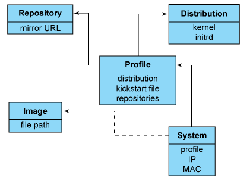
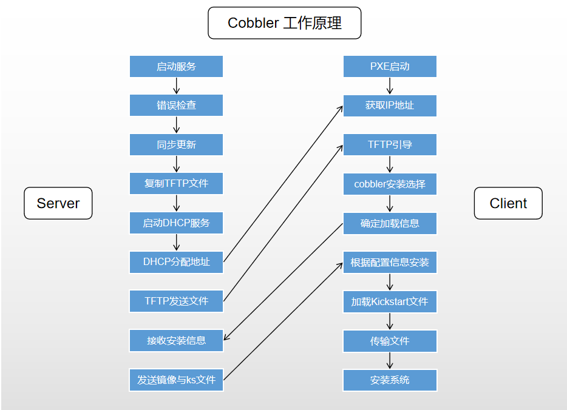
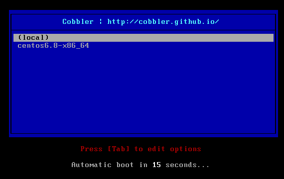
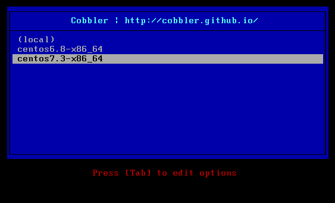
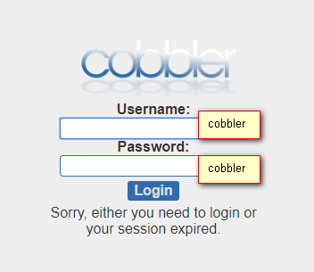

[TOC]


# Cobbler无人值守安装系统

# 1 Cobbler简介

> Cobbler是通过将DHCP、TFTP、DNS、HTTP等服务进行集成，创建一个中央管理节点，其可以实现的功能有配置服务，创建存储库，解压缩操作系统媒介，代理或集成一个配置管理系统，控制电源管理等。 Cobbler的最终目的是实现无需进行人工干预即可安装机器。在进行进一步的操作之前，我们有必要先了解下pxe和kickstart 。


Cobbler是一个快速网络安装linux的服务，而且在经过调整也可以支持网络安装windows。该工具使用python开发，小巧轻便（才15k行python代码），使用简单的命令即可完成PXE网络安装环境的配置，同时还可以管理DHCP、DNS、TFTP、RSYNC以及yum仓库、构造系统ISO镜像。 Cobbler支持命令行管理，web界面管理，还提供了API接口，可以方便二次开发使用。 Cobbler客户端Koan支持虚拟机安装和操作系统重新安装，同时支持服务器的电源管理，使重装系统更便捷。更多内容可以查看cobbler官方网站！

cobbler官方网站：http://cobbler.github.io/


# 2 Cobbler功能

- pxe支持
- dhcp管理
- dns服务管理（bind，dnsmasq）
- 电源管理
- kickstart支持
- yum仓库管理
- tftp（pxe启动时需要）
- apache，提供ks得安装源，并提供定制化得ks配置，同时，它和apache做了深度整合，通过cobbler，可以使redhat/centos/fedora系统得快速部署，同时也支持suse、debian（ubuntu）系统，通过配置开可以支持windows


# 3 Cobbler框架



`Cobbler`的配置结构基于一组注册的对象。每个对象表示一个与另一个实体相关联的实体。当一个对象指向另一个对象时，它就继承了被指向对象的数据，并可覆盖或添加更多特定信息。

- 发行版(`distros`)： 表示一个操作系统。它承载了内核和`initrd`的信息，以及内核参数等其他数据。
- 配置文件(`profiles`)：包含一个发行版、一个`kickstart`文件以及可能的存储库，还包括更多特定的内核参数等其他数据。
- 系统(`systems`)：表示要配给的机器。它包括一个配置文件或一个镜像、`IP`和`MAC`地址、电源管理（地址、凭据、类型）以及更为专业的数据等信息。
- 镜像(`images`)：可以替换一个保函不屑于此类别的文件的发行版对象（例如，无法分为内核和`initrd`的对象）。


# 4 Cobbler工作原理



**Server端**

- 启动`Cobbler`服务
- 进行`Cobbler`错误检查，执行`cobbler check`命令
- 进行配置同步，执行`cobbler sync`命令
- 复制相关启动文件到`TFTP`目录中
- 启动`DHCP`服务，提供地址分配
- `DHCP`服务分配IP地址
- `TFTP`传输启动文件
- `Server`端接收安装信息
- `Server`端发送`ISO`镜像与`Kickstart`文件

**Client端**

- 客户端以`PXE`模式启动
- 客户端获取`IP`地址
- 通过`TFTP`服务器获取启动文件
- 进入`Cobbler`安装选择界面
- 根据配置信息准备安装系统
- 加载`Kickstart`文件
- 传输系统安装的其它文件
- 进行安装系统


# 5 Cobbler部署

## 5.1 环境介绍

| 主机名  | 系统           | 配置  | 外网ip    | 内网ip      |
| ------- | -------------- | ----- | --------- | ----------- |
| cobbler | CentOS7.3.1611 | 2核4G | 10.0.0.44 | 172.16.1.44 |
|         |                |       |           |             |

说明：虚拟机网卡采用NAT模式或者仅主机模式，不要使用桥接模式，因为后面会搭建DHCP服务器，在同一个局域网多个DHCP服务会有冲突。VMware的NAT模式的dhcp服务也关闭，避免干扰。

## 5.2 安装

```shell

[root@ cobbler ~]# yum -y install cobbler cobbler-web tftp-server pykickstart httpd dhcp xinetd debmirror

cobbler        #cobbler程序包
cobbler-web     #cobbler的web服务包
pykickstart    #cobbler检查kickstart语法错误
httpd      	#Apache web服务
dhcp       #Dhcp服务
tftp      #tftp服务
xinetd　　#诸多服务的超级守护进程

#启动cobbler及httpd并加入开机启动
[root@ cobbler ~]# systemctl start httpd cobblerd
[root@ cobbler ~]# systemctl enable httpd cobblerd

#查看xinetd管理的服务
[root@ cobbler ~]# chkconfig
```

## 5.3 配置Cobbler

检查Cobbler的配置，如果看不到下面的结果，再次重启cobbler。

```shell
[root@ cobbler ~]# cobbler check   #类似一个使用手册，告诉我们需要完成以下内容
The following are potential configuration items that you may want to fix:

1 : The 'server' field in /etc/cobbler/settings must be set to something other than localhost, or kickstarting features will not work.  This should be a resolvable hostname or IP for the boot server as reachable by all machines that will use it.
2 : For PXE to be functional, the 'next_server' field in /etc/cobbler/settings must be set to something other than 127.0.0.1, and should match the IP of the boot server on the PXE network.
3 : change 'disable' to 'no' in /etc/xinetd.d/tftp
4 : Some network boot-loaders are missing from /var/lib/cobbler/loaders, you may run 'cobbler get-loaders' to download them, or, if you only want to handle x86/x86_64 netbooting, you may ensure that you have installed a *recent* version of the syslinux package installed and can ignore this message entirely.  Files in this directory, should you want to support all architectures, should include pxelinux.0, menu.c32, elilo.efi, and yaboot. The 'cobbler get-loaders' command is the easiest way to resolve these requirements.
5 : enable and start rsyncd.service with systemctl
6 : comment out 'dists' on /etc/debmirror.conf for proper debian support
7 : comment out 'arches' on /etc/debmirror.conf for proper debian support
8 : The default password used by the sample templates for newly installed machines (default_password_crypted in /etc/cobbler/settings) is still set to 'cobbler' and should be changed, try: "openssl passwd -1 -salt 'random-phrase-here' 'your-password-here'" to generate new one
9 : fencing tools were not found, and are required to use the (optional) power management features. install cman or fence-agents to use them

Restart cobblerd and then run 'cobbler sync' to apply changes.

```

看到上面出现的问题，然后一个一个的进行解决，先进行设置为可以动态配置，也可以直接更改配置文件。

```
[root@ cobbler ~]# sed -ri '/allow_dynamic_settings:/c\allow_dynamic_settings: 1' /etc/cobbler/settings
[root@ cobbler ~]# grep allow_dynamic_settings /etc/cobbler/settings
allow_dynamic_settings: 1
[root@ cobbler ~]# systemctl restart cobblerd
```

逐个解决上面的问题

```shell
#1.配置server地址
[root@ cobbler ~]# cobbler setting edit --name=server --value=10.0.0.44

#2.配置next_server地址
[root@ cobbler ~]# cobbler setting edit --name=next_server --value=10.0.0.44

#3.配置xinetd管理tftp
[root@ cobbler ~]# sed -ri '/disable/c\disable = no' /etc/xinetd.d/tftp
[root@ cobbler ~]# systemctl enable xinetd
[root@ cobbler ~]# systemctl restart xinetd

#4.boot-loaders
[root@ cobbler ~]# cobbler get-loaders

#5.启动rsync
[root@ cobbler ~]# systemctl start rsyncd
[root@ cobbler ~]# systemctl enable rsyncd

#6和7.debian support
[root@ cobbler ~]# sed -i 's#@dists="sid";#\#@dists="sid";#gp' /etc/debmirror.conf
[root@ cobbler ~]# sed -i 's#@arches="i386";#\#@arches="i386";#g' /etc/debmirror.conf

#8.default_password_crypted
# 注意：这里设置的密码是clbbler安装完系统后，默认root用户初始化登录密码，用 openssl 生成一串密码后加入到 cobbler 的配置文件（/etc/cobbler/settings）里，替换 default_password_crypted 字段

[root@ cobbler ~]# openssl passwd -1 -salt `openssl rand -hex 4` '123456'
$1$random-p$mzxQ/Sx848sXgvfwJCoZM0
[root@ cobbler ~]# cobbler setting edit --name=default_password_crypted --value='$1$random-p$mzxQ/Sx848sXgvfwJCoZM0'

#9.安装fencing tools
[root@ cobbler ~]# yum -y install fence-agents

#解决完后再次检查
[root@ cobbler ~]# systemctl restart cobblerd
[root@ cobbler ~]# cobbler sync
[root@ cobbler ~]# cobbler check
No configuration problems found.  All systems go.
```

## 5.4 配置DHCP

```shell
[root@ cobbler ~]# cobbler setting edit --name=manage_dhcp --value=1
[root@ cobbler ~]# vim /etc/cobbler/dhcp.template
#修改一下几处
subnet 10.0.0.0 netmask 255.255.255.0 {   #这里改为分配的网段和掩码
     option routers             10.0.0.254;  #如果有网关，这里改为网关地址
     option domain-name-servers 223.5.5.5;   #如果有DNS，这里改为DNS地址
     option subnet-mask         255.255.255.0;  #改为分配的IP的掩码
     range dynamic-bootp        10.0.0.100 10.0.0.200;  #改为分配的IP的范围

# 重启dhcpd服务
[root@ cobbler ~]# cobbler sync
[root@ cobbler ~]# systemctl  restart dhcpd && systemctl  enable dhcpd

```

## 5.5 同步Cobbler配置

```
[root@ cobbler ~]# cobbler sync
```

查看一下dhcp，查看cobbler是否可以管理`dhcp`

```shell
[root@ cobbler ~]# cat /etc/dhcp/dhcpd.conf
# ******************************************************************
# Cobbler managed dhcpd.conf file
# generated from cobbler dhcp.conf template (Sun Mar  1 11:25:17 2020)
# Do NOT make changes to /etc/dhcpd.conf. Instead, make your changes
# in /etc/cobbler/dhcp.template, as /etc/dhcpd.conf will be
# overwritten.
# ******************************************************************

ddns-update-style interim;

allow booting;
allow bootp;

ignore client-updates;
set vendorclass = option vendor-class-identifier;

option pxe-system-type code 93 = unsigned integer 16;

subnet 10.0.0.0 netmask 255.255.255.0 {
     option routers             10.0.0.254;
     option domain-name-servers 223.5.5.5;
     option subnet-mask         255.255.255.0;
     range dynamic-bootp        10.0.0.100 10.0.0.200;
     default-lease-time         21600;
     max-lease-time             43200;
     next-server                10.0.0.44;
     class "pxeclients" {
          match if substring (option vendor-class-identifier, 0, 9) = "PXEClient";
          if option pxe-system-type = 00:02 {
                  filename "ia64/elilo.efi";
          } else if option pxe-system-type = 00:06 {
                  filename "grub/grub-x86.efi";
          } else if option pxe-system-type = 00:07 {
                  filename "grub/grub-x86_64.efi";
          } else if option pxe-system-type = 00:09 {
                  filename "grub/grub-x86_64.efi";
          } else {
                  filename "pxelinux.0";
          }
     }

}

# group for Cobbler DHCP tag: default
group {
}
```

## 5.6 Cobbler命令帮助

| 命令             | 说明                                       |
| ---------------- | ------------------------------------------ |
| cobbler check    | 核对当前设置是否有问题                     |
| cobbler list     | 列出所有的cobbler元素                      |
| cobbler report   | 列出元素的详细信息                         |
| cobbler sync     | 同步配置到数据目录，更改配置最好都执行一下 |
| cobbler reposync | 同步yum仓库                                |
| cobbler distro   | 查看导入的发行版系统信息                   |
| cobbler system   | 查看添加的系统信息                         |
| cobbler profile  | 查看配置信息                               |


4.1 Cobbler命令说明

| 命令名称         | 命令用途                                |
| ---------------- | --------------------------------------- |
| cobbler check    | 检查cobbler配置                         |
| cobbler list     | 列出所有的cobbler元素                   |
| cobbler report   | 列出元素的详细信息                      |
| cobbler distro   | 查看导入的发行版系统信息                |
| cobbler system   | 查看添加的系统信息                      |
| cobbler profile  | 查看配置信息                            |
| cobbler sync     | 同步Cobbler配置，更改配置最好都要执行下 |
| cobbler reposync | 同步yum仓库                             |

命令参考

cobbler --help

cobbler distro --help 

cobbler distro add --help


## 5.7 Cobbler目录说明

Cobbler配置文件存放在/etc/cobbler下

```
配置文件目录:/etc/cobbler
/etc/cobbler/settings : cobbler 主配置文件
/etc/cobbler/iso/ : iso模板配置文件
/etc/cobbler/pxe : pxe模板文件
/etc/cobbler/power : 电源配置文件
/etc/cobbler/users.conf : Web服务配置文件
/etc/cobbler/users.digest : 用于web访问的用户名密码配置文件
/etc/cobbler/dhcp.template : DHCP服务配置模板文件
/etc/cobbler/dnsmasq.template : DNS服务配置模板文件
/etc/cobbler/tftpd.template : tftp服务配置模板文件
/etc/cobbler/modules.conf : Cobbler模块配置文件

 

数据目录:/var/lib/cobbler
/var/lib/cobbler/config : 用于存放distros systems profiles等信息配置文件
/var/lib/cobbler/triggers : 用于存放用户自定义的cobbler命令
/var/lib/cobbler/kickstarts : 默认存放kickstart文件
/var/lib/cobbler/loaders : 存放各种引导程序

 
镜像数据目录: /var/www/cobbler
/var/www/cobbler/ks_mirror : 导入的发行版系统的所有数据
/var/www/cobbler/images : 导入发行版的kernel和initrd镜像用于远程网络启动
/var/www/cobbler/repo_mirror/ :yum仓库存储目录

 

日志目录:/var/log/cobbler
/var/log/cobbler/install.log : 客户端系统安装日志
/var/log/cobbler/cobbler.log : cobbler日志

 

Cobbler Commands(常用使用命令参数)
    * * Import
    * * Sync
    * * Reposync 
    * * Build ISO (使用发行版、配置文件、制作出系统镜像)
    * * Command Line Search
    * * Replication
    * * Validata Kickstart
    * * ACL Setup
```

这时候创建一个新虚拟机可以获取到如下信息，没有镜像选择，只能从本地启动。


# 6 Cobbler安装centos6.8

注意：由于我这台是在`centos7`系统上面配置的`cobbler`，并没有centos6.8镜像，所以需要上传了一个`centos6.8`的镜像并进行挂载。

## 6.1 创建挂载到cobbler服务器

```
[root@ cobbler ~]# mkdir -p /centos6.8
total 4764676
-rw-------. 1 root root       1277 2019-09-17 22:18 anaconda-ks.cfg
-rw-r--r--  1 root root 3916431360 2020-03-01 19:54 CentOS-6.8-x86_64-bin-DVD1.iso
[root@ cobbler ~]# mkdir /centos6.8
[root@ cobbler ~]# mount -o loop CentOS-6.8-x86_64-bin-DVD1.iso /centos6.8
```

## 6.2 查看挂载后的目录

```
[root@ cobbler kickstarts]# ls /centos6.8
```

## 6.3 导入镜像

```shell
[root@ cobbler ~]# cobbler import --path=/centos6.8 --name=centos6.8 --arch=x86_64
# --path 镜像路径
# --name 为安装源定义一个名字
# --arch 指定安装源是32位、64位、ia64, 目前支持的选项有: x86│x86_64│ia64
# 安装源的唯一标示就是根据name参数来定义，本例导入成功后，安装源的唯一标示就是：centos6.8，如果重复，系统会提示导入失败。
```

## 6.4 查看导入后镜像信息

```shell
[root@ cobbler ~]# cobbler distro report --name=centos6.8-x86_64
Name                           : centos6.8-x86_64
Architecture                   : x86_64
TFTP Boot Files                : {}
Breed                          : redhat
Comment                        :
Fetchable Files                : {}
Initrd                         : /var/www/cobbler/ks_mirror/centos6.8-x86_64/images/pxeboot/initrd.img
Kernel                         : /var/www/cobbler/ks_mirror/centos6.8-x86_64/images/pxeboot/vmlinuz
Kernel Options                 : {}
Kernel Options (Post Install)  : {}
Kickstart Metadata             : {'tree': 'http://@@http_server@@/cblr/links/centos6.8-x86_64'}
Management Classes             : []
OS Version                     : rhel6
Owners                         : ['admin']
Red Hat Management Key         : <<inherit>>
Red Hat Management Server      : <<inherit>>
Template Files                 : {}
```

## 6.5 查看profile信息

```
[root@ cobbler ~]# cobbler profile report --name=centos6.8-x86_64
Name                           : centos6.8-x86_64
TFTP Boot Files                : {}
Comment                        :
DHCP Tag                       : default
Distribution                   : centos6.8-x86_64
Enable gPXE?                   : 0
Enable PXE Menu?               : 1
Fetchable Files                : {}
Kernel Options                 : {}
Kernel Options (Post Install)  : {}
Kickstart                      : /var/lib/cobbler/kickstarts/sample_end.ks
Kickstart Metadata             : {}
Management Classes             : []
Management Parameters          : <<inherit>>
Name Servers                   : []
Name Servers Search Path       : []
Owners                         : ['admin']
Parent Profile                 :
Internal proxy                 :
Red Hat Management Key         : <<inherit>>
Red Hat Management Server      : <<inherit>>
Repos                          : []
Server Override                : <<inherit>>
Template Files                 : {}
Virt Auto Boot                 : 1
Virt Bridge                    : xenbr0
  rt CPUs                      : 1
Virt Disk Driver Type          : raw
Virt File Size(GB)             : 5
Virt Path                      :
Virt RAM (MB)                  : 512
Virt Type                      : kvm
```

## 6.6 编辑centos6.8镜像的kickstart文件

```shell
[root@ cobbler ~]# cd /var/lib/cobbler/kickstarts/
[root@ cobbler kickstarts]# cp sample_end.ks centos6.8.ks
[root@ cobbler kickstarts]# vim centos6.8.ks
# This kickstart file should only be used with EL > 5 and/or Fedora > 7.
# For older versions please use the sample.ks kickstart file.
# Install OS instead of upgrade
install
# Use text mode install
text
# System keyboard
keyboard us
# System language
lang en_US.UTF-8
# System timezone
timezone  Asia/ShangHai
#Root password
rootpw --iscrypted $default_password_crypted
# System authorization information
auth  --useshadow  --enablemd5
# Firewall configuration
firewall --disabled
# SELinux configuration
selinux --disabled
# Use network installation
url --url=$tree

# Clear the Master Boot Record
zerombr
# System bootloader configuration
bootloader --location=mbr
# Partition clearing information
clearpart --all --initlabel
part /boot --fstype=ext4 --size=200
part swap --fstype=swap --size=2048
part / --fstype=ext4 --grow --size=200 --asprimary

# If any cobbler repo definitions were referenced in the kickstart profile, include them here.
$yum_repo_stanza
# Network information
$SNIPPET('network_config')
# Do not configure the X Window System
skipx
# Run the Setup Agent on first boot
firstboot --disable
# Reboot after installation
reboot


%pre
$SNIPPET('log_ks_pre')
$SNIPPET('kickstart_start')
$SNIPPET('pre_install_network_config')
# Enable installation monitoring
$SNIPPET('pre_anamon')
%end

%packages
$SNIPPET('func_install_if_enabled')
@core
@base
tree
nmap
wget
lftp
lrzsz
telnet
%end

%post --nochroot
$SNIPPET('log_ks_post_nochroot')
%end

%post
$SNIPPET('log_ks_post')
# Start yum configuration
$yum_config_stanza
# End yum configuration
$SNIPPET('post_install_kernel_options')
$SNIPPET('post_install_network_config')
$SNIPPET('func_register_if_enabled')
$SNIPPET('download_config_files')
$SNIPPET('koan_environment')
$SNIPPET('redhat_register')
$SNIPPET('cobbler_register')
# Enable post-install boot notification
$SNIPPET('post_anamon')
# Start final steps
$SNIPPET('kickstart_done')
# End final steps

sed -ri "/^#UseDNS/c\UseDNS no" /etc/ssh/sshd_config
sed -ri "/^GSSAPIAuthentication/c\GSSAPIAuthentication no" /etc/ssh/sshd_config
%end

# 动态编辑指定使用新的kickstart文件
[root@ cobbler kickstarts]# cobbler profile edit --name=centos6.8-x86_64 --kickstart=/var/lib/cobbler/kickstarts/centos6.8.ks

# 验证是否更改成功
[root@ cobbler kickstarts]# cobbler profile report --name=centos6.8-x86_64 |grep Kickstart
Kickstart                      : /var/lib/cobbler/kickstarts/centos6.8.ks
Kickstart Metadata             : {}
```

## 6.7 同步cobbler配置

注意：系统镜像文件centos6.8.ks，每修改一次都要进行同步。

```
[root@ cobbler kickstarts]# cobbler sync
```


## 6.8 新建虚拟机进行测试



用键盘方向键选择安装的系统，如果超时未选择，默认不安装，安装完后即可登录系统。


# 7 Cobbler安装centos7.3

由于我这里实在`centos7.3`系统上面配置的`cobbler`，所以直接挂载/dev/cdrom即可。

**以下操作可参考上边的centos6.8。**

```shell
[root@ cobbler ~]# mkdir /centos7.3
[root@ cobbler ~]# mount -o loop /dev/cdrom /centos7.3
[root@ cobbler ~]# cobbler import --path=/centos7.3 --name=centos7.3 --arch=x86_64
[root@cobbler ~]# cd /var/lib/cobbler/kickstarts/
[root@ cobbler kickstarts]# cp centos6.8.ks centos7.3.ks
#注意：centos7的系统默认的文件系统是xfs
[root@ cobbler kickstarts]# sed -i '/fstype=ext4/ s#ext4#xfs#g' centos7.3.ks
[root@ cobbler kickstarts]# cobbler profile edit --name=centos7.3-x86_64 --kickstart=/var/lib/cobbler/kickstarts/centos7.3.ks
[root@ cobbler kickstarts]# cobbler profile report --name=centos7.3-x86_64 |grep Kickstart
[root@ cobbler kickstarts]# cobbler sync
```

新建一台虚机，选择centos7.3，即可。



> 如果出现/sbin/dmsquash-live-root: line 286: printf: write error: No space left on device因为内存不足2G的原因

# 8 Cobbler Web界面配置

web界面有很多功能，包括上传镜像、编辑kickstart、等等很多在命令行操作的都可以在web界面直接操作。
在上面已经安装了cobbler-web软件，访问地址：https://10.0.0.44/cobbler_web 即可。

默认账号为cobbler，密码也为cobbler




修改cobbler登录密码

```shell
/etc/cobbler/users.conf     #Web服务授权配置文件
/etc/cobbler/users.digest   #用于web访问的用户名密码

[root@cobbler ~]# cat /etc/cobbler/users.digest 
cobbler:Cobbler:a2d6bae81669d707b72c0bd9806e01f3

# 设置密码，在Cobbler组添加cobbler用户，输入2遍密码确
[root@cobbler ~]# htdigest /etc/cobbler/users.digest "Cobbler" cobbler
Changing password for user cobbler in realm Cobbler
New password: superman
Re-type new password: superman

# 同步配置并重启httpd、cobbler
[root@cobbler ~]# cobbler sync
[root@cobbler ~]# systemctl restart httpd
[root@cobbler ~]# systemctl restart cobblerd
```

再次登录即使用新设置的密码登录即可。


# 9 Cobbler自动安装KVM虚机

经过上面的学习测试，cobbler自动装机应该已经学会了。但是你会发现一些小问题，就是当你装系统的时候，如果安装系统界面超时后，会报`No bootalbe device`;而无法安装系统。这时可以通过自定义cobbler（其实是pxe）的启动界面来实现。


**9.1 自定义pxe启动界面**

```bash
[root@ localhost pxelinux.cfg]# cobbler distro list
   CentOS-7.4-x86_64

# pxe启动界面模板文件；
[root@ cobbler pxelinux.cfg]# cat /etc/cobbler/pxe/pxedefault.template

DEFAULT menu   # 指定菜单风格
PROMPT 0       # 是否等用户选择；0为是，1为否
MENU TITLE Cobbler | http://cobbler.github.io/
TIMEOUT 200  #等待20s进入默认菜单
TOTALTIMEOUT 6000
ONTIMEOUT CentOS-7.4-x86_64   # 超时后启动CentOS-7.4-x86_64

LABEL local
MENU LABEL (local)
MENU DEFAULT
LOCALBOOT -1

$pxe_menu_items

MENU end


[root@ cobbler pxelinux.cfg]# cobbler sync  # 执行cobbler  sync后会覆盖/var/lib/tftpboot/pxelinux.cfg/default
```

**9.2 修改KS自动安装文件**

```bash
[root@ localhost ~]# cat /var/lib/cobbler/kickstarts/CentOS-7.4.ks
install
text
keyboard us
lang en_US.UTF-8
timezone --utc Asia/Shanghai
rootpw --iscrypted $default_password_crypted
auth  --useshadow  --enablemd5
firewall --disabled
selinux --disabled
url --url=http://10.159.237.1/cobbler/ks_mirror/CentOS-7.4-x86_64/

zerombr
bootloader --location=mbr
clearpart --all --initlabel
part /boot --fstype=xfs --size=500
part swap --fstype=swap --size=2048
part / --fstype=xfs --grow --size=500 --asprimary


repo --name=base --baseurl=http://10.159.237.1/cobbler/ks_mirror/CentOS-7.4-x86_64/


skipx

firstboot --disable

network --bootproto=dhcp --device=eth0 --onboot=yes --noipv6 --activate
reboot


%packages --nobase
@core
%end


%post
systemctl stop kdump.service
systemctl disable kdump.service
sed -ri "/^#UseDNS/c\UseDNS no" /etc/ssh/sshd_config
sed -ri "/^GSSAPIAuthentication/c\GSSAPIAuthentication no" /etc/ssh/sshd_config
%end
```

**9.3 安装kvm虚机**

**pxe网络引导**

```bash
#虚机名称
vmname=vm01
virt-install \
--connect qemu+ssh://root@10.159.237.1/system \
--name=${vmname} \
--virt-type=kvm \
--vcpus=4 \
--ram=8192 \
--pxe \
--network bridge=br0,model=virtio \
--disk path=/data0/${vmname}.qcow2,size=100,format=qcow2 \
--graphics vnc,listen=0.0.0.0 \
--noautoconsole \
--force \
--autostart \
--os-type=linux \
--os-variant=rhel7
```


# 10 kickstar-KS文件和语法解析


**10.1 ks文件说明**

使用kickstart，只需事先定义好一个Kickstart自动应答配置文件ks.cfg（通常存放在安装服务器上），并让安装程序知道该配置文件的位置，在安装过程中安装程序就可以自己从该文件中读取安装配置，这样就避免了在安装过程中多次的人机交互，从而实现无人值守的自动化安装。

**1.生成kickstart配置文件的三种方法**

- 方法1：
  每安装好一台Centos机器，Centos安装程序都会创建一个kickstart配置文件，名字叫anaconda-ks.cfg位于/root/anaconda-ks.cfg ,记录真实安装配置。
- 方法2：
  Centos提供了一个图形化的kickstart配置工具。在任何一个安装好的Linux系统上运行该工具，就可以很容易地创建你自己的kickstart配置文件。
- 方法3：
  阅读kickstart配置文件的手册。用任何一个文本编辑器都可以创建你自己的kickstart配置文件。
  官方链接:
  https://access.redhat.com/documentation/zh-cn/red_hat_enterprise_linux/7/html/installation_guide/sect-kickstart-howto

**2.kickstart文件语法检查**

```
yum install pykickstart
ksvalidator /var/www/html/ks_config/CentOS-7-ks.cfg 
```

请记住这个验证工具有其局限性。Kickstart 文件可能会很复杂；ksvalidator 可保证其语法正确，且该文件不包含淘汰的选项，但它无法保证安装会成功。它也不会尝试验证 Kickstart 文件的 %pre、%post 和 %packages 部分。

**3.root密码生成**

1. python法

```
python -c 'import crypt; print(crypt.crypt("123456"))'
$6$mM/gpJHUs......AFcT3Q0CMJCqWk9d90
```

1. grub-crypt法

```
grub-crypt
Password: 
Retype password: 
$6$npM35T......PburyA/FFDbdeGvnUrWpWi.
```

**10.2 ks.cfg详解**

**10.2.1 ks文件组成**

1.命令段
键盘类型，语言，安装方式等系统的配置，有必选项和可选项，如果缺少某项必选项，安装时会中断并提示用户选择此项的选项

2.软件包段
以%packages开头，以%end结束,在安装过程中默认安装的软件包，安装软件时会自动分析依赖关系。

```
@groupname：指定安装的包组
package_name：指定安装的包
-package_name：指定不安装的包
```

3.脚本段(可选)
以%post开头，以%end结束，在安装完系统之后执行的相关Linux命令、脚本
以%pre开头，以%end结束，在安装完系统之前执行的相关Linux命令、脚本

**10.2.2 关键字含义说明**

1.开始部分

```
# Kickstart Configurator for CentOS 7 by NOAH LUO
install
```

告知安装程序，这是一次全新安装，而不是升级upgrade。
2.安装源部分

```
url --url="http://10.0.0.7/CentOS-6.7/"
url --url ftp://<username>:<password>@<server>/<dir>
nfs --server=nfsserver.example.com --dir=/tmp/install-tree
```

通过FTP或HTTP或NFS从远程服务器上的安装树中安装。任选一即可
3.模式语言键盘等

```bash
text		#使用文本模式安装。
lang en_US.UTF-8		#设置在安装过程中使用的语言以及系统的缺省语言。
keyboard us	#设置系统键盘类型。
zerombr	#清除mbr引导信息。
```

4.bootloader 系统引导配置

```bash
bootloader --location=mbr --driveorder=sda --append="crashkernel=auto rhgb quiet"
--location		#指定引导记录被写入的位置.有效的值如下:mbr(缺省),partition,none。
--driveorder	#指定在BIOS引导顺序中居首的驱动器。
--append=		#指定内核参数.要指定多个参数,使用空格分隔它们。
```

5.network网络配置[客户机]

```bash
network --bootproto=dhcp --device=eth0 --onboot=yes --noipv6 --hostname=CentOS7 --activate
或者
network --bootproto=static --device=eth0 --ip=10.0.0.201 --netmask=255.255.255.0 --gateway=10.0.0.201 --nameserver=10.0.0.202 --activate
network  --hostname=CentOS7
# static方法要求在kickstart文件里输入所有的网络信息。

# 请注意所有配置信息都必须在一行上指定,或写两个newwork,不能使用反斜线来换行。
--ip=			被安装的机器的IP地址.
--gateway		IP地址格式的默认网关.
--netmask		安装的系统的子网掩码.
--hostname		安装的系统的主机名.
--onboot		是否在引导时启用该设备.
--noipv6		禁用此设备的IPv6.
--nameserver	配置dns解析.
```

6.时区认证等

```bash
timezone --utc Asia/Shanghai
authconfig --enableshadow --passalgo=sha512
rootpw  --iscrypted $6$X20eRtuZhkHznTb4$dK0BJByOSA.....wJbAjVI5D6/
```

设置时区上海,设置认证方式,设置密码,密码非明文,用前文生成密码的方式生成
7.分区相关

```bash
clearpart --all --initlabel
--all 从系统中清除所有分区，--initlable 初始化磁盘标签
part /boot --fstype xfs --size 1024
part swap --size 1024
part / --fstype xfs --size 1 --grow
# 磁盘分区
--fstype		为分区设置文件系统类型.有效的类型为ext2,ext3,swap, xfs和vfat。
--asprimary	强迫把分区分配为主分区,否则提示分区失败。
--size			以MB为单位的分区最小值.在此处指定一个整数值,如500.不加MB。
--grow			告诉分区使用所有可用空间(若有),或使用设置的最大值。
```

8.其他信息

```bash
firstboot --disable
selinux --disabled
firewall --disabled
logging --level=info
reboot
firstboot	负责协助配置redhat一些重要的信息。
selinux		关闭selinux。
firewall	关闭防火墙。
logging		设置日志级别。
reboot		设定安装完成后重启,也可以选择halt关机。
```

9.包选装

```
%packages
@^minimal
@compat-libraries
@debugging
@development
tree
nmap
sysstat
lrzsz
dos2unix
telnet 
wget 
vim 
bash-completion
%end
```

10.安装完成后操作

```
%post
systemctl disable postfix.service
%end
```

可以调用优化脚本,对装完后的服务器进行初始优化


# 11 配置DHCP，以用于多VLAN环境


