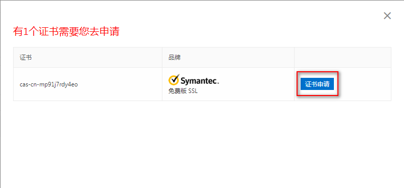

[TOC]


# Nginx系列


# 正向代理

> 注意：Nginx本身不支持HTTPS正向代理，需要安装ngx_http_proxy_connect_module模块后才可以支持HTTPS正向代理，否则会遇到HTTP 400错误。

参考文档：

- <https://github.com/chobits/ngx_http_proxy_connect_module>


## 安装Nginx和模块

```
yum -y install make zlib zlib-devel gcc-c++ libtool  openssl openssl-devel  wget pcre pcre-devel git
git clone https://github.com/chobits/ngx_http_proxy_connect_module.git
wget http://nginx.org/download/nginx-1.14.2.tar.gz
tar -xzvf nginx-1.14.2.tar.gz
cd nginx-1.14.2/
patch -p1 <../ngx_http_proxy_connect_module/patch/proxy_connect_1014.patch
./configure  --with-http_stub_status_module --with-http_ssl_module --add-module=../ngx_http_proxy_connect_module
make && make install
```

## **虚拟主机配置**

```
[root@ docker ~]# mkdir -p /usr/local/nginx/conf/conf.d/

[root@ docker ~]# vim /usr/local/nginx/conf/nginx.conf
user  nobody;
worker_processes  1;
events {
	worker_connections  1024;
}
http {
	include       mime.types;
	default_type  application/octet-stream;
	sendfile        on;
	keepalive_timeout  65;
	include /usr/local/nginx/conf/conf.d/*.conf;

}

[root@ docker ~]# vim /usr/local/nginx/conf/conf.d/test.conf
server {
        listen 90;
        server_name 10.0.0.90;
        resolver 223.5.5.5;
        proxy_connect;
        proxy_connect_allow            443 563;
        proxy_connect_connect_timeout  10s;
        proxy_connect_read_timeout     10s;
        proxy_connect_send_timeout     10s;
location / {
        proxy_pass http://$host;
        proxy_set_header Host $host;
        }
}
```

## 客户端配置 

**全局的代理设置：** 

```shell
vim /etc/profile
##代理
export http_proxy=http://10.0.0.90:90
export https_proxy=http://10.0.0.90:90
export ftp_proxy=http://10.0.0.90:90
```

**yum的代理设置：** 

```shell
vim /etc/yum.conf 
proxy=http://http://10.0.0.90:90
```

**wget的代理设置：** 

```shell
vim /etc/wgetrc 
http_proxy=hhttp://10.0.0.90:90
ftp_proxy=http://10.0.0.90:90
```

## 测试代理

**方法一：** 

访问HTTP网站，可以直接这样的方式:

```shell
curl ‐I ‐‐proxy 10.0.0.90:90 http://www.baidu.com
curl ‐I ‐‐proxy 10.0.0.90:90 https://www.baidu.com
```

**方法二：** 

**使用浏览器访问** 

这里使用的是firefox浏览器


**如何确定访问是不是走的代理那？** 

可以在浏览器上设置好代理后，然后将你代理的nginx关掉，然后重新打开一个网页，会发现测试不可以访问网站了！！


# 配置HTTPS

## 什么是https？

HTTP：是互联网上应用最为广泛的一种网络协议，是一个客户端和服务器端请求和应答的标准（TCP），用于从WWW服务器传输超文本到本地浏览器的传输协议，它可以使浏览器更加高效，使网络传输减少。

HTTPS：全称：Hyper Text Transfer Protocol over Secure Socket Layer，则是以安全为目标的HTTP通道，简单讲是HTTP的安全版，即HTTP下加入SSL层，HTTPS的安全基础是SSL，因此加密的详细内容就需要SSL。

HTTPS协议的主要作用可以分为两种：一种是建立一个信息安全通道，来保证数据传输的安全；另一种就是确认网站的真实性。

## 配置过程

首先需要申请一个证书，可以申请一个免费的。

## 证书申请方式

### 阿里云申请

可以使用腾讯云/阿里云，云产品-》域名与网站-》SSL证书管理




然后选免费版的，一般免费版有效期是一年，然后填各种信息，提交审核就好了，审核很快的，一个小时工作时间左右吧

审核成功后就可以在证书列表里下载证书了，下载出来是一个压缩包，里面有各种版本的证书：Apache、IIS、Nginx、


### Certbot申请

官网：<https://certbot.eff.org/>

Let’s Encrypt提供了免费的证书申请服务，同时也提供了官方客户端 Certbot，打开首页，就可以得到官方的安装教程。官方教程给出了四种常用服务器和不同的Linux、Unix的安装使用方案，可以说是十分的贴心了。


### openssl自签证书


## 自签证书测试

### 安装nginx

```shell
yum -y install nginx
```

### 检查Nginx的SSL模块

```shell
[root@ docker ~]# nginx -V
nginx version: nginx/1.16.1
built by gcc 4.8.5 20150623 (Red Hat 4.8.5-39) (GCC)
built with OpenSSL 1.0.2k-fips  26 Jan 2017
TLS SNI support enabled
configure arguments: --prefix=/usr/share/nginx --sbin-path=/usr/sbin/nginx --modules-
--with-http_ssl_module --with-http_v2_module --with-http_realip_module --with-stream_ssl_preread_module 
```

### 准备私钥和证书

创建私钥

```shell
[root@ docker ~]# cd /etc/nginx/
[root@ docker nginx]# mkdir -p ssl
[root@ docker nginx]# cd ssl/
[root@ docker ssl]# openssl genrsa -des3 -out server.key 1024
Enter pass phrase for server.key:123456
Verifying - Enter pass phrase for server.key:123456
[root@ docker ssl]# ll
total 4
-rw-r--r-- 1 root root 963 2020-02-26 02:43 server.key
```

签发证书

```shell
[root@ docker ssl]# openssl req -new -key server.key -out server.csr
Enter pass phrase for server.key: 123456

Country Name (2 letter code) [XX]:CN
State or Province Name (full name) []:BJ
Locality Name (eg, city) [Default City]:BJ
Organization Name (eg, company) [Default Company Ltd]:SDU
Organizational Unit Name (eg, section) []:BJ
Common Name (eg, your name or your server's hostname) []:wjj
Email Address []:602616568@qq.com

A challenge password []:回车
An optional company name []:回车

```

删除私钥口令

```
[root@ docker ssl]# cd /etc/nginx/ssl
[root@ docker ssl]# cp server.key server.key.ori
[root@ docker ssl]# openssl rsa -in server.key.ori -out server.key
Enter pass phrase for server.key.ori:123456
```

生成使用签名请求证书和私钥生成自签证书

```shell
[root@ docker ssl]# openssl x509 -req -days 365 -in server.csr -signkey server.key -out server.crt

Signature ok
subject=/C=CN/ST=BJ/L=BJ/O=SDU/OU=BJ/CN=wjj/emailAddress=602616568@qq.com
Getting Private key
Enter pass phrase for server.key:密码
```

开启Nginx SSL

```shell
创建虚拟主机
[root@ docker conf.d]# mkdir -p /etc/nginx/html
[root@ docker conf.d]# vim hack.conf
server {
    listen       443 ssl;
    server_name  www.hack.com;

    ssl_certificate /etc/nginx/ssl/server.crt;
    ssl_certificate_key /etc/nginx/ssl/server.key;

    # Load configuration files for the default server block.
    include /etc/nginx/default.d/*.conf;

    location / {
    #定义站点目录
        root    /etc/nginx/html;
    }

    error_page 404 /404.html;
        location = /40x.html {
    }

    error_page 500 502 503 504 /50x.html;
        location = /50x.html {
    }
}

[root@ docker conf.d]# nginx -t
[root@ docker conf.d]# nginx -s reload
```

绑定windows的hosts，然后谷歌浏览器访问`https://www.hack.com/hack.html`。

```
10.0.0.90 www.hack.com
```


此时，你会发现，`http://www.hack.com/hack.html`，浏览器访问不了了（注意浏览器缓存），这时就需要将80端口重定向到443端口。

### rewrite跳转

以上配置有个不好的地方，如果用户忘了使用https或者443端口，那么网站将无法访问，因此需要将80端口的访问转到443端口并使用ssl加密访问。只需要增加一个server段，使用301永久重定向。

```shell
[root@ docker conf.d]# vim hack.conf
server {
    listen 80;
    server_name www.hack.com;
    rewrite ^(.*) https://$server_name$1 permanent;
}

server {
    listen       443 ssl;
    server_name  www.hack.com;

    ssl_certificate /etc/nginx/ssl/server.crt;
    ssl_certificate_key /etc/nginx/ssl/server.key;

    # Load configuration files for the default server block.
    include /etc/nginx/default.d/*.conf;

    location / {
    #定义站点目录
        root    /etc/nginx/html;
    }

    error_page 404 /404.html;
        location = /40x.html {
    }

    error_page 500 502 503 504 /50x.html;
        location = /50x.html {
    }
}

[root@ docker conf.d]# nginx -t
[root@ docker conf.d]# nginx -s reload
```

这时，浏览器访问`http://www.hack.com/hack.html`，nginx会将请求跳转到`https://www.hack.com/hack.html`，详细可以查看nginx日志。


