[TOC]


# KVM虚拟化


# 1.1 KVM简介

​	Kernel-based Virtual Machine的简称，是一个开源的系统虚拟化模块，自Linux 2.6.20之后集成在Linux的各个主要发行版本中。它使用Linux自身的调度器进行管理，所以相对于Xen，其核心源码很少。KVM目前已成为学术界的主流VMM之一。
​	KVM的虚拟化需要硬件支持（如Intel VT技术或者AMD V技术)。是基于硬件的完全虚拟化。而Xen早期则是基于软件模拟的Para-Virtualization，新版本则是基于硬件支持的完全虚拟化。但Xen本身有自己的进程调度器，存储管理模块等，所以代码较为庞大。广为流传的商业系统虚拟化软件VMware ESX系列是基于软件模拟的Full-Virtualization。

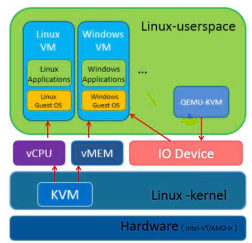

​	因为对进程管理比较麻烦,RedHat发布了一个开源项目libvirt。libvirt有命令行工具也有API，可以通过图形化界面，完成对虚拟机的管理。大多数管理平台通过libvirt来完成对KVM虚拟机的管理；比如Openstack、Cloudstack、OpenNebula等。


## 1.1.2 虚拟化概念

**软件模拟**
优点：能够模拟任何硬件，包括不存在的
缺点：功能非常低效，一般用于研究，生产环境不同。
代表：QEM

**虚拟化层翻译**
软件全虚拟化----VMware
半虚拟化----改动虚拟机的内核（linux）xen（被淘汰）
硬件支持的全虚拟化----KVM

**容器虚拟化 docker**

**虚拟化分类**
1.硬件虚拟化 硬件虚拟化代表：KVM 
2.软件虚拟化 软件虚拟化代表：Qemu

​	提示：硬件虚拟化是需要CPU支持，如果CPU不支持将无法创建KVM虚拟机。Qemu和KVM的最大区别就是，如果一台物理机内存直接4G，创建一个vm虚拟机分配内存分4G，在创建一个还可以分4G。支持超配，但是qemu不支持


## 1.1.3 QEMU与KVM

​	QUME十一个开源项目，实际就是一台硬件模拟器，可以模拟许多硬件，包括X86架构处理器、AMD64架构处理器等。
​	QEMU的优点是因为是纯软件模拟，所以可以在支持的平台模拟支持的设备。缺点是因为纯软件模拟，所以非常慢。
​	KVM只是一个内核模块，只能提供CPU和内存；所以还需要QEMU模拟IO设备；如磁盘、网卡等。


## 1.1.4 Libvirt与KVM

Libvirt是一套开源的虚拟化管理工具，主要由3部分组成。

- 一套API的lib库，支持主流的编程语言，包括C、Python、Ruby等
- Libvirt服务
- 命令行工具virsh
  Libvirt可以实现对虚拟机的管理，比如虚拟机的创建、启动、关闭、暂停、恢复、迁移、销毁，以及对虚拟网卡、硬盘、CPU、内存等多种设备的热添加。


# 2.1 KVM安装

## 2.1.1 环境准备

### **2.1.1.1 硬件环境**

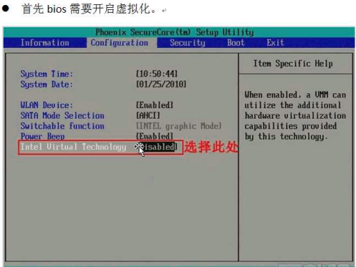

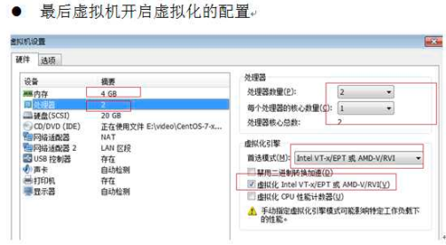


**虚拟化Intel使用的是intel VT-X AMD使用的是AMD-V**


### **2.1.1.2 系统环境**

**检测系统版本及内核**

```shell
[root@ CentOS7-200 ~]# cat /etc/redhat-release
CentOS Linux release 7.3.1611 (Core)

[root@ CentOS7-200 ~]# uname -r
3.10.0-514.el7.x86_64

[root@ CentOS7-200 ~]# getenforce
Disabled

[root@ CentOS7-200 ~]# systemctl stop firewalld.service
```

**检查CPU是否支持虚拟化**
vmx       ##(for Intel CPU)
svm       ##（for AMD CPU）

KVM其实已经在Centos7内置到系统内核，无需安装。

```shell
[root@ CentOS7-200 ~]# egrep -o '(vmx|svm)' /proc/cpuinfo
```

**检查CPU是否开启虚拟化**

在linux平台下，我们可以通过dmesg |grep kvm命令来查看。
如果CPU没有开启虚拟化的话，显示如下：


**安装kvm用户态模块**

```shell
[root@ CentOS7-200 ~]# yum install qemu-kvm qemu-kvm-tools libvirt -y
```

libvirt 用来管理kvm
kvm属于内核态，不需要安装。但是需要一些类似于依赖的


**启动libvirt**

```shell
systemctl start libvirtd.service
systemctl enable libvirtd.service
```

启动之后我们可以使用ifconfig进行查看，libvirtd已经为我们安装了一个桥接网卡

```shell
[root@ CentOS7-200 ~]# ip a
5: virbr0: <NO-CARRIER,BROADCAST,MULTICAST,UP> mtu 1500 qdisc noqueue state DOWN qlen 1000
    link/ether 52:54:00:a5:70:e9 brd ff:ff:ff:ff:ff:ff
    inet 192.168.122.1/24 brd 192.168.122.255 scope global virbr0
```


## 2.1.2 创建虚拟机

创建虚拟机步骤

1.准备虚拟机硬盘

2.需要系统iso镜像

3.需要安装一个vnc的客户端来连接

注意：

```shell
[root@ CentOS7-200 ~]#   #这台机器为宿主机
[root@localhost ~]#		 #这台机器为kvm虚机
```


### 2.1.2.1 查看磁盘空间

最好是20G以上

```shell
[root@ CentOS7-200 ~]# df -h
Filesystem           Size  Used Avail Use% Mounted on
/dev/mapper/cl-root   28G   14G   15G  50% /
devtmpfs             2.0G     0  2.0G   0% /dev
tmpfs                2.0G     0  2.0G   0% /dev/shm
tmpfs                2.0G  8.7M  2.0G   1% /run
tmpfs                2.0G     0  2.0G   0% /sys/fs/cgroup
/dev/sda1           1014M  121M  894M  12% /boot
tmpfs                394M     0  394M   0% /run/user/0
```


### 2.1.2.2 上传镜像 

提示：如果使用rz上传镜像可能会出现错误，所以我们使用dd命令，复制系统的镜像。只需要挂载上光盘即可。

```shell
[root@ CentOS7-200 ~]# cd /opt/
[root@ CentOS7-200 opt]# dd if=/dev/cdrom of=/opt/CentOS-7-x86_64-Minimal-1810.iso
```


### 2.1.2.3 创建磁盘 

提示： qemu-img软件包是我们安装qemu-kvm-tools 依赖给安装上的

```shell
[root@ CentOS7-200 opt]# qemu-img create -f qcow2 /opt/c73.qcow2 6G

[root@ CentOS7-200 opt]# ll
total 4277444
-rw-r--r-- 1 root root 4379901952 Apr 24 14:42 CentOS-7-x86_64-Minimal-1810.iso
-rw-r--r-- 1 root root     197120 Apr 24 14:43 c73.qcow2 
```

-f 制定虚拟机格式
/opt/Centos  存放路径
6G 代表镜像大小

**磁盘格式介绍**
raw----裸磁盘不支持快照
qcow2----支持快照。Openstack使用的方式推荐使用这个。注意：关闭虚拟机后操作。
区别：
全镜像格式（典型代表raw），特点：设置多大就是多大，写入速度快，方便转换其他格式，性能最优，但是占用空间大。
稀疏格式（典型代表qcow2）,其特点：支持压缩、快照、镜像，更小的存储空间（即用多少占多少）
qcow2 数据的基本组成单元是cluster 
raw性能比qcow2快
raw创建多大磁盘，就占用多大空间直接分配，qcow2动态的用多大占用多大空间。


### 2.1.2.4 安装虚拟机

```shell
[root@ CentOS7-200 opt]# yum install -y virt-install

[root@ CentOS7-200 opt]# virt-install --virt-type=kvm --name=c73 --vcpus=1 -r 1024 --cdrom=/opt/CentOS-7-x86_64-Minimal-1810.iso --network network=default --graphics vnc,listen=0.0.0.0 --noautoconsole --os-type=linux --os-variant=rhel7 --disk path=/opt/c73.qcow2,size=6,format=qcow2

#默认连接端口是从5900开始的
[root@ CentOS7-200 opt]# virsh list --all
 Id    Name                           State
----------------------------------------------------
 3     c73                            running
 
[root@ CentOS7-200 opt]# netstat -lntup|grep 5900
tcp        0      0 0.0.0.0:5900            0.0.0.0:*               LISTEN      8440/qemu-kvm
```

**virt-install常用参数**

```shell
1.-n --name= 客户端虚拟机名称
2.-r --ram= 客户端虚拟机分配的内存
3.-u --uuid= 客户端UUID 默认不写时，系统会自动生成
4.--vcpus= 客户端的vcpu个数
5.-v --hvm 全虚拟化
6.-p --paravirt 半虚拟化
7.-l --location=localdir 安装源，有本地、nfs、http、ftp几种，多用于ks网络安装
8.--vnc 使用vnc ，另有--vnclient＝监听的IP  --vncport ＝VNC监听的端口
9.-c --cdrom= 光驱 安装途径
10.--disk= 使用不同选项作为磁盘使用安装介质
11.-w NETWORK, --network=NETWORK 连接客户机到主机网络 
12.-s --file-size= 使用磁盘映像的大小 单位为GB
13.-f --file= 作为磁盘映像使用的文件
14.--cpuset=设置哪个物理CPU能够被虚拟机使用
15.--os-type=OS_TYPE 针对一类操作系统优化虚拟机配置（例如：‘linux’，‘windows’）
16.--os-variant=OS_VARIANT 针对特定操作系统变体（例如’rhel6’, ’winxp’,'win2k3'）进一步优化虚拟机配置
17.--host-device=HOSTDEV 附加一个物理主机设备到客户机。HOSTDEV是随着libvirt使用的一个节点设备名（具体设备如’virsh nodedev-list’的显示的结果）
18.--accelerate KVM或KQEMU内核加速,这个选项是推荐最好加上。如果KVM和KQEMU都支持，KVM加速器优先使用。
19.-x EXTRA, --extra-args=EXTRA 当执行从"--location"选项指定位置的客户机安装时，附加内核命令行参数到安装程序
20.--nographics "virt-install" 将默认使用--vnc选项，使用nographics指定没有控制台被分配给客户机
```

### 2.1.2.5 VNC连接虚拟机

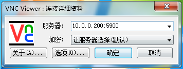

安装系统

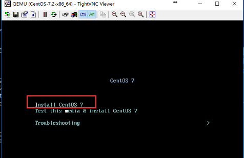

注意：如果查看5900端口开启，但是VNC无法连接KVM虚拟机时，看下防火墙是否开启。创建的虚机用VNC连接时从默认端口5900开始,即虚机一:10.0.0.200:5900  虚机二:10.0.0200:5901

虚拟机安装完成后是关闭了，我们需要启动

```shell
[root@ CentOS7-200 opt]# virsh list --all
Id    Name                           State
- 	  c73                            shut off

[root@ CentOS7-200 opt]# virsh start c73
```

#c73 是虚拟机的名字，是我们创建的时候定义的

#c73 是虚拟机的名字，是我们创建的时候定义的

**常用的virsh管理命令**

```shell
列出所有的虚拟机	virsh list --all
显示虚拟机信息		virsh dominfo c73
列出ID为6的虚拟机名 virsh domname 6
显示虚拟机内存和cpu的使用情况 	virt-top
关闭虚拟机 		virsh shutdown c73 
强制关闭虚拟机 	virsh destroy c73 
启动虚拟机 			virsh start c73 
设置虚拟机随系统自启 	virsh autostart c73 
关闭虚拟机随系统自启	virsh autostart --disable c73 
删除虚拟机			virsh undefine c73 
通过控制窗口登录虚拟机 virsh console c73 
挂起$hostname虚拟机 	virsh suspend c73 
恢复挂起的虚拟机		virsh resume c73 
查看网卡配置信息		virsh domiflist c73 
查看该虚拟机的磁盘位置	  virsh domblklist  c73 
查看KVM虚拟机当前配置	virsh dumpxml c73 
```


# 2.3 KVM桥接配置

**(建议先配置宿主机桥接网络→创建虚机)**

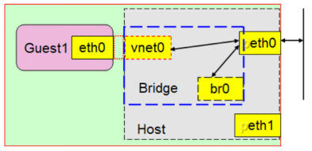

​	在该模式下，宿主机会虚拟出来一张虚拟网卡作为宿主机本身的通信网卡，而宿主机的物理网卡则成为桥设备（交换机），所以虚拟机相当于在宿主机所在局域网内的一个单独的主机，他的行为和宿主机是同等地位的，没有依存关系。

​	安装好虚拟化组件(RHEL6.0之后，系统自带的均是KVM，已经没有XEN虚拟化的支持了），会自动生成一个virbr0这样的桥接设备。

```shell
[root@ CentOS7-200 ~]# brctl  show
bridge name	bridge id		STP enabled	interfaces
docker0		8000.0242e20b14dc	no
virbr0		8000.5254005f3794	yes		virbr0-nic   #生成这个
```

​	Bridge设备其实就是网桥设备，也就相当于想在的二层交换机，用于连接同一网段内的所有机器，所以我们的目的就是将网络设备ens33配置成br0，此时br0就成为了所谓的交换机设备，我们物理机的ens33也是连接在上面的。


## 2.3.1 查看物理机网卡设备

```
[root@CentOS7-200 ~]# ifconfig virbr0
virbr0: flags=4099<UP,BROADCAST,MULTICAST>  mtu 1500
        inet 192.168.122.1  netmask 255.255.255.0  broadcast 192.168.122.255
        ether 52:54:00:86:9b:5b  txqueuelen 1000  (Ethernet)
        RX packets 41  bytes 1468 (1.4 KiB)
        RX errors 0  dropped 0  overruns 0  frame 0
        TX packets 0  bytes 0 (0.0 B)
        TX errors 0  dropped 0 overruns 0  carrier 0  collisions 0

```


## 2.3.2 配置桥接设备br0

```shell
[root@ CentOS7-200 ~]# yum -y install bridge-utils
```

**(1) 手动添加临时生效**

```shell
[root@ CentOS7-200 ~]# brctl  addbr br0

[root@ CentOS7-200 ~]# brctl  show
bridge name	bridge id		STP enabled	interfaces
br0		8000.000000000000	no
docker0		8000.0242e20b14dc	no
virbr0		8000.5254005f3794	yes		virbr0-nic

[root@ CentOS7-200 ~]#  brctl  addif br0 ens33
执行此步后,会导致xshell与宿主机断开连接,以下操作在宿主机完成.
删除ens33上面的ip地址,将br0上面添加上固定ip地址:

[root@ CentOS7-200 ~]#  ip addr del dev ens33 10.0.0.200/24  //删除ens33上的IP地址
[root@ CentOS7-200 ~]# ifconfig  br0 10.0.0.200/24 up  //配置br0的IP地址并启动设备
[root@ CentOS7-200 ~]#  route add default gw 10.0.0.254 //重新加入默认网关
连接xshell查看是否生效

[root@ CentOS7-200 ~]# route -n
Kernel IP routing table
Destination     Gateway         Genmask         Flags Metric Ref    Use Iface
0.0.0.0         10.0.0.254      0.0.0.0         UG    0      0        0 br0
10.0.0.0        0.0.0.0         255.255.255.0   U     0      0        0 br0
172.16.1.0      0.0.0.0         255.255.255.0   U     100    0        0 ens37
172.17.0.0      0.0.0.0         255.255.0.0     U     0      0        0 docker0
192.168.122.0   0.0.0.0         255.255.255.0   U     0      0        0 virbr0

[root@CentOS7-200 ~]# ifconfig br0
br0: flags=4163<UP,BROADCAST,RUNNING,MULTICAST>  mtu 1500
        inet 10.0.0.200  netmask 255.255.255.0  broadcast 10.0.0.255
        inet6 fe80::20c:29ff:fe0e:41a  prefixlen 64  scopeid 0x20<link>
        ether 00:0c:29:0e:04:1a  txqueuelen 1000  (Ethernet)
        RX packets 44264  bytes 33757615 (32.1 MiB)
        RX errors 0  dropped 0  overruns 0  frame 0
        TX packets 31974  bytes 49194899 (46.9 MiB)
        TX errors 0  dropped 0 overruns 0  carrier 0  collisions 0
        
        
[root@ CentOS7-200 ~]# ping www.baidu.com
PING www.a.shifen.com (61.135.169.121) 56(84) bytes of data.
64 bytes from 61.135.169.121 (61.135.169.121): icmp_seq=1 ttl=128 time=4.95 ms
64 bytes from 61.135.169.121 (61.135.169.121): icmp_seq=2 ttl=128 time=4.19 ms
64 bytes from 61.135.169.121 (61.135.169.121): icmp_seq=3 ttl=128 time=6.30 ms
^C
--- www.a.shifen.com ping statistics ---
3 packets transmitted, 3 received, 0% packet loss, time 2004ms
rtt min/avg/max/mdev = 4.194/5.151/6.301/0.872 ms
```

此时宿主机的ip:10.0.0.200已经绑定到br0网卡;但是服务器重启后就不能生效。

**(2) 通过配置文件配置桥接设备永久生效**

为KVM宿主机创建虚拟网卡，并将物理网卡作为桥设备

```shell
[root@ CentOS7-200 ~]# cp /etc/sysconfig/network-scripts/ifcfg-ens33 .

[root@ CentOS7-200 opt]# vim /etc/sysconfig/network-scripts/ifcfg-ens33
DEVICE=ens33
TYPE=Ethernet
ONBOOT=yes
BRIDGE=br0
NM_CONTROLLED=no

[root@ CentOS7-200 opt]# vim /etc/sysconfig/network-scripts/ifcfg-br0
DEVICE=br0
TYPE=Bridge
ONBOOT=yes
BOOTPROTO=static
IPADDR=10.0.0.200
NETMASK=255.255.255.0
GATEWAY=10.0.0.254
NM_CONTROLLED=no

[root@ CentOS7-200 opt]# systemctl restart network.service
```


**(3) 通过VNC连接KVM虚机修改网卡配置**

```shell
[root@ CentOS7-200 ~]# virsh list --all
 Id    Name                           State
----------------------------------------------------
 -     c73                            running
 
[root@ CentOS7-200 ~]# systemctl stop firewalld.service

[root@localhost ~]# vi /etc/sysconfig/network-scripts/ifcfg-ens33
DEVICE=ens33
TYPE=Ethernet
BOOTPROTO=static
ONBOOT=yes
IPADDR=10.0.0.100
PREFIX=24
GATEWAY=10.0.0.254
DNS1=223.5.5.5     此处配置后则不需要手动添加/etc/resolv.conf
DNS2=1.1.1.1

[root@localhost ~]# vim /etc/resolv.conf   #必须有否则xshell连不上
nameserver 223.5.5.5
[root@localhost ~]# ifup ens33
```

注意：此时宿主机还需要通过图形化工具设置网卡为桥接方式，否则无法ping通网关和外网。


# 2.4 KVM图形管理工具（virt-manager）

​	virt-manager是用于管理KVM虚拟环境的主要工具，virt-manager默认设置下需要使用root用户才能够使用该工具。当你想在KVM hypervisor服务器上托管虚拟机，由最终用户而非root用户访问这些虚拟机时并不总是很便利。
​	virt-manager可以设置本机，同样也可以连接远程宿主机来管理。
​	利用virt-manager、xmanager、xshell启动界面来管理虚拟机,适合管理单机的KVM.

## 2.4.1 查看sshd是否开启X11转发

```shell
[root@ CentOS7-200 ~]# grep X11Forwarding /etc/ssh/sshd_config --colour
X11Forwarding yes

# X11Forwarding no
```


## 2.4.2 安装xorg-x11

```shell
yum install -y xorg-x11-font-utils.x86_64 xorg-x11-server-utils.x86_64 xorg-x11-utils.x86_64 xorg-x11-xauth.x86_64 xorg-x11-xinit.x86_64 xorg-x11-drv-ati-firmware
```

## 2.4.3 安装libvirt 

libvirt是管理虚拟机的API库，不仅支持KVM虚拟机，也可以管理Xen等方案下的虚拟机。

```shell
[root@ CentOS7-200 ~]# yum install virt-manager libvirt libvirt-Python python-virtinst libvirt-client virt-viewer qemu-kvm mesa-libglapi  -y
```

因为我的主机是服务器，没有图形化界面，想要用virt-manager图形化安装虚拟机，还需要安装X-window。

```shell
[root@ CentOS7-200 ~]# yum install libXdmcp libXmu libxkbfile xkeyboard-config xorg-x11-xauth xorg-x11-xkb-utils -y
```

开启libvirt服务

```shell
systemctl start libvirtd.service
systemctl enable libvirtd.service
```


## 2.4.4 配置xshell

**安装好Xming后**，打开xshell，在连接属性的tunneing中，勾选 Forwarding X11 connection to选项，可以正常打开virt-manager的图形界面。

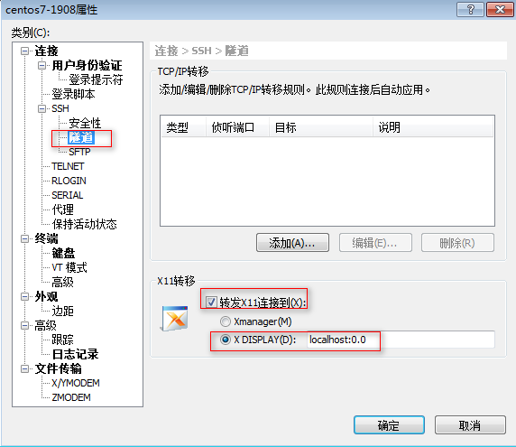


## 2.4.5 启动virt-manager

断开xshell会话，重新连接，输入命令：virt-manager，就可以自动弹出kvm管理软件

```shell
[root@ CentOS7-200 ~]# virt-manager
```

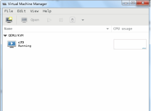

出现乱码，请安装以下包

```shell
yum install dejavu-sans-mono-fonts -y
```

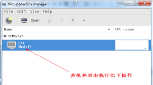

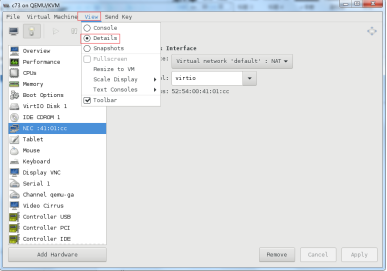

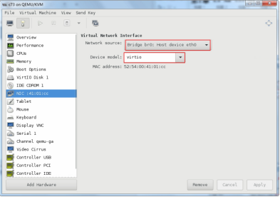

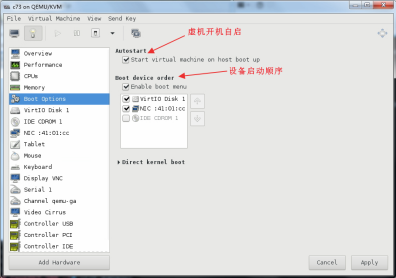