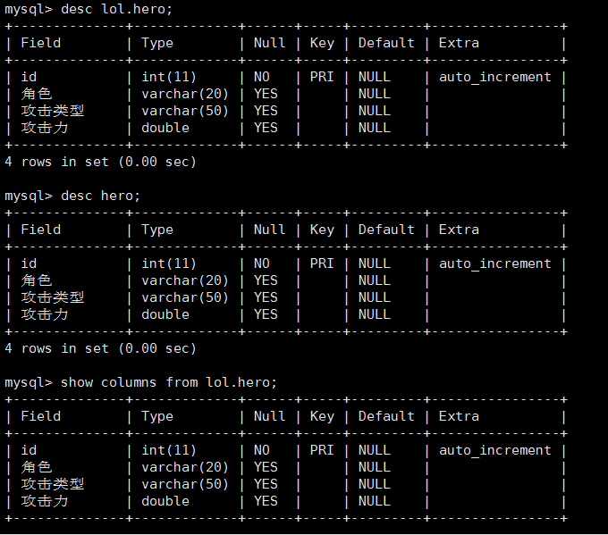
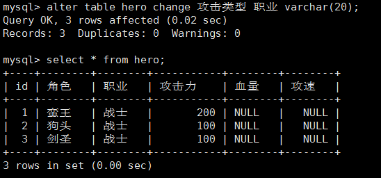
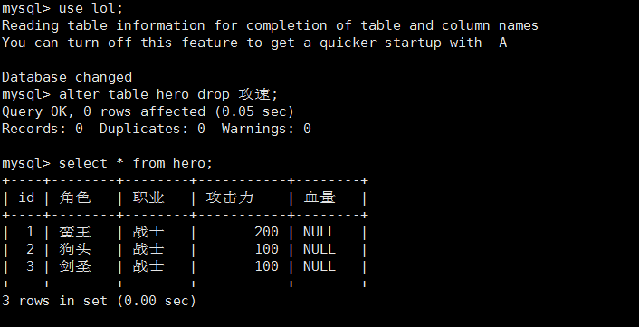
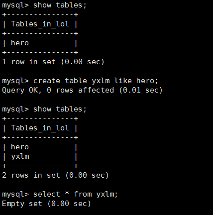
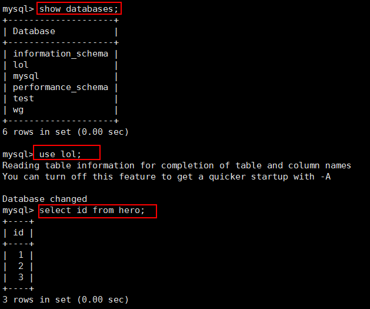
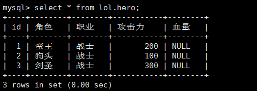
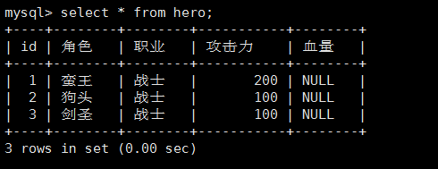
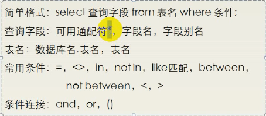
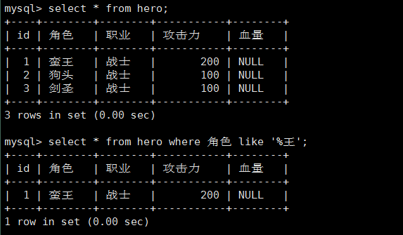
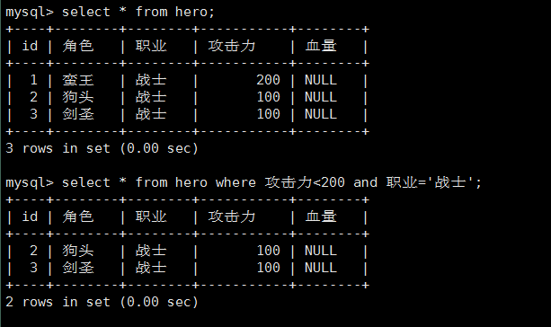

[TOC]


# 第二单元-mysql数据库中表的管理

## 2.1 mysql中表的创建、删除

### 2.1.1 create table命令的使用

**创建表的格式：**

```
create table 表名(
字段名1  类型  [字段约束],
字段名2  类型  [字段约束],
…
);
```

例如：

创建一个学生基本信息表student，字段为：学号 姓名 科目 分数

```
CREATE TABLE student (
id  int NOT NULL AUTO_INCREMENT ,  -- 自增ID
studentID  varchar(20) NULL,       -- 学号
name  varchar(20) NULL,    		   -- 姓名
subject  varchar(50) NULL,         -- 科目
score  double NULL,                -- 分数
PRIMARY KEY (id)                   -- 主键设置
);
```

例如：
创建一个英雄基本信息表hero，字段为：角色 攻击类型 攻击力

```
CREATE TABLE hero (
id  int NOT NULL AUTO_INCREMENT ,
角色  varchar(20) NULL,
攻击类型  varchar(50) NULL,
攻击力  double NULL,
PRIMARY KEY (id)
);
```


### 2.1.2 drop table命令的使用

```
drop table 表名;
drop table if exists 表名;
```


## 2.2 mysql中表结构的操作

**显示表结构**

```
desc 库名.表名;
desc boy.test;
show columns from 库名.表名;
show columns from boy.test;
```




**查询表结构SQL语句**

```
show create table 表名\G
```

**查看表库中的表**

```
show tables from 库名;
或者
use 库名;
show tables;
```


### 2.2.1 mysql表中字段的添加、修改、删除

alter table 语句用于创建后对表的修改

**添加列**

基本形式: alter table 表名 add 列名 列数据类型 [after 插入位置];

在表的最后追加列 攻速:   

```
alter table hero add 攻速 double;
```


在名为 攻击力 的列后插入列 血量:  

```
alter table hero add 血量 varchar(20) after 攻击力;
```


**修改列**

基本形式: alter table 表名 change 列名称 列新名称 新数据类型;

示例:

基本形式: 
alter table 表名 change 列名称 列新名称 新数据类型;

```
alter table hero change 攻击类型 职业 varchar(20);
```




将 name 列的数据类型改为 char(16): 

```
alter table students change name name char(16) not null;
```


**删除列**

基本形式: alter table 表名 drop 列名称;

示例:

删除 攻速 列:  

```
alter table hero drop 攻速;
```




## 2.3 mysql中表的重命名和复制


### 2.3.1 修改表名

a) alter table 表名 rename [to] 新表名；

例子：将student表重新命名为stu

```
alter table student rename to stu;  
```

b) rename table 旧表名 to 新表名;

例子：将stu表重命名student表

```
rename table stu to student; 
```

注意：当你执行 RENAME 时，你不能有任何锁定的表或活动的事务。你同样也必须有对原初表的 ALTER 和 DROP 权限，以及对新表的 CREATE 和 INSERT 权限。


### 2.3.2 表的复制

a) create table 新表名 like 旧表名;      **//只复制表结构不复制数据**



b) create table 新表名 select * from 旧表名;      **//表结构和数据一起复制**


## 2.4 mysql表中数据的插入、删除和修改

### 2.4.1 insert和insert into…select…语句

1）insert into 表名 values(字段值1,字段值2,字段值3,..); 	//全部列插入的方式
2）insert into 表名(字段名1,字段名2,...) values(字段值1,字段值2,..) ; 	//部分列插入的方式
3）insert into 表名 select 字段 from 表名2;	//将查询结果插入的方式


插入记录（即插入一行）

命令：insert into <表名> [( <字段名1>[,..<字段名n > ])] values ( 值1 )[, ( 值n )]

```
insert into student values(1,'Tom',19,55),(2,'Joan',17,66), (3,'Wang',20,77);
```

此方法为批量插入数据到表，效率高

注意：insert into每次只能向表中插入一条记录，但是可以为多个字段。


### 2.4.3 delete语句

delete from 表名; //清空表
delete from 表名 where 条件;//删除满足指定条件的记录


### 2.4.4 update语句

语法：update 表名 set 字段=新值,… where 条件
例子： mysql> update MyClass set name='Mary' where id=1;
注意： 使用update时，必须使用where条件限制，否则修改了整列


## 2.5 mysql查询语句的使用

### 2.5.1 select语句的基本结构

前提：指定库名。

**1.select 查询字段 from 表名**






**select * from 表名**

表示显示所有字段。




### 2.5.2 select语句的条件顺序

SQL Select语句完整的执行顺序：

1、from子句组装来自不同数据源的数据；

2、where子句基于指定的条件对记录行进行筛选；

3、group by子句将数据划分为多个分组；

4、使用聚集函数进行计算；

5、使用having子句筛选分组；

6、计算所有的表达式；

7、select 集合输出

8、使用order by对结果集进行排序。


## 2.6 select语句的查询

### 2.6.1 运用条件查询




根据筛选条件可以分为以下几类：

  1.按照条件按表达式进行筛选

     常用条件运算符如下：> 、<、=、!=、<>、<=、>=
     
     不等号(!=,<>)

 


 2.按照逻辑表达式进行筛选

     逻辑运算符的主要作用：用于连接条件表达式
    
     & 、 || 、!    、and、or、not

 


 3.模糊查询

    like、between and 、in、is null

**like模糊查询**



**and 表示和    or 表示或**




**between 表示在什么什么之间**


### 2.6.2 函数的使用

max（）最大值
min（） 最小值
sum（）求和
avg（）平均值
count（）统计个数


### 2.6.3 多表查询

**一、外连接**

1.左连接  left join 或 left outer join

SQL语句：select * from student left join score on student.Num=score.Stu_id;

2.右连接  right join 或 right outer join

SQL语句：select * from student right join score on student.Num=score.Stu_id;

3.完全外连接  full join 或 full outer join

SQL语句：select * from student full join score on student.Num=score.Stu_id;

通过上面这三种方法就可以把不同的表连接到一起，变成一张大表，之后的查询操作就简单一些了。

而对于select * from student,score;则尽量不使用此语句，产生的结果过于繁琐。

**二、内连接** 

join 或 inner join

SQL语句：select * from student inner join score on student.Num=score.Stu_id;

此时的语句就相当于：select * from student,score where student.ID=course.ID;

**三、交叉连接**

cross join，没有where指定查询条件的子句的交叉联接将产生两表的笛卡尔积。

SQL语句：select * from student cross join score;

**四、结构不同的表连接**

当两表为多对多关系的时候，我们需要建立一个中间表student_score，中间表至少要有两表的主键。

SQL语句：select s.Name,C.Cname from student_score as sc left join student as s on s.Sno=sc.Sno left join score as c on c.Cno=sc.Cno

select C_name,grade from student left join score on student.Num=score.Stu_id where name='李五一';
红色部分即中间表，是集合两表所有内容的一张总表。

**五、UNION操作符用于合并两个或多个select语句的结果集。**

UNION内部的SELECT语句必须拥有相同数量的列，每个列也必须拥有相似的数据类型，每条SELECT语句中的列的顺序必须相同。

select Num from student union select Stu_id from score;
union操作符是默认查重的，如果允许重复的值，就可以使用union all 。对于两张结构相同的表，union也可以把他们合并成一张表：

select * from student1 union select *from student2;

**六、子查询**

有时候，查询时需要的条件是另外一个select语句的结果，就会使用到子查询。	

**1.带IN关键字的子查询**

SQL语句：select * from student where Num IN(select Stu_id from score);

**2.带EXISTS关键字的子查询**

exists内查询返回一个真价值，若返回true时，外查询进行查询，否则外查询不进行查询。

SQL语句：select * from student where exists(select * from score where C_name='计算机');

**3.带ANY关键字的子查询**

使用ANY关键字只要有一个满足，就通过该条件来执行外查询。

SQL语句：select sname,(date_format(from_days(now())-to_days(birthday)),'%Y')+0) as '年龄' from student where birthday>ANY(select birthday from student where bumen='计算机系');

**4.带ALL关键字的子查询**

使用ALL关键字必须满足所有的内层查询语句返回的所有结果，才执行外查询

SQL语句：select sname,(date_format(from_days(now())-to_days(birthday)),'%Y')+0) as '年龄' from student where birthday>ALL(select birthday from student where bumen='计算机系');

 