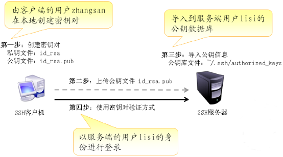

[TOC]


# 第十七单元-ssh批量部署


## 17.1 公司批量部署

### 17.1.1 批量部署的运用场景

在企业服务器系统中，往往要在几台服务器甚至成十台服务器部署相同的服务，以形成集群，共同协调完成公司业务处理，提高业务响应能力与速度，并保证数据安全。如果手动在所有服务器上安装相同服务，那工作量就会加大及效率势必会极大低下，因此要用到批量自动部署。


### 17.1.2 批量部署的思路

在公司中要实现全自动批量部署，目前使用最多的就是通过ssh服务的无密码登录，因此首先应该在所有的服务器上配置ssh的无密码登录服务；之后将手动安装服务的命令编写成脚本并将脚本与软件包通过scp服务远程传输到各个服务器，并在运程服务器上执行脚本即可完成指定部署。


## 17.2 ssh无密码登录


### 17.2.1 ssh无密码登录原理





### 17.1.3 生成秘钥并批量分发

**交互生成密钥对并分发公钥：**

需要输入几次回车

```shell
ssh-keygen
ssh-copy-id -i ~/.ssh/id_rsa.pub root@10.0.0.22
```


**免交互批量分发公钥：**

```shell
#!/bin/bash
yum -y install sshpass &>/dev/null
UserName=root
IP="10.0.0."
#创建密钥
ssh-keygen -t rsa -f ~/.ssh/id_rsa -P "" &>/dev/null
#分发公钥
for i in 23
  do
    sshpass -p "123456" ssh-copy-id -i ~/.ssh/id_rsa.pub "-p 22 -o StrictHostKeyChecking=no $UserName@$IP$i" &>/dev/null
done
```


### 17.1.4 ssh远程执行操作

**1.执行简单远程命令**

```
ssh root@10.0.0.22 "mkdir -p /opt/test;cd /opt/test;touch www.txt"
```

基本能完成常用的对于远程节点的管理了，几个注意的点：

1. 双引号，必须有。
2. 分号，两个命令之间用分号隔开。


**2.远程执行脚本**

对于要完成一些复杂功能的场景，如果是仅仅能执行几个命令的话，简直是弱爆了。

（1）执行本地的脚本

注意：`touch.sh`此脚本在本地服务器。

```shell
[root@ localhost ~]# vim /opt/scripts/touch.sh
#!/bin/bash

mkdir -p /opt/test{01..10}
touch /opt/test01/www{01..10}


[root@ c6m01 ~]# ssh root@10.0.0.22 < "/opt/scripts/touch.sh"
```

（2）执行远程脚本

注意：`del.sh`此脚本在远程服务器。

```shell
[root@ localhost ~]# ssh root@10.0.0.22 "sh /root/del.sh"
```


## 17.3 脚本源码包安装apache

```shell
vim /opt/scripts/install_apache.sh

#!/bin/bash
yum -y install gcc gcc-c++

#上传httpd源码包，并解压。
tar -xvf /root/httpd-2.2.9.tar.gz
cd /root/httpd-2.2.9
./configure --enable-so --prefix=/usr/local/apache2
make
make install
```


## 17.4 apache启动脚本

### 17.4.1 实现思路与流程分析

- 设置变量以存放apache启动命令
- 定义start、stop、restart、status等各个函数
- 在case语句中调用各个函数


### 17.4.2 编程实现与调试

**基础版：**

```shell
[root@ c6m01 ~]# vim /etc/init.d/httpd2
#!/bin/bash

apache="/usr/local/apache2/bin/apachectl"
lock="/usr/local/apache2/httpd.lock"

start (){
	if [ -e $lock ]
	then
	    echo "httpd2服务已启动"
	else
	    $apache -k start &>/dev/null
	    echo "正在启动httpd2服务"
	    touch $lock
	fi
}

stop (){
	$apache -k stop &>/dev/null
	echo "正在关闭httpd2服务"
	rm -f $lock
}

restart (){
	stop
	start
}

status(){
	if [ -e $lock ];then
		echo "httpd2服务已启动"
	else
		echo "httpd2服务已停止"
	fi
}

case "$1" in
	"start")
		start
		;;
	"stop")
		 stop
		 ;;
	"restart")
		 restart
		 ;;
	"status")
		status
		;;
	*)
		echo "usage:service apache start|stop|restart|status"
		;;
esac

[root@ c6m01 ~]# chmod +x /etc/init.d/httpd2
```


**优化版：**优化后的脚本调用了系统函数库，更接近与系统脚本。

```shell
[root@ c6m01 ~]# cat /etc/init.d/httpd2
#!/bin/bash
# apache - this script starts and stops the apache daemon
# chkconfig:   - 85 15
# description:  Apache is an HTTP(S) server
# processname: apache
# config:      /usr/local/apache/conf/apache.conf
# Source function library.

. /etc/rc.d/init.d/functions

# Source networking configuration.
. /etc/sysconfig/network

# Check that networking is up.

[ "$NETWORKING" = "no" ] && exit 0
apache="/usr/local/apache2/bin/apachectl"
prog=$(basename $apache)
APACHE_CONF_FILE="/usr/local/apache2/conf/httpd.conf"
lockfile=/var/lock/subsys/apache

start() {
    [ -x $apache ] || exit 5
    [ -f $APACHE_CONF_FILE ] || exit 6
    echo -n $"Starting $prog: "
    echo_success
    echo
    $apache start &>/dev/null
    retval=$?
    [ $retval -eq 0 ] && touch $lockfile
    return $retval
}
stop() {
    echo -n $"Stopping $prog: "
    echo_success
    echo
    $apache stop &>/dev/null
    retval=$?
    [ $retval -eq 0 ] && rm -f $lockfile
    return $retval
}
restart() {
    stop
    start
}
status()
{
        if [ -e $lockfile ];then
                echo "服务已启动"
        else
                echo "服务已停止"
        fi
}
case "$1" in
    start)
        $1
        ;;
    stop)
        $1
        ;;
    restart)
        $1
        ;;
    status)
$1;;
    *)
        echo $"Usage: $0 {start|stop|status|restart}"
        exit 2
esac

```


