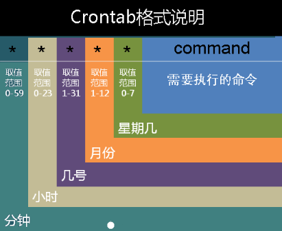

[TOC]


# 第十三单元-Linux作业调度机制


## 13.1 计划任务at命令

**计划任务**，在特定的时间执行某项工作，在特定的**时间执行一次**，需要安装at服务，`yum -y install at`

atd是linux 下一次性定时计划任务命令的守候进程。
查看

```
ps -ef | grep atd
```

配置开机启动

```
chkconfig atd on
```


### 13.1.1 at应用场景

在未来的某个时间点执行一次某个任务，如果在企业管理中，有一个任务要在**以后的一个时间里运行一次**，那就使用at命令设置任务执行时间，如果任务比较复杂，可将命令写成脚本并在at命令中调用。


### 13.1.2 at命令详解


**1.语法：**

```shell
at(选项)(参数)
```


**2.选项：**

```shell
-m：当指定的任务被完成之后，将给用户发送邮件，即使没有标准输出
-M：不发送邮件
-l：atq的别名
-d：atrm的别名
-r：atrm的别名
-v：显示任务将被执行的时间,显示的时间格式为：Thu Feb 20 14:50:00 1997
-c：打印任务的内容到标准输出
-V：显示版本信息
-q：后面加<队列> 使用指定的队列
-f：后面加<文件> 从指定文件读入任务而不是从标准输入读入
-t：后面<时间参数> 以时间参数的形式提交要运行的任务
```


**3. 时间定义：**

at允许使用一套相当复杂的指定时间的方法。

● 能够接受在当天的hh:mm（小时:分钟）式的时间指定。假如该时间已过去，那么就放在第二天执行。 例如：04:00
● 能够使用midnight（深夜），noon（中午），teatime（饮茶时间，一般是下午4点）等比较模糊的词语来指定时间。
● 能够采用12小时计时制，即在时间后面加上AM（上午）或PM（下午）来说明是上午还是下午。 例如：12pm
● 能够指定命令执行的具体日期，指定格式为month day（月 日）或mm/dd/yy（月/日/年）或dd.mm.yy（日.月.年），指定的日期必须跟在指定时间的后面。 例如：04:00 2009-03-1
● 能够使用相对计时法。指定格式为：now + count time-units ，now就是当前时间，time-units是时间单位，这里能够是minutes（分钟）、hours（小时）、days（天）、weeks（星期）。count是时间的数量，几天，几小时。 例如：now + 5 minutes 04pm + 3 days
● 能够直接使用today（今天）、tomorrow（明天）来指定完成命令的时间。


AT Time中的时间表示方法

| 时 间  | 例子                | 说明                         |
| ------ | ------------------- | ---------------------------- |
| Minute | at now + 5 minutes  | 任务在5分钟后运行            |
| Hour   | at now + 1 hour     | 任务在1小时后运行            |
| Days   | at now + 3 days     | 任务在3天后运行              |
| Weeks  | at now + 2 weeks    | 任务在两周后运行             |
| Fixed  | at midnight         | 任务在午夜运行               |
| Fixed  | at 10:30pm          | 任务在晚上10点30分           |
| Fixed  | at 23:59 12/31/2018 | 任务在2018年12月31号23点59分 |


**4.相关命令：**

● at：在特定的时间执行一次性的任务
● atq：列出用户的计划任务，如果是超级用户将列出所有用户的任务，结果的输出格式为：作业号、日期、小时、队列和用户名
● atrm：根据Job number删除at任务
● batch：在系统负荷允许的情况下执行at任务，换言之，就是在系统空闲的情况下才执行at任务


**5.相关配置文件：**

● 时间规范的确切定义可以在/usr/share/doc/at-3.1.10/timespec中查看
● 默认情况下计划任务都是放在/var/spool/at/这个文件
● root用户可以在任何情况下使用at命令，而其他用户使用at命令的权限定义在/etc/at.allow（被允许使用计划任务的用户）和/etc/at.deny（被拒绝使用计划任务的用户）文件中
● 如果/etc/at.allow文件存在，只有在该文件中的用户名对应的用户才能使用at
● 如果/etc/at.allow文件不存在，/etc/at.deny存在，所有不在/etc/at.deny文件中的用户可以使用at
● at.allow比at.deny优先级高，执行用户是否可以执行at命令，先看at.allow文件没有才看at.deny文件
● 如果/etc/at.allow和/etc/at.deny文件都不存在，只有root用户能使用at
● 一个空内容的/etc/at.deny表示任何用户都能使用at命令，这是默认的配置
● 一般情况下这两个文件存在一个即可。如果只有少数几个用户需要使用计划任务，那么就保留at.allow文件，如果大部分用户都要使用计划任务，那么保留at.deny即可


### 13.1.3 at命令应用举例

创建at任务方式有两种，从文件输入和从命令行输入。以下分别用两种方式创建1分钟后将当前时间写入 date.log 文件的命令

**1. 文件输入：**

```shell
[root@ localhost ~]# vim at.sh  	#编辑打印系统时间到data.log的脚本
#!/bin/bash
echo `date` >>date.log

[root@ localhost ~]# at -f at.sh now +1 minutes		#启动at计划任务于下一分钟执行
job 2 at 2019-10-17 20:26

[root@ localhost ~]# atq		#查看队列（未执行的定时任务）
2	2019-10-17 20:26 a root

[root@ localhost ~]# cat date.log	#查看文件
Thu Oct 17 20:26:00 CST 2019

```


**2.命令行输入：**

创建格式：

at  时间   回车

at> 命令

at> Ctrl+D结束

```shell
#创建at定时任务

[root@ localhost ~]# at now +1 minutes
at> echo '命令行输入' >>date.log
at> <EOT>
job 5 at 2019-10-17 20:44

#查看at定时任务
[root@ localhost ~]# at -l
5	2019-10-17 20:44 a root
#作业号  执行时间   队列（将不同作业放入不同队列分类） 用户

#删除at作业：
命令：at -d或atrm 作业号
例：at -d 2
```


**3.使用实例**

**实例1：三天后的下午 5 点执行 /bin/ls**

命令：

```
at 5pm+3 days
```

输出：

```shell
[root@ localhost ~]# at 5pm+3 days
at> ls
at> <EOT>
job 7 at 2019-10-20 17:00

```


**实例2：明天17点钟，输出时间到指定文件内**

命令：

```
at 17:00 tomorrow
```

输出：

```shell
[root@ localhost ~]# at 17:00 tomorrow
at> date >./date.log
at> <EOT>
job 8 at 2019-10-18 17:20
```


**实例3：计划任务设定后，在没有执行之前我们可以用atq命令来查看系统没有执行工作任务**

命令：

```
atq 或 at -l
```

输出：

```shell
[root@ localhost ~]# atq
6	2019-10-20 17:00 a root
7	2019-10-20 17:00 a root
8	2019-10-18 17:20 a root

[root@ localhost ~]# at -l
6	2019-10-20 17:00 a root
7	2019-10-20 17:00 a root
8	2019-10-18 17:20 a root
```


**实例4：删除已经设置的任务**

命令：

```
atrm 7 或 at -d 作业号
```

输出：

```shell
[root@ localhost ~]# atrm 7
[root@ localhost ~]# at -l
6	2019-10-20 17:00 a root
8	2019-10-18 17:20 a root

```


**实例5：显示已经设置的任务内容**

命令：

```
at -c 8
```

输出：

```shell
[root@localhost ~]# at -c 8

#!/bin/sh
# atrun uid=0 gid=0
# mail     root 0
umask 22此处省略n个字符
```


## 13.2 计划任务crond命令

**crontab**命令常见于Unix和Linux的操作系统之中，用于设置**周期性被执行的指令**。该命令从标准输入设备读取指令，并将其存放于“crontab”文件中，以供之后读取和执行。通常，crontab储存的指令被守护进程激活。crond 常常在后台运行，每一分钟检查是否有预定的作业需要执行。这类作业一般称为cron jobs。

### 13.2.1 安装配置

```
yum -y install vixie-cron crontabs

说明：
vixie-cron 软件包是 cron 的主程序；
crontabs 软件包是用来安装、卸装、或列举用来驱动 cron 守护进程的表格的程序。
```

**配置**

cron 是 linux 的内置服务，但它不自动起来，可以用以下的方法启动、关闭这个服务：

```
service crond start  #启动服务
service crond stop 	  #关闭服务
service crond restart #重启服务
service crond reload  #重新载入配置
service crond status  #查看服务状态
```

在CentOS系统中加入开机自动启动: 

```
chkconfig crond on
```

cron 的主配置文件是 /etc/crontab，它包括下面几行：

```
SHELL=/bin/bash
PATH=/sbin:/bin:/usr/sbin:/usr/bin
MAILTO=root
HOME=/

# run-parts
01 * * * * root run-parts /etc/cron.hourly
02 4 * * * root run-parts /etc/cron.daily
22 4 * * 0 root run-parts /etc/cron.weekly
42 4 1 * * root run-parts /etc/cron.monthly
```

前四行是用来配置 cron 任务运行环境的变量。


### 13.2.2 crontab命令

**语法：**

```
crontab[-u <用户名称>][配置文件] 或 crontab [-u <用户名称>][-elr]
```

解释：cron 是一个常驻服务，它提供计时器的功能，让用户在特定的时间得以执行预设的指令或程序。只要用户会编辑计时器的配置文件，就可以使用计时器的功能。其配置文件格式如下：`Minute Hour Day Month DayOFWeek Command`

**参数说明：**

```
crontab -u //设定某个用户的cron服务，一般root用户在执行这个命令的时候需要此参数
crontab -l //列出某个用户cron服务的详细内容   #常用
crontab -r //删除某个用户的cron服务
crontab -e //编辑某个用户的cron服务    #常用

比如说root查看自己的cron设置：crontab -u root -l
再例如，root想删除fred的cron设置：crontab -u fred -r
```


**格式:**




```
第1列表示分钟1～59 每分钟用*或者 */1表示
第2列表示小时1～23（0表示0点）
第3列表示日期1～31
第4列表示月份1～12
第5列标识号星期0～6（0表示星期天）
第6列要运行的命令
```


### 13.2.3 crond应用举例

```shell
30 21 * * * /etc/init.d/httpd restart
上面的例子表示每晚的21:30重启apache。

45 4 1,10,22 * * /etc/init.d/httpd restart
上面的例子表示每月1、10、22日的4 : 45重启apache。

10 1 * * 6,0 /etc/init.d/httpd restart
上面的例子表示每周六、周日的1 : 10重启apache。

*/30 18-23 * * * /etc/init.d/httpd restart
上面的例子表示在每天18 : 00至23 : 00之间每隔30分钟重启apache。

0 23 * * 6 /etc/init.d/httpd restart
上面的例子表示每星期六的23 : 00重启apache。

* */1 * * * /etc/init.d/httpd restart
每一小时重启apache

* 20-23/1 * * * /etc/init.d/httpd restart
晚上20点到23点之间，每隔一小时重启apache

0 11 4 * mon-wed /etc/init.d/httpd restart
每月的4号与每周一到周三的11点重启apache

0 4 1 jan * /etc/init.d/httpd restart
一月一号的4点重启apache

*/30 * * * * /usr/sbin/ntpdate 210.72.145.44
每半小时同步一下时间
```


### 13.2.4 crontab 运行 service 命令不起作用的问题

> 需要特别注环境变量的设置，因为我们手动执行某个任务时，是在当前shell环境下进行的，程序当然能找到环境变量，而系统自动执行任务调度时，是不会加载任何环境变量的，因此，就需要在crontab文件中指定任务运行所需的所有环境变量，这样，系统执行任务调度时就没有问题了。


例如,以下任务就找不到service

	52 10 * * * service httpd restart

需要写全路径

有可能是 /sbin/service ， 也有可能是 /usr/sbin/service

使用以下命令确定：

```
which service
```

我的系统返回的是：/sbin/service

正确的路径的service

```
52 10 * * * /sbin/service httpd restart
```


## 13.3 Linux进程控制

### 13.3.1 进程相关知识

**含义：**

 进程（process）：进程是程序的执行实例，即运行中的程序，也是程序的副本；程序放置于磁盘中，而进程放置于内存中；进程的启动及调度均是由内核发起的。centos6系统init是所有进程的父进程，而子进程是由fork（）进程生成。

    线程（Thread）：一个进程至少包括一个线程，通常将该线程称为主线程，所以线程是比进程更小的单位，是系统分配处理器时间资源的基本单元。一个进程要想同时在多颗CPU上运行，必须得分成互不影响的多个执行流，而后每组单独在各自所分配的CPU上运行，这种分化后的执行流且有着比进程更小资源分配单位称之为线程。


**进程优先级0-139 ：**

实时优先级：0-99 ，数字越大，优先级越高

静态优先级：100-139，数字越小，优先级越高


**进程nice值：**

指静态优先级，降低优先级

取值范围：-20—19；-20对用100,19对用139


**进程类型：守护进程、用户进程**

守护进程：系统启动时运行的进程，类似windows上的开机进程（开机任务），跟终端无关

用户进程：用户通过终端启动的进程，也可以叫前台进程，需要注意的是，也可以把前台进程送往后台，以守护模式运行。


**进程状态：**

​    运行态：running ，正在运行的进程就是当前进程（由current所指向的进程），而准备运行的进程只要得到CPU就可以立即投入运行，CPU是这些进程唯一等待的系统资源。系统中有一个运行队列（run_queue），用来容纳所有处于可运行状态的进程，调度程序执行时，从中选择一个进程投入运行。

​    等待态：waiting，处于该状态的进程正在等待某个事件（event）或某个资源，它肯定位于系统中的某个等待队列（wait_queue）中。Linux中处于等待状态的进程分为两种：可中断的等待状态和不可中断的等待状态。处于可中断等待态的进程可以被信号唤醒，如果收到信号，该进程就从等待状态进入可运行状态，并且加入到运行队列中，等待被调度；而处于不可中断等待态的进程是因为硬件环境不能满足而等待。

​    睡眠态：sleeping，可中断睡眠（interruptable）、不可中断睡眠（uninterruptable）

​    停止态：stop ，不会被调度 stopped ，此时的进程暂时停止运行来接受某种特殊处理。通常当进程接收到SIGSTOP、SIGTSTP、SIGTTIN或 SIGTTOU信号后就处于这种状态。例如，正接受调试的进程就处于这种状态。

​    僵死态：zombie，系统调用，终止进程的信息也还没有回收。顾名思义，处于该状态的进程就是死进程，这种进程实际上是系统中的垃圾，必须进行相应处理以释放其占用的资源。


**进程管理命令：**pstree，ps，pgrep，top，htop，vmstat，dstat


### 13.3.2 信号的概念解读

**1.掌握生成信号**

（1）中断进程 
使用`ctrl+c`组合键可以生产SIGINT信号比如用sleep命令测试 

```
[root@wzp ~]# sleep 100 
```

如果我不使用组合键那么控制台就无法进行输入了一直运行该sleep程序，所以通过这方法可以终止进程。 

（2）暂停进程 
有些进程想暂停而不是终止它可以使用`ctrl+z`组合键生产SIGTSTP信号 

```
[root@wzp ~]# sleep 100 
[1]+  Stopped                 sleep 100 
```

看到没有，如果是暂停进程会有log信息显示stopped的。 
如上可以看到中括号里面有一个1数值就是shell分配的作业编号，第一个启动的进程分配作业编号1，第二个启动的进程分配作业编号2，依此类推，如果shell会话中存在停止的作业，退出shell时会发出警告信号的\\

**2.掌握trap捕捉信号的格式：**

trap  '命令'   信号列表

a) 掌握trap捕捉信号实例：捕捉中断信息和退出信号

```shell
#!/bin/bash

trap "echo 程序运行过程中不可中断" SIGINT
trap "echo  程序执行完毕" exit
for i in `seq 1 5`
do

if ping -c 1 10.0.0.$i &>/dev/null;then
	echo 10.0.0.$i is up
else
	echo 10.0.0.$i is down
fi
done
```


## 13.4 Linux作业调度

**前台进程和后台进程：**

前台进程需前台控制，所以只有等进程结束才能回到输入命令提示符状态。

而后台不需前台控制，启动后可以回到命令提示符状态继续执行其它进程。


**1. nohup**

用途：不挂断地运行命令。该命令可以在退出帐户之后继续运行相应的进程。 nohup就是不挂起的意思( no hang up)。

语法：nohup Command [ Arg … ] [　& ]

　　无论是否将 nohup 命令的输出重定向到终端，输出都将附加到当前目录的 nohup.out 文件中。


**2. &**

用途：在后台运行

一般两个一起用

例如：

```
[root@ localhost ~]# nohup sh test.sh &
[1] 27815
```


**3.jobs**

在Linux中，启动、停止、终止以及恢复作业的这些功能统称为作业控制。作业控制中的关键命令是jobs命令，jobs命令允许查看shell当前正在处理的作业。jobs命令中输出有加号和减号，带加号的作业被当做默认作业，带减号的为下一个默认作业。

```
# -l，列出进程的PID和作业号
[root@ localhost ~]# jobs -l
[1]+ 27874 Running                 nohup sh test.sh &


# -p，只列出作业的PID
[root@ localhost ~]# jobs -p
27874
[1]+  Done                    nohup sh test.sh


# -s，只列出停止的作业
$ jobs -s

# -r，只列出运行的作业
$ jobs -r
```


**bg**
将一个在后台暂停的命令，变成继续执行

**fg**
将后台中的命令调至前台继续运行


**补充：**Shell重定向＆>file、2>&1、1>&2的区别

```
0 表示标准输入
1 表示标准输出
2 表示标准错误输出

> 默认为标准输出重定向，与 1> 相同
2>&1 意思是把 标准错误输出 重定向到 标准输出.   例如：>/dev/null 2>&1
&>file 意思是把 标准输出 和 标准错误输出 都重定向到文件file中.  例如：&>/dev/null
```
