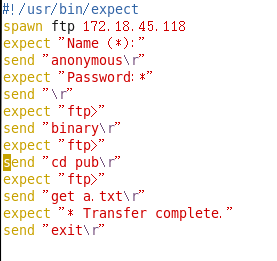

[TOC]


# 第十二单元-expect实现自动交互


## 12.1 expect语言

### 12.1.1 expect语言介绍

**1.含义**

`expect`是一个免费的编程工具，用来实现自动的**交互式任务**，而无需人为干预。说白了，`expect`就是一套用来实现自动交互功能的软件。

**2.应用场景**

借助Expect处理交互的命令，可以将交互过程如：**ssh登录，ftp登录等写在一个脚本上，使之自动化完成**。尤其适用于需要对多台服务器执行相同操作的环境中，可以大大提高系统管理人员的工作效率 。

**安装**

```
yum -y install expect
```


### 12.1.2 expect语法

expect 是基于tcl 演变而来的，所以很多语法和tcl 类似，基本的语法如下

**脚本开头**

expect脚本一般以`#!/usr/bin/expect`开头，类似bash脚本。

**常用后缀**

expect脚本常常以`.exp`或者`.ex`结束。

**命令含义及说明**

| 命令             | 作用                                                         | 示例                                       |
| ---------------- | ------------------------------------------------------------ | ------------------------------------------ |
| spawn            | spawn命令是expect的初始命令，它用于启动一个进程，之后所有expect操作都在这个进程中进行，如果没有spawn语句，整个expect就无法执行了 | spawn ssh root@10.0.0.22                   |
| expect           | 用于等候一个相匹配内容的输出，一旦匹配上就执行               | expect "*password:" { send "$password\r" } |
| send             | 发送问题答案给交互命令                                       | send "yes\r"                               |
| \r               | 表示回车                                                     |                                            |
| exp_continue     | 表示问题回答完毕退出 expect 环境                             |                                            |
| interact         | 表示问题回答完毕留在交互界面                                 |                                            |
| set              | 定义变量                                                     |                                            |
| set timeout -1   | 设置超时方式为永远不超时                                     |                                            |
| set timeout 30   | 设置超时时间为30秒                                           |                                            |
| [lindex $argv 0] | 获取expect脚本的第1个参数                                    |                                            |
| [lindex $argv 1] | 获取expect脚本的第2个参数                                    |                                            |

### 12.1.3 expect命令分支

expect命令采用了tcl的**模式-动作**语法，此语法有以下几种模式：

**单一分支语法**

```shell
set password 123456
expect "*assword:" { send "$password\r" }
```

当输出中匹配*assword:时，输出password变量的数值和回车。

**多分支模式语法**

```shell
set password 123456
expect {
      "*assword:" { send "$password\r" }
      "(yes/no)?" { send "yes\r"; exp_continue }
}
```

当输出中包含(yes/no)?时，输出yes和回车,同时重新执行此多分支语句。

当输出中匹配*assword:时，输出password变量的数值和回车。


## 12.2 expect实现ssh自动登录

**实现思路：**
执行ssh命令远程登录ssh服务器---->等待ssh服务器端返回输入用户名与密码的界面---->输入用户名与密码实现登录


**脚本示例一：基础版**

```shell
#!/usr/bin/expect

set timeout 10
spawn ssh root@10.0.0.22
expect "*password*"
send "123456\r"

interact
```

**脚本示例二：传参版**

```shell
[root@ c6m01 ~]# vim login.exp
#!/usr/bin/expect

if {$argc < 3} {
    puts "Usage:cmd <host> <username> <password>"
    exit 1
}

set timeout -1
set host [lindex $argv 0]
set username [lindex $argv 1]
set password [lindex $argv 2]

spawn ssh $username@$host

expect {
    "password" {send "$password\r";}
    "yes/no" {send "yes\r";exp_continue}
}

interact
```

**参数详解**

`if {$argc < 3}`: 判断脚本执行性是否满足有三个参数，如果不满足，则打印出提示信息

`set timeout -1`: 设置超时方式为永远等待

`set host [lindex $argv 0]`: 设置脚本传递进来的第一个参数为host变量

`spawn ssh $username@$host`: spawn是进入expect环境后才可以执行的expect内部命令，如果没有装expect或者直接在默认的SHELL下执行是找不到spawn命令的。它主要的功能是给ssh运行进程加个壳，用来传递交互指令；

`interact`：执行完成后保持交互状态，把控制权交给控制台，这个时候就可以手工操作了。如果没有这一句登录完成后会退出，而不是留在远程终端上。


## 12.3 expcet实现scp自动文件传输

**思路分析：**
启动scp命令---->服务端返回输入用户名与密码界面---->发送用户名密码完成登录


**脚本示例一：简单版**

```shell
#!/usr/bin/expect

set timeout 10
spawn scp -P22 root@10.0.0.20:/root/install.log /home
expect "*password*"
send "123456\r"

interact
```

**脚本示例二：传参版**

```shell
[root@ c6m01 ~]# vim scp_pull.exp

#!/usr/bin/expect

if {$argc < 3} {
    puts "Usage:cmd <port> <host> <username> <password> <file_name> <local_path>"
    exit 1
}

set timeout -1
set port [lindex $argv 0]
set host [lindex $argv 1]
set username [lindex $argv 2]
set password [lindex $argv 3]
set file_name [lindex $argv 4]
set local_path [lindex $argv 5]

spawn scp -P$port $username@$host:$file_name $local_path

expect {
    "password" {send "$password\r";}
    "yes/no" {send "yes\r";exp_continue}
}

interact

```


## 12.4 expcet实现ftp自动文件传输

**实现思路：**

启动命令---->服务器返回输入用户名密码界面---->发送用户名密码完成登录à服务器返回命令操作界面---->发送操作命令---->退出


脚本示例：





