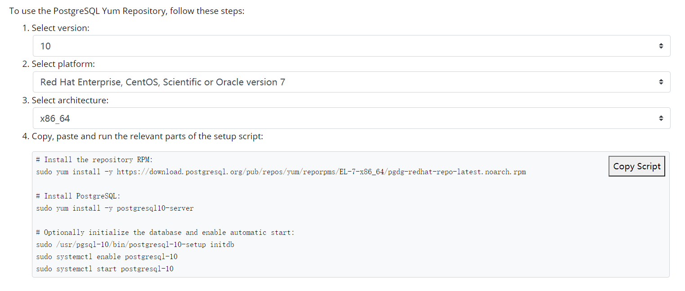
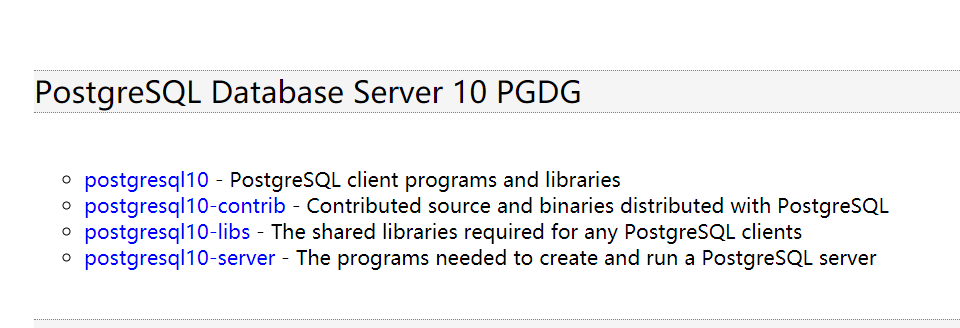

[TOC]


# PostgreSQL安装

# 1 简 介 

PostgreSQL 是一种非常复杂的对象-关系型数据库管理系统（ORDBMS），也是目前功能最强大，特性最丰富和最复杂的自由软件数据库系统。有些特性甚至连商业数据库都不具备。这个起源于伯克利（BSD）的数据库研究计划目前已经衍生成一项国际开发项目，并且有非常广泛的用户。


# 2 PostgreSQL优点特性

　    PostgreSQL 是世界上可以获得的最先进的开放源码的数据库系统， 它提供了多版本并行控制，支持几乎所有 SQL 构件(包括子查询，事务和用户定 义类型和函数)， 并且可以获得非常广阔范围的(开发)语言绑定 (包括 C，C++，Java，perl，tcl，和 python)。具体的优点特性如下：

　　1. PostgreSQL 的特性覆盖了 SQL-2/SQL-92 和 SQL-3/SQL-99，是目前世界上支持最丰富的数据类型的数据库。

　　2. PostgreSQL 是全功能的自由软件数据库，PostgreSQL 是唯一支持事务、子查询、多版本并行控制系统、数据完整性检查等特性的唯一的一种自由软件的数据库管理系统。

　　3. PostgreSQL 采用的是比较经典的 C/S (client/server)结构，也就是一个客户端对应一个服务器端守护进程的模式，这个守护进程分析客户端来的查询请求，生成规划树，进行数据检索并最终把结果格式化输出后返回给客户端。

　　4. PostgreSQL 对接口的支持也是非常丰富的，几乎支持所有类型的数据库客户端接口。

　　**Salesforce.com 最近宣布提供了 PostgreSQL-as-a-service 服务：**

　　1. PorstgreSQL 是一项好技术。

　　2. MySQL 正在奋力直追，不过 PostgreSQL 仍然在许多方面遥遥领先。

　　3. PostgreSQL 有很多用户，很涉及领域广，包括学术界，同时涵盖人群广泛，很多用户是俄罗斯人。

　　4. 不论是 EnterpriseDB 还是 PostgreSQL 社区，都很乐于管理、维护这个数据库。

　　5. 很多 DBMS 产品都是 PostgreSQL 的衍生品，比如 Greenplum, Aster Data nCluster, Netezza 等等。

　　6. PostgreSQL 的创新仍在继续，例如http://www.dbms2.com/2011/11/08/hadapt-is-moving-forward/

　　7. 无法保证 Oracle 会在 MySQL 项目上持续加强投入力度，特别是 Oracle 的反垄断承诺将在2014年到期。


# 3 安装PostgreSQL


## 3.1 Yum安装

在https://www.postgresql.org/download/linux/redhat/选择对应的版本进行yum安装。




## 3.2 RPM包安装

在https://yum.postgresql.org/rpmchart/，选择对应版本的RPM包进行安装。



下载链接：

```shell
wget --no-check-certificate https://yum.postgresql.org/10/redhat/rhel-7-x86_64/postgresql10-10.15-1PGDG.rhel7.x86_64.rpm
wget --no-check-certificate https://yum.postgresql.org/10/redhat/rhel-7-x86_64/postgresql10-contrib-10.15-1PGDG.rhel7.x86_64.rpm
wget --no-check-certificate https://yum.postgresql.org/10/redhat/rhel-7-x86_64/postgresql10-libs-10.15-1PGDG.rhel7.x86_64.rpm
wget --no-check-certificate https://yum.postgresql.org/10/redhat/rhel-7-x86_64/postgresql10-server-10.15-1PGDG.rhel7.x86_64.rpm
```

安装顺序：

```shell
rpm -ivh postgresql10-libs-10.15-1PGDG.rhel7.x86_64.rpm
rpm -ivh postgresql10-10.15-1PGDG.rhel7.x86_64.rpm
rpm -ivh postgresql10-server-10.15-1PGDG.rhel7.x86_64.rpm
rpm -ivh postgresql10-contrib-10.15-1PGDG.rhel7.x86_64.rpm
```


## 3.3 源码安装

源码包地址：

https://ftp.postgresql.org/pub/source/v10.7/postgresql-10.7.tar.gz

1. **安装依赖**

```bash
yum install -y bison flex readline-devel zlib-devel gcc zlib readline openssl openssl-devel
```

2. **下载软件并安装**

```bash
wget https://ftp.postgresql.org/pub/source/v10.7/postgresql-10.7.tar.gz
tar -zvvf postgresql-10.7.tar.gz
cd postgresql-10.7
./configure --prefix=/usr/local/pgsql10
make
make install
```

3. **添加用户并更改权限**

```shell
useradd postgres
echo "DtDream@0209"|passwd --stdin postgres
mkdir -p /data/pgsql/data
mkdir -p /data/pgsql/log
touch /data/pgsql/log/pgsql.log
chown -R postgres:postgres /data/pgsql
chown -R postgres:postgres /usr/local/pgsql10
```

4. **添加环境变量**

```bash
cat >>/etc/profile<<\EOF
#postgresql
export PGHOME=/data/pgsql
export PGBASE=/usr/local/pgsql10
export PATH=$PATH:$PGBASE/bin
EOF
source /etc/profile
```

5. **初始化实例**

```shell
[root@host-10-18-22-154 data]# su - postgres
[root@host-10-18-22-154 data]# cd /usr/local/pgsql10/bin
[postgres@host-10-18-22-154 bin]$ ./initdb -D /data/pgsql/data
The files belonging to this database system will be owned by user "postgres".
This user must also own the server process.

The database cluster will be initialized with locale "en_US.UTF-8".
The default database encoding has accordingly been set to "UTF8".
The default text search configuration will be set to "english".

Data page checksums are disabled.

fixing permissions on existing directory /data/pgsql/data ... ok
creating subdirectories ... ok
selecting default max_connections ... 100
selecting default shared_buffers ... 128MB
selecting dynamic shared memory implementation ... posix
creating configuration files ... ok
running bootstrap script ... ok
performing post-bootstrap initialization ... ok
syncing data to disk ... ok

WARNING: enabling "trust" authentication for local connections
You can change this by editing pg_hba.conf or using the option -A, or
--auth-local and --auth-host, the next time you run initdb.

Success. You can now start the database server using:

    ./pg_ctl -D /data/pgsql/data -l logfile start
```

查看数据是否生成：

```shell
[postgres@host-10-18-22-154 ~]$ ls /data/pgsql/data/
base          pg_hba.conf    pg_notify     pg_stat      pg_twophase  postgresql.auto.conf
global        pg_ident.conf  pg_replslot   pg_stat_tmp  PG_VERSION   postgresql.conf
pg_commit_ts  pg_logical     pg_serial     pg_subtrans  pg_wal
pg_dynshmem   pg_multixact   pg_snapshots  pg_tblspc    pg_xact
```

其中：

` base `目录是表空间目录；

` global `目录是相关全局变量目录；

` pg_hba.conf `是访问控制配置文件；

` postgresql.conf `是postgresql的主配置文件。

6. **修改pg_hba.conf文件**

将该文件中的IPV4的连接修改为 ` 0.0.0.0/0 `，表示信任来自所有id连接的客户端，加密方式改为 ` md5`；

```shell
[postgres@host-10-18-22-154 data]$ vi pg_hba.conf
```


7. **修改postgresql.conf配置文件**

将 ` localhost `改为 ` * `，表示监听所有的网络连接。其他的参数保持默认即可。

```shell
[postgres@host-10-18-22-154 data]$ vi postgresql.conf
```


8. **启动数据库**

```shell
[postgres@host-10-18-22-154 data]$ pg_ctl -D /data/pgsql/data -l /data/pgsql/log/pgsql.log   start
waiting for server to start..... done
server started
```

9. **登录数据库并设置密码**

```sql
[postgres@host-10-18-22-154 data]$ psql -p 5432
psql (10.7)
Type "help" for help.

postgres=# ALTER USER postgres WITH PASSWORD 'a*aDnw4YL$3t';
```


10. **设置开机自启**

```shell
vi /etc/rc.local
su - postgres -c "/usr/local/pgsql10/bin/pg_ctl -D /data/pgsql/data -l /data/pgsql/log/pgsql.log   start"
chmod +x /etc/rc.d/rc.local
```


# 4 安装PostGIS

PostGIS离线安装较为麻烦，安装之前需要准备相应的编译环境。安装之前最好查看一下[编译环境要求](https://trac.osgeo.org/postgis/wiki/UsersWikiPostgreSQLPostGIS)和[相关说明](http://postgis.net/docs/postgis_installation.html#install_requirements)，并包含相应下载地址。

## 4.1 安装依赖

```bash
yum install -y libtool libxml2 libxml2-devel libxslt libxslt-devel json-c json-c-devel cmake gmp gmp-devel mpfr mpfr-devel boost-devel pcre-devel
```

**编译安装proj**

```bash
wget http://download.osgeo.org/proj/proj-5.0.0.tar.gz
tar -xf proj-5.0.0.tar.gz
cd proj-5.0.0
./configure --prefix=/usr/local/pgsql10/plugin/proj
make
make install
echo "/usr/local/pgsql10/plugin/proj/lib" > /etc/ld.so.conf.d/proj-5.0.0.conf
ldconfig
```

**安装geos**

```bash
wget http://download.osgeo.org/geos/geos-3.6.2.tar.bz2
tar -jxf geos-3.6.2.tar.bz2
cd geos-3.6.2
./configure --prefix=/usr/local/pgsql10/plugin/geos
make
make install
echo "/usr/local/pgsql10/plugin/geos/lib" > /etc/ld.so.conf.d/geos-3.6.2.conf
ldconfig
```

**安装gdal**

```bash
wget http://download.osgeo.org/gdal/2.1.2/gdal-2.1.2.tar.gz
tar -xf gdal-2.1.2.tar.gz
cd gdal-2.1.2
./configure --prefix=/usr/local/pgsql10/plugin/gdal
make
make install
echo "/usr/local/pgsql10/plugin/gdal/lib" > /etc/ld.so.conf.d/gdal-2.1.2.conf
ldconfig
```

**安装PostGIS**

```bash
wget https://download.osgeo.org/postgis/source/postgis-2.5.2.tar.gz
tar -xvzf postgis-2.5.2.tar.gz
cd postgis-2.5.2
./configure --prefix=/usr/local/pgsql10/plugin/postgis \
--with-pgconfig=/usr/local/pgsql10/bin/pg_config \
--with-geosconfig=/usr/local/pgsql10/plugin/geos/bin/geos-config \
--with-gdalconfig=/usr/local/pgsql10/plugin/gdal/bin/gdal-config \
--with-projdir=/usr/local/pgsql10/plugin/projdir
make
make install
```

常见报错：

```bash
在postgis中执行./configure时，遇到 checking for library containing GDALAllRegister... no 的错误信息
checking for library containing GDALAllRegister... no
configure: error: could not find GDAL

解决办法：将PostgreSQL的lib目录（/postgresql/lib）和GDAL的lib文件目录（/usr/local/lib）添加到系统的库文件目录中

echo '/usr/local/pgsql/lib/' >>/etc/ld.so.conf
echo '/usr/local/pgsql/plugin/gdal/lib/' >>/etc/ld.so.conf

ldconfig

检查是否生效
[root@test postgis-2.1.1]# ldconfig -p | grep libpq
    libpqwalreceiver.so (libc6,x86-64) => /postgresql/lib/libpqwalreceiver.so
    libpq.so.5 (libc6,x86-64) => /postgresql/lib/libpq.so.5
    libpq.so (libc6,x86-64) => /postgresql/lib/libpq.so

[root@test postgis-2.1.1]# ldconfig -p | grep gdal
    libgdal.so.1 (libc6,x86-64) => /usr/local/lib/libgdal.so.1
    libgdal.so (libc6,x86-64) => /usr/local/lib/libgdal.so

再执行./configure就正常了。
```


**安装fuzzystrmatch**

数据库编译安装时，该扩展不会自动安装，需要自行编译安装。

```shell
#进入postgresql-10.7源码包目录
cd /root/postgresql-10.7/contrib/fuzzystrmatch
make && make install
```

添加环境变量

```bash
#postgresql
export PGHOME=/data/pgsql
export PGBASE=/usr/local/pgsql10
export PATH=$PATH:$PGBASE/bin

export LD_LIBRARY_PATH=/usr/local/pgsql10/plugin/geos/lib:/usr/local/pgsql10/plugin/proj/lib:/usr/local/pgsql10/plugin/gdal/lib::$PGHOME/lib:/lib64:/usr/lib64:/usr/local/lib64:/lib:/usr/lib:/usr/local/lib:$LD_LIBRARY_PATH
```


## 4.2 检查PostGIS是否安装成功

进入数据库终端，测试空间数据库是否能够创建成功。

```bash
su - postgres
psql
create database gistest;  # 创建普通数据库
\c gistest  # 切换到该数据库
\dx  # 显示扩展模块
```

查看已安装扩展：

```sql
SELECT name, default_version,installed_version FROM pg_available_extensions WHERE name LIKE 'postgis%' or name LIKE 'address%';
```

为普通数据库增加空间扩展

```sql
CREATE EXTENSION postgis;
CREATE EXTENSION fuzzystrmatch;
CREATE EXTENSION postgis_tiger_geocoder;
CREATE EXTENSION address_standardizer;
CREATE EXTENSION postgis_topology;
```


# 5 PostgreSQL多实例

就是共用一套程序，然后在多创建一个实例，注意配置文件中的端口和特殊配置即可。


