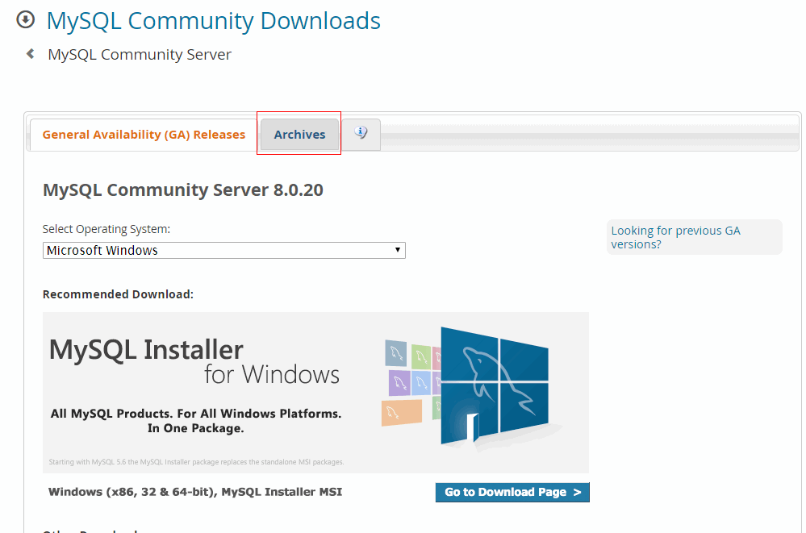
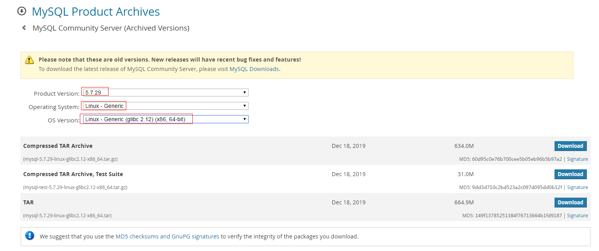
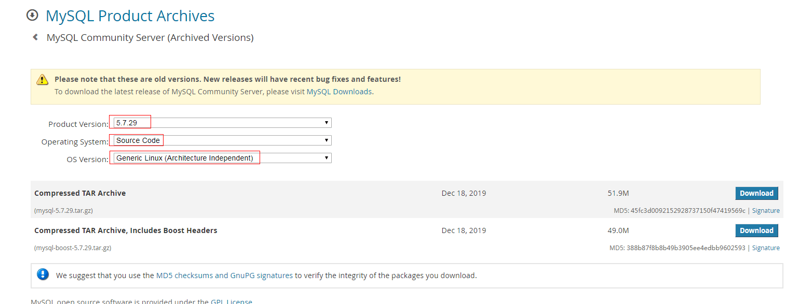

# MySQL安装

# 1.1 安装方式介绍

MySQL 在Linux 下的安装方式有三种：

**1、yum/rpm安装**

yum安装比较简单，适合对数据库要求不太高的场合，例如并发不大，公司内部，企业内部的一些应用场景，大的门户把源码根据企业的需求制作成rpm,搭建yum仓库，yum install xxx -y。 

**2、二进制安装**

二进制软件安装：linux下二进制格式的软件是指事先已经在各种平台编译安装好相关的软件，然后压缩打包，在安装时只需要解压或者执行安装可执行文件即可。这种软件发行格式类似于windows系统，这样做的原因是保护源代码程序不对外泄露，保护知识产权。二进制软件包的有点事安装简单、容易。缺点是缺乏灵活性，相应的软件包执行在对应的平台下安装，离开这个环境软件就无法运行。例如：JDK，oracle，Weblogic的安装。

二进制版本要求不高，适用于测试用，若是线上环境，还请使用。

**3、源码安装**

源码安装的优势：linux操作系统开放源代码，因此在其上面安装的软件大部分也都是开源软件。开源软件基本都提供×××和源码安装的方式。源码安装的好处是用户可以自己定制软件的功能，安装需要的模块，不需要的功能可以不用安装，此外，用户还可以自己选择安装的路径，方便管理。卸载软件也很方便，只需要删除对应的安装目录即可。没有windows所谓的注册表之说。 


# 1.2 如何安装


## yum安装

mysql5.7

```bash
wget http://repo.mysql.com/mysql-community-release-el7-5.noarch.rpm
rpm -ivh mysql-community-release-el7-5.noarch.rpm
yum install mysql-server mysql -y
```

注意：在新版本的CentOS7中，默认的数据库已更新为了Mariadb，而非 MySQL，所以执行 yum install mysql 命令只是更新Mariadb数据库，并不会安装 MySQL 。


## 二进制安装

 安装包地址：https://dev.mysql.com/downloads/mysql/ ；选择自己需要的版本。





 1、查询删除原有mysql

```bash
rpm -qa | grep mysql
yum remove mysql mysql-server mysql-libs compat-mysql51 -y
```

2、安装依赖

```bash
yum install bison-devel ncurses-devel libaio-devel -y
```

3、创建MySQL用户组和用户

```bash
groupadd mysql
useradd -r -g mysql -s /sbin/nologin mysql
```

3、下载二进制包并添加环境变量

```bash
cd /usr/local/src/
wget https://downloads.mysql.com/archives/get/p/23/file/mysql-5.7.29-linux-glibc2.12-x86_64.tar.gz
tar -zxvf mysql-5.7.29-linux-glibc2.12-x86_64.tar.gz -C /usr/local/
mv /usr/local/mysql-5.7.29-linux-glibc2.12-x86_64 /usr/local/mysql
chown -R mysql.mysql /usr/local/mysql

echo 'PATH=/usr/local/mysql/bin:$PATH' >>/etc/profile
source /etc/profile
```

4、创建数据、日志目录并授权

```
mkdir -p /data/mysql/{data,logs}
chown -R mysql.mysql /data/mysql
```

5、初始化

```bash
mysqld --initialize-insecure --user=mysql --basedir=/usr/local/mysql --datadir=/data/mysql
```

- --initialize-insecure：此参数初始化数据库时为空密码

6、创建启动文件和配置文件

```bash
# 配置文件
vim /etc/my.cnf
[mysqld]
basedir=/usr/local/mysql
datadir=/data/mysql/data
user=mysql
server_id=1
log-error=/data/mysql/logs/mysql-error.log
skip_name_resolve
port=3306

# 启动文件
vim /etc/systemd/system/mysqld.service 
[Unit]
Description=MySQL Server
Documentation=man:mysqld(8)
Documentation=http://dev.mysql.com/doc/refman/en/using-systemd.html
After=network.target
After=syslog.target

[Install]
WantedBy=multi-user.target

[Service]
User=mysql
Group=mysql
ExecStart=/usr/local/mysql/bin/mysqld --defaults-file=/etc/my.cnf
LimitNOFILE = 5000

# 重新加载systemd并启动
systemctl daemon-reload
systemctl restart mysqld.service
```


## 源码安装



在MySQL5.7中，编译安装方式跟5.6有些不同，需要boost源码参与编译安装。

1、安装依赖

```bash
yum install -y  gcc gcc-c++ cmake ncurses ncurses-devel bison openssl-devel
```

各个包功能的简单介绍：

- make      mysql源代码是由C和C++语言编写，在linux下使用make对源码进行编译和构建，要求必须安装make 3.75或以上版本
- gcc         GCC是Linux下的C语言编译工具，mysql源码编译完全由C和C++编写，要求必须安装GCC4.4.6或以上版本
- cmake    mysql使用cmake跨平台工具预编译源码，用于设置mysql的编译参数。如：安装目录、数据存放目录、字符编码、排序规则等。安装最新版本即可。
- bison      Linux下C/C++语法分析器
- ncurses  字符终端处理库

2、安装boost库

```bash
wget http://nchc.dl.sourceforge.net/project/boost/boost/1.59.0/boost_1_59_0.tar.gz
tar zxvf  boost_1_59_0.tar.gz  -C /var/lib/
```

3、添加mysql用户和用户组、工作和数据目录

```bash
groupadd mysql
useradd -r -g mysql -s /sbin/nologin  mysql
mkdir -p /usr/local/mysql /data/mysql/{data,logs,tmp}
chown -R mysql:mysql /data/mysql /usr/local/mysql
```

4、下载源码包并安装

```bash
wget https://downloads.mysql.com/archives/get/p/23/file/mysql-5.7.29.tar.gz
tar zxvf mysql-5.7.29.tar.gz
cd mysql-5.7.29
cmake -DCMAKE_INSTALL_PREFIX=/usr/local/mysql \
-DMYSQL_DATADIR=/data/mysql/data \
-DMYSQL_UNIX_ADDR=/data/mysql/tmp/mysql.sock \
-DSYSCONFDIR=/etc \
-DDEFAULT_CHARSET=utf8 \
-DDEFAULT_COLLATION=utf8_general_ci \
-DMYSQL_TCP_PORT=3306 \
-DMYSQL_USER=mysql \
-DWITH_MYISAM_STORAGE_ENGINE=1 \
-DWITH_INNOBASE_STORAGE_ENGINE=1 \
-DWITH_ARCHIVE_STORAGE_ENGINE=1 \
-DWITH_BLACKHOLE_STORAGE_ENGINE=1 \
-DWITH_MEMORY_STORAGE_ENGINE=1 \
-DDOWNLOAD_BOOST=1 \
-DWITH_BOOST=/var/lib/boost_1_59_0
make
make install
```

添加mysql命令到环境变量：

```
echo "export PATH=$PATH:/usr/local/mysql/bin">>/etc/profile
source /etc/profile
```

Mysql5.7源码安装参数：

> https://dev.mysql.com/doc/refman/5.7/en/source-configuration-options.html#cmake-general-options


5、初始化数据库

```bash
mysqld --initialize --user=mysql --basedir=/usr/local/mysql --datadir=/data/mysql/data

#2020-05-24T03:24:24.012490Z 1 [Note] A temporary password is generated for root@localhost: KfgLQZKfi7%8
```

注：初始化后会生成默认密码，请记录下来。

```sql
alter user 'root'@'localhost' identified by '123456';
```

注意：必须修改默认密码，将不能正常使用sql。 

6、创建启动文件和配置文件

```bash
# 配置文件
vim /etc/my.cnf
[mysqld]
basedir=/usr/local/mysql
datadir=/data/mysql/data
user=mysql
server_id=1
log-error=/data/mysql/logs/mysql-error.log
skip_name_resolve
port=3306

# 启动文件
vim /etc/systemd/system/mysqld.service 
[Unit]
Description=MySQL Server
Documentation=man:mysqld(8)
Documentation=http://dev.mysql.com/doc/refman/en/using-systemd.html
After=network.target
After=syslog.target

[Install]
WantedBy=multi-user.target

[Service]
User=mysql
Group=mysql
ExecStart=/usr/local/mysql/bin/mysqld --defaults-file=/etc/my.cnf
LimitNOFILE = 5000

# 重新加载systemd并启动
systemctl daemon-reload
systemctl restart mysqld.service
systemctl enable mysqld.service
```


7、Mysql5.7配置文件简单优化及解释

```bash
[client]
port = 3306
socket = /home/mysql/tmp/mysql.sock

######基础设置######
[mysqld]
user = mysql
server-id = 1
#设置autocommit=0，则用户将一直处于某个事务中，直到执行一条commit提交或rollback语句才会结束当前事务重新开始一个新的事务。set autocommit=0的好处是在频繁开启事务的场景下，减少一次begin的交互。
autocommit = 1
#utf8mb4编码是utf8编码的超集，兼容utf8，并且能存储4字节的表情字符。 
#采用utf8mb4编码的好处是：存储与获取数据的时候，不用再考虑表情字符的编码与解码问题
character_set_server=utf8mb4
basedir = /home/mysql 
datadir = /home/mysql/data
pid-file = /home/mysql/tmp/mysql.pid
socket = /home/mysql/tmp/mysql.sock
#只能用IP地址检查客户端的登录，不用主机名
skip-name-resolve = 1
#主要用于MyISAM存储引擎,如果多台服务器连接一个数据库则建议注释下面内容
skip-external-locking = 1
symbolic-links=0

max_connections = 800
max_connect_errors = 1000
#事务隔离级别，默认为可重复读，mysql默认可重复读级别（此级别下可能参数很多间隙锁，影响性能）
transaction_isolation = READ-COMMITTED
#MySQL在完成某些join（连接）需求的时候，为了减少参与join的“被驱动表”的读取次数以提高性能，需要使用到join buffer来协助完成join操作当join buffer 太小，MySQL不会将该buffer存入磁盘文件而是先将join buffer中的结果与需求join的表进行操作，然后清空join buffer中的数据，继续将剩余的结果集写入次buffer中
join_buffer_size = 128M
thread_cache_size = 8
query_cache_size = 8M
query_cache_limit = 2M
key_buffer_size = 4M
tmp_table_size = 64M
tmpdir = /home/mysql/tmp
#该值设置过小将导致单个记录超过限制后写入数据库失败，且后续记录写入也将失败
max_allowed_packet = 64M
#mysql在关闭一个交互的连接之前所要等待的秒数
interactive_timeout = 1200
#mysql在关闭一个非交互的连接之前所要等待的秒数
wait_timeout = 600
#MySQL读入缓冲区的大小
read_buffer_size = 16M
#MySQL的随机读缓冲区大小
read_rnd_buffer_size = 8M
#MySQL的顺序读缓冲区大小
sort_buffer_size = 8M

######日志设置######
log_error = /home/mysql/log/error-mysql.log
#开启慢查询日志
slow_query_log = 1
#超出次设定值的SQL即被记录到慢查询日志
long_query_time = 6
slow_query_log_file = /home/mysql/log/slow.log
#表示记录下没有使用索引的查询
log_queries_not_using_indexes = 1
#记录管理语句
log_slow_admin_statements = 1
#开启复制从库复制的慢查询的日志
log_slow_slave_statements = 1
#设置每分钟增长的没有使用索引查询的日志数量
log_throttle_queries_not_using_indexes = 10
expire_logs_days = 90
min_examined_row_limit = 100

######复制设置######
#将master.info和relay.info保存在表中
master_info_repository = TABLE
relay_log_info_repository = TABLE
log_bin = /home/mysql/log/mysql-bin
max_binlog_size = 1000M
#三种模式 STATEMENT（有可能主从数据不一致，日质量小）、ROW（产生大量二进制日志）、MIXED
binlog_format = mixed
expire_logs_days = 7
#当每进行n次事务提交之后，MySQL将进行一次fsync之类的磁盘同步指令来将binlog_cache中的数据强制写入磁盘。设置为零是让系统自行决定
sync_binlog = 5
#开启全局事务ID，GTID能够保证让一个从服务器到其他的从服务器那里实现数据复制而且能够实现数据整合的
gtid_mode = on
#开启gtid，必须主从全开
enforce_gtid_consistency = 1
#从服务器的更新是否写入二进制日志
log_slave_updates = 1
#relay-log日志记录的是从服务器I/O线程将主服务器的二进制日志读取过来记录到从服务器本地文件，然后SQL线程会读取relay-log日志的内容并应用到从服务器
relay_log = /home/mysql/log/relay.log
relay_log_recovery = 1
#开启简单gtid，开启此项会提升mysql执行恢复的性能
binlog_gtid_simple_recovery = 1
slave_skip_errors = ddl_exist_errors

######innodb settings######
#这个参数在一开始初始化时就要加入my.cnf里，如果已经创建了表，再修改，启动MySQL会报错。最好为8K
#innodb_page_size = 8K
#数据缓冲区buffer pool大小，建议使用物理内存的 75%
innodb_buffer_pool_size = 128M
#当buffer_pool的值较大的时候为1，较小的设置为8
innodb_buffer_pool_instances = 8
#运行时load缓冲池，快速预热缓冲池，将buffer pool的内容（文件页的索引）dump到文件中，然后快速load到buffer pool中。避免了数据库的预热过程，提高了应用访问的性能
innodb_buffer_pool_load_at_startup = 1
innodb_buffer_pool_dump_at_shutdown = 1
#在innodb中处理用户查询后，其结果在内存空间的缓冲池已经发生变化，但是还未记录到磁盘。这种页面称为脏页，将脏页记录到磁盘的过程称为刷脏
innodb_lru_scan_depth = 2000
innodb_io_capacity = 4000
innodb_io_capacity_max = 8000
innodb_read_io_threads = 8
#事务等待获取资源等待的最长时间，超过这个时间还未分配到资源则会返回应用失败，默认50s
innodb_lock_wait_timeout = 30
#日志组所在的路径，默认为data的home目录
innodb_log_group_home_dir = /home/mysql/data
#这个参数控制着innodb数据文件及redo log的打开、刷写模式，http://blog.csdn.net/gua___gua/article/details/44916207
#innodb_flush_method = O_DIRECT-不经过系统缓存直接存入磁盘
innodb_file_format = Barracuda
innodb_file_format_max = Barracuda
innodb_strict_mode = 1
#undo日志回滚段 默认为128
innodb_undo_logs = 128
#传统机械硬盘建议使用，而对于固态硬盘可以关闭
#innodb_flush_neighbors = 1
innodb_log_file_size = 1G
innodb_log_buffer_size = 64M
#控制是否使用独立purge线程
innodb_purge_threads = 1
#改为ON时，允许单列索引最大达到3072。否则最大为767
innodb_large_prefix = 1
innodb_thread_concurrency = 8
#开启后会将所有的死锁记录到error_log中
innodb_print_all_deadlocks = 1
innodb_sort_buffer_size = 16M

########semi sync replication settings########
##半同步复制
plugin_load = "rpl_semi_sync_master=semisync_master.so;rpl_semi_sync_slave=semisync_slave.so"
loose_rpl_semi_sync_master_enabled = 1
loose_rpl_semi_sync_slave_enabled = 1
loose_rpl_semi_sync_master_timeout = 5000
#表示转储每个bp instance LRU上最热的page的百分比。通过设置该参数可以减少转储的page数。
innodb_buffer_pool_dump_pct = 40
#刷脏的进程N-1
innodb_page_cleaners = 4
innodb_undo_log_truncate = 1
innodb_max_undo_log_size = 2G
##控制回收(收缩)undo log的频率.undo log空间在它的回滚段没有得到释放之前不会收缩
innodb_purge_rseg_truncate_frequency = 128
log_timestamps=system
##该参数基于MySQL5.7 Group Replication组复制的，没有使用不要设置
##transaction_write_set_extraction=MURMUR32
show_compatibility_56=on

[mysqldump]
quick  
max_allowed_packet = 16M

[mysqld_safe]
log-error=/home/mysql/log/error-mysql.log
pid-file=/home/mysql/tmp/mysql.pid


# include all files from the config directory
!includedir /etc/my.cnf.d
```


