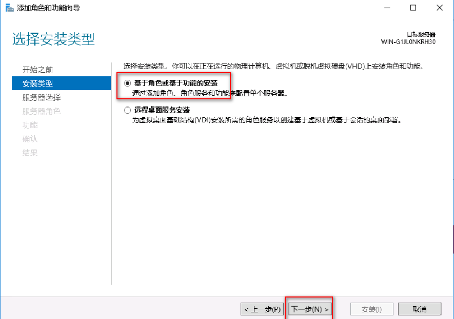
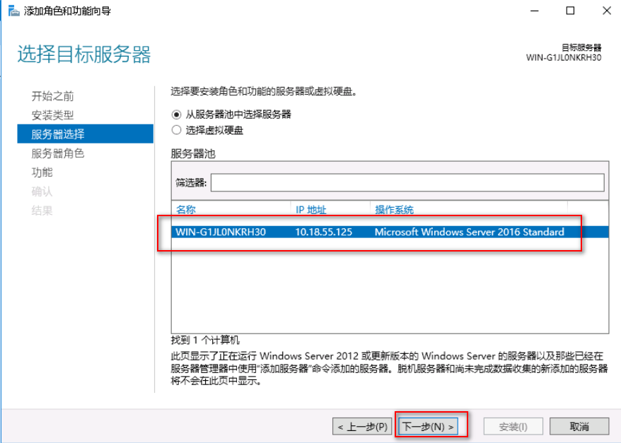
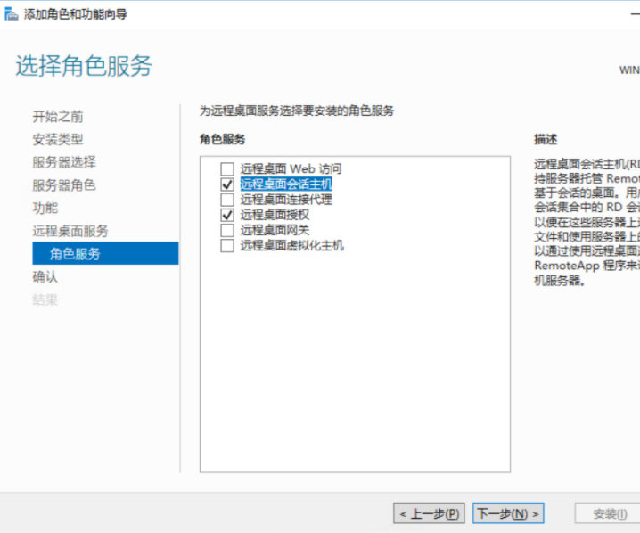
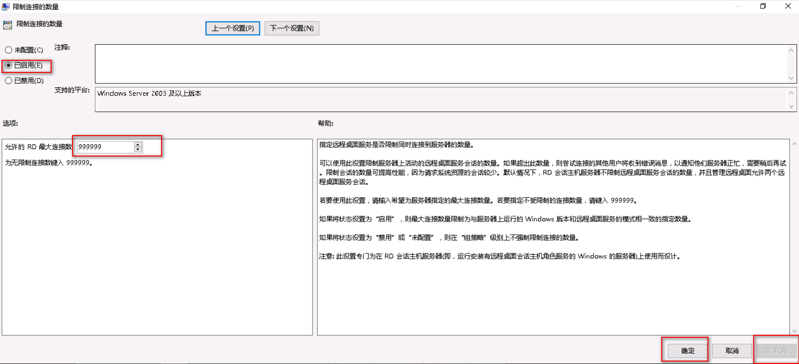
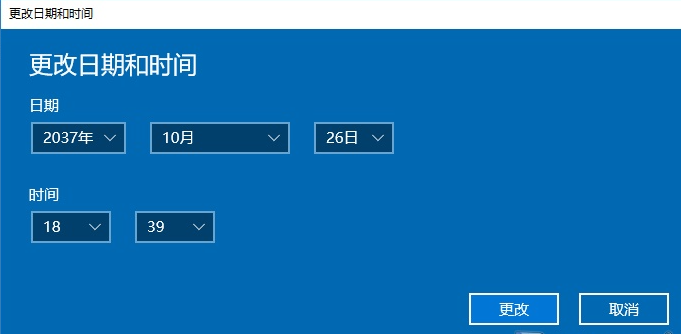
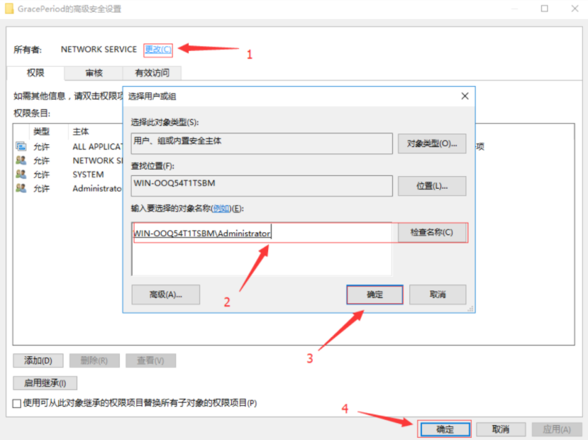
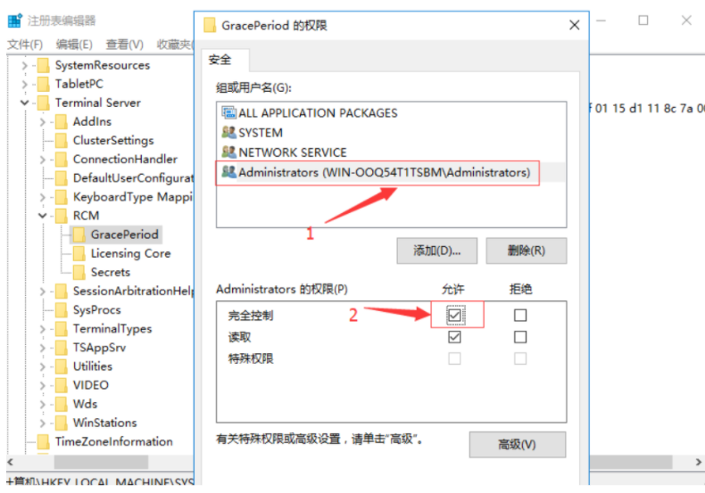
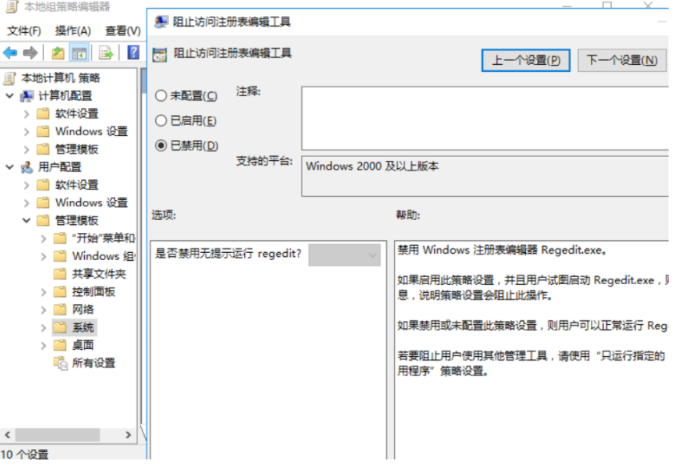

# Windows Server 2016 远程桌面解除多用户限制

## 多用户配置

1、安装远程桌面服务，在服务管理器，添加角色和功能，下一步，选择“基于角色或基于功能的安装”

选中要安装的服务器：

在服务器角色窗口，勾选“远程桌面服务”。下一步：

选择“远程桌面服务”-->角色服务-->远程桌面会话主机和远程桌面授权-->下一步-->选中如果需求重启-->安装

这样只能使用119天：

配置组策略，运行框输入gpedit.msc，打开计算机配置–>管理模板—>windows组件—>然后在右边的菜单中选择远程桌面服务；双击打开。双击远程桌面会话主机->连接，点击限制连接的数量，设置如下。

以上配置后即可同时登陆，但期限为120天。

## 破解远程桌面时间

1、调整日期为未来的时间（获得更长的时间，不更改可再次获得120天授权）

2、删除注册表项

在“运行”输入 "regedit",进入注册表，删除`HKEY_LOCAL_MACHINE\SYSTEM\CurrentControlSet\Control\Terminal Server\RCM\GracePeriod`目录。如过提示权限不够，需进行如下操作

然后，删除 GracePeriod目录。

3、运行 gpedit.msc，在用户配置 - 管理模板 - 系统中修改组织访问注册表编辑工具为已禁用，然后重启服务器。

