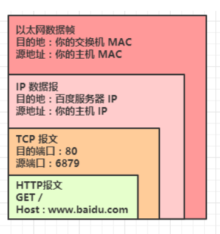
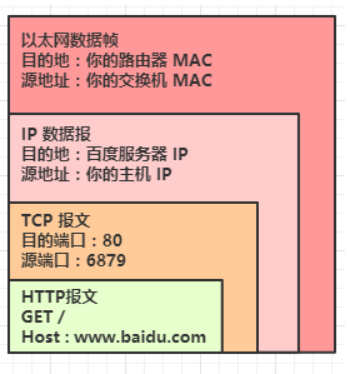
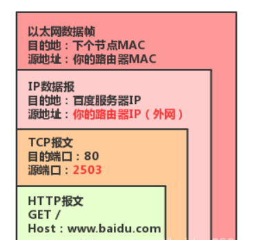

# 路由器与交换机详解

[TOC]

# 1、概念

交换机（switch）是一种在通信系统中完成信息交换功能的网络设备。主要特点是：一次路由，多次转发。是一种基于mac(网卡的硬件地址)识别，为始发者和接收者之间建立临时的联网路径。

交换机分为：二层交换机、三层交换机或更高层的交换机。三层交换机可以有路由的功能，而且比低端路由器的转发速率更快。

路由器(Router)亦称选径器，是在网络层实现互连的设备。两大典型功能，即数据通道功能和控制功能。

# 2、区别

1、路由器可以给你的局域网自动分配IP，虚拟拨号。交换机只是用来分配网络数据的。

2、路由器工作在网络层，根据IP地址寻址，可以处理TCP/IP协议，交换机不可以。交换机工作在链路层，根据MAC地址寻址。（目前有更加高级的三层交换机，四层交换机，甚至还有七层交换机）。

3、路由器可以把一个IP分配给很多个主机使用，这些主机对外只表现出一个IP。交换机可以把很多主机连起来，这些主机对外各有各的IP。

4、路由器提供防火墙的服务，交换机不能提供该功能。集线器、交换机都是做端口扩展的，就是扩大局域网(通常都是以太网)的接入点，也就是能让局域网可以连进来更多的电脑。 路由器是用来做网间连接，也就是用来连接不同的网络。

# 3、如何工作

路由器：寻址，转发（依靠 IP 地址）
交换机：过滤，转发（依靠 MAC 地址）

路由器内有一份**路由表**，里面有它的寻址信息（就像是一张地图），它收到网络层的**数据报**后，会根据路由表和选路算法将数据报转发到下一站（可能是路由器、交换机、目的主机）

交换机内有一张**MAC表**，里面存放着和它相连的所有设备的MAC地址，它会根据收到的**数据帧**的首部信息内的目的MAC地址在自己的表中查找，如果有就转发，如果没有就放弃

我们来看一个网络拓扑图例子：

通过拓扑图我们应该知道：
**每一个路由器与其之下连接的设备，其实构成一个局域网**
交换机工作在路由器之下，就是也就是**交换机工作在局域网内**
交换机用于**局域网内网的数据转发**
路由器用于**连接局域网和外网**

举个例子：
我们每个人相当于主机，路由器相当于快递员，宿管大爷相当于交换机，学校是一个局域网
快递员根据学校地址（IP）把包裹送到学校，再根据公寓号（子网IP）把快递交给这个公寓的宿管大爷，宿管大爷根据你的名字（MAC）交给你

**少一个可以吗？**

交换机在局域网内工作，它根据 MAC 地址转发数据，如果没有了路由器在网络层寻址，那么我们的数据就不能发送到其他网络终端上去了。

路由器内集成了交换机的功能，主机与路由器相连也可以实现数据转发，但是不足之处是：可扩展的接口不如交换机多；交换机通常由硬件加速转发，路由器主要靠软件寻址，速度慢

# 4、实际网络数据转发过程

通过一个实际网络数据转发的过程，我们可以更好的理解路由器与交换机的区别所在

假设你使用电脑访问www.baidu.com
过程大致如下：

你的电脑先在应用层打包一个 HTTP报文，然后在传输层在打包成 TCP报文，然后再根据 DNS 查到的 IP 在网络层打包成 IP数据报，然后在通过链路层打包成以太网数据帧，发送给你的交换机：

你的交换机收到后，重新包装数据帧，再发送给你的路由器：

你的路由器利用 NAT(Network Address Translation)，将你的主机IP（局域网IP）转换为外网IP，还会修改端口号，对外完全隐藏你的主机，再根据路由表选择一条合适的路径进行转发：

在接下来的过程中，每个节点都只改变 MAC 地址，然后在网络中一路向着目的地发送

# 5、关于NAT

NAT是一种网络隐蔽技术，它通过建立IP地址映射来隐藏内部的网络
它的主要功能有：

- 提高内部网络的安全性
- 共享网络地址，减少地址消耗

NAT主要有三种实现方式：

- 静态NAT（Basic NAT）：最基本的网络转换实现，只转换IP地址，建立IP地址的一对一映射，不支持端口转换
- 网络地址端口转换（NAPT）：这种方式支持端口的映射，并允许多台主机共享一个公网IP地址
- 端口多路复用（Port address Translation,PAT)：是指改变外出数据包的源端口并进行端口转换，即端口地址转换.采用端口多路复用方式。